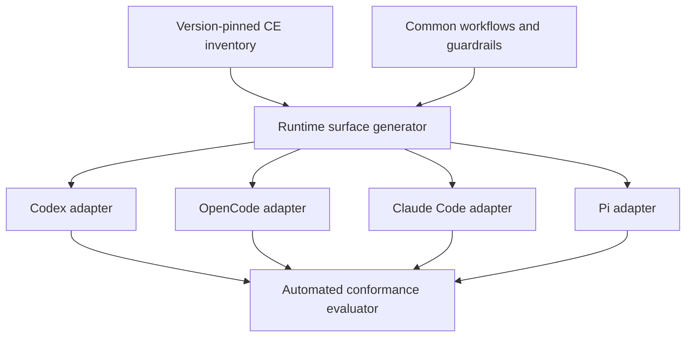

# Oh My Harness - Plan

## Goal Capsule

- **Objective:** `oh-my-pi`를 Codex, OpenCode, Claude Code, Pi에서 동일한 Compound Engineering 워크플로와 동등한 산출물 품질을 제공하는 개인용 런타임 중립 하네스 코어로 확장한다.
- **Product authority:** 버전이 고정된 Compound Engineering 기능 목록과 공통 워크플로·가드레일 원본이 기준이며, 런타임별 설정과 명령 표면은 이 기준에서 파생한다.
- **Primary proof:** 전체 Compound Engineering 기능을 네 런타임에서 자동 검증하고, 동일 fixture의 `Plan → Work → Review` 실행 결과를 공통 계약으로 비교한다.
- **Open blockers:** 계획을 시작하기 전에 해결해야 할 제품 결정은 없다.

---

## Product Contract

### Summary

`oh-my-harness`는 하나의 Compound Engineering 정의와 공통 가드레일을 네 코딩 에이전트의 native 표면으로 배포한다.
모든 Compound Engineering 기능은 Codex, OpenCode, Claude Code, Pi에서 자동 conformance를 통과해야 하며 지원 차이는 조용히 강등되지 않는다.

### Problem Frame

현재 `oh-my-pi`는 개인의 Pi 환경을 프로필, lock receipt, capability registry, setup doctor, safety policy로 재현하지만 패키지와 런타임 통합은 Pi에 종속되어 있다.
사용자는 Compound Engineering을 Pi, OpenCode, Claude Code에서 유용하게 사용해 왔지만 런타임마다 설치를 반복하고 `ce-compound`로 얻은 학습 중 가드레일로 승격할 내용을 각 에이전트 형식에 다시 반영해야 한다.
Codex는 새 호환 대상이며, 런타임별 산출물 편차는 아직 공통 fixture로 측정되지 않았다.

개별 설정을 복사하는 방식은 설치 여부를 보여줄 뿐 같은 워크플로가 같은 품질 계약으로 동작하는지 보장하지 못한다.
제품은 원하는 상태를 공통 원본으로 선언하고 런타임별 native 표면을 생성하며 실제 업무 수행을 자동 검증해야 한다.

### Key Decisions

- **워크플로와 산출물 계약을 동일성의 기준으로 삼는다.** (session-settled: user-directed — chosen over environment-only or byte-identical parity: 모델별 표현 차이는 허용하되 단계, 의미, 구조, 품질 기준의 drift는 허용하지 않기 위해서다.)
- **개인 1인 파일럿으로 시작한다.** (session-settled: user-directed — chosen over a team- or organization-first rollout: 같은 사용자와 저장소에서 런타임 차이만 분리해 검증하기 위해서다.)
- **런타임 중립 코어를 먼저 만든다.** (session-settled: user-directed — chosen over porting all existing Pi connectors and providers: 전체 기능 이식 전에 공통 계약과 adapter 경계를 증명하기 위해서다.)
- **계약·conformance와 native 설정 생성기를 v1에 함께 포함한다.** (session-settled: user-directed — chosen over a contract-only first release: 검증뿐 아니라 설치와 가드레일 중복 반영 비용도 함께 해결하기 위해서다.)
- **전체 Compound Engineering 기능을 네 런타임에서 자동 검증한다.** (session-settled: user-directed — chosen over validating only a representative workflow: 어느 에이전트에서도 Compound Engineering 전체가 정상 동작한다는 약속을 v1 완료 기준으로 삼기 위해서다.)
- **필수 공통 코어는 엄격하게 차단하고 native 기능은 선택 확장으로 격리한다.** (session-settled: user-directed — chosen over best-effort degradation or runtime-specific workflow forks: 지원 부족이 동일성 보증을 조용히 낮추지 않게 하기 위해서다.)
- **중앙 통합 실행기를 만들지 않는다.** 각 에이전트의 native 사용 경험을 유지하고 `oh-my-harness`는 공통 정의, 배포, 검증을 책임진다.

공통 원본은 다음 파생 관계의 유일한 제품 기준이다.

### Actors

- A1. **Operator:** 자신의 저장소에서 네 에이전트를 번갈아 사용하고 공통 워크플로·가드레일 원본을 관리하는 사용자다.
- A2. **Runtime adapter:** 공통 정의를 각 에이전트의 native 명령, 스킬, 지침, 승인 표면에 연결한다.
- A3. **Surface generator:** 공통 원본에서 런타임별 파생 설정을 재현 가능하게 만들고 drift를 식별한다.
- A4. **Conformance evaluator:** 기능별 실행 증거와 산출물을 정규화해 공통 계약 충족 여부를 판정한다.
- A5. **Compound Engineering distribution:** v1이 지원해야 할 기능 목록과 기준 워크플로의 버전 고정된 upstream이다.

### Requirements

**Canonical workflow and guardrails**

- R1. v1은 선택한 Compound Engineering 버전의 모든 사용자 실행 가능 기능을 누락 없는 inventory로 관리해야 한다.
- R2. 공통 원본은 각 기능의 워크플로 단계, 입력, 산출물 계약, handoff, 필수 capability, 실패 경계를 선언해야 한다.
- R3. `ce-*` 기능 이름과 단계 의미는 네 런타임에서 동일하게 발견되고 호출되어야 하며 native 문법 차이는 adapter가 흡수해야 한다.
- R4. 공통 가드레일은 한 곳에서 관리되어 네 런타임의 지침 표면으로 파생되어야 한다.
- R5. `ce-compound`로 검증된 학습 중 사용자가 공통 가드레일로 승격한 항목은 한 번의 원본 변경으로 네 런타임에 전파되고 검증되어야 한다.
- R6. 생성된 native 표면을 직접 수정해 공통 원본과 달라진 상태는 drift로 판정되어야 한다.

**Runtime delivery and capability handling**

- R7. Codex, OpenCode, Claude Code, Pi adapter는 자신이 제공하는 capability와 지원하는 Compound Engineering 기능을 기계 판독 가능한 형태로 보고해야 한다.
- R8. 필수 capability가 없거나 호환 버전이 아니면 해당 기능은 실행 전에 차단되고 부족한 조건을 설명해야 한다.
- R9. 런타임 고유 hook, subagent, approval UI는 공통 산출물과 성공 기준을 바꾸지 않는 선택 확장으로만 제공되어야 한다.
- R10. 같은 선언에서 같은 native 설정이 생성되어야 하며 반복 적용해도 사용자 소유 설정을 불필요하게 덮어쓰지 않아야 한다.
- R11. 설치·동기화 진단은 기대 버전, 실제 버전, 기능 준비 상태, 생성물 drift, 다음 복구 행동을 런타임별로 보여줘야 한다.
- R12. 기존 Pi connector와 provider는 v1 공통 코어의 필수 범위가 아니지만 Pi 전용 capability pack으로 보존하거나 명시적인 마이그레이션 경로를 제공해야 한다.

**Automated conformance**

- R13. inventory의 모든 Compound Engineering 기능은 Codex, OpenCode, Claude Code, Pi 각각에서 자동 end-to-end conformance 시나리오를 가져야 한다.
- R14. 각 시나리오는 기능 발견과 호출, 사용자 상호작용, 산출물, 다음 단계 handoff, 승인·안전 경계, 예상 실패를 해당 기능에 필요한 범위에서 검증해야 한다.
- R15. `Plan → Work → Review`는 동일한 fixture 저장소와 요구사항을 네 런타임에서 독립 실행하는 대표 비교 시나리오여야 한다.
- R16. 결과 비교는 문구나 코드 diff의 바이트 동일성이 아니라 단계 완료, 필수 문서 구조, stable ID, 검증 증거, review finding 품질 계약을 평가해야 한다.
- R17. 외부 서비스가 필요한 기능도 자동 검증 경로를 가져야 하며 격리된 fixture와 test double 검증, 자격 증명이 필요한 live 검증을 구분해 보고해야 한다.
- R18. 실제 에이전트 실행은 서로 격리된 작업 공간에서 수행되어 한 런타임의 파일, 세션, 인증 상태가 다른 결과를 오염시키지 않아야 한다.
- R19. 릴리스 gate는 전체 기능과 네 런타임의 필수 시나리오가 모두 통과할 때만 성공해야 하며 skip, silent fallback, 미분류 강등을 성공으로 세지 않아야 한다.
- R20. Compound Engineering 버전 변경으로 inventory가 달라지면 누락된 adapter 또는 conformance 시나리오가 drift로 검출되고 릴리스가 차단되어야 한다.
- R21. conformance report는 기능과 런타임별 판정, 실행 증거, 동등성 차이, 재현 정보를 제공해야 한다.

### Key Flows

- F1. **공통 원본에서 네 런타임 준비**
  - **Trigger:** A1이 지원할 Compound Engineering 버전과 공통 가드레일을 선택한다.
  - **Actors:** A1, A2, A3, A5
  - **Steps:** inventory와 정책을 검증하고 네 native 표면을 생성한 뒤 설치 상태와 drift를 진단한다.
  - **Outcome:** 네 런타임이 같은 기준 버전과 워크플로 계약을 사용할 준비가 된다.
  - **Covered by:** R1–R12
- F2. **전체 기능 자동 conformance**
  - **Trigger:** 공통 원본, adapter, Compound Engineering 버전 중 하나가 변경된다.
  - **Actors:** A2, A4, A5
  - **Steps:** 기능 inventory와 런타임의 전체 조합을 격리 실행하고 기능별 계약과 실패 경계를 판정한다.
  - **Outcome:** 누락과 강등 없이 전체 matrix의 통과 여부가 보고된다.
  - **Covered by:** R13, R14, R17–R21
- F3. **동일 작업 4종 비교**
  - **Trigger:** 대표 `Plan → Work → Review` fixture benchmark를 시작한다.
  - **Actors:** A1, A2, A4
  - **Steps:** 같은 시작 상태와 요구사항을 네 격리 환경에 제공하고 각 런타임 결과를 공통 기준으로 정규화해 비교한다.
  - **Outcome:** 워크플로와 산출물의 동등성이 증거와 함께 판정된다.
  - **Covered by:** R15, R16, R18, R21
- F4. **학습을 공통 가드레일로 승격**
  - **Trigger:** A1이 검증된 학습을 공통 가드레일로 채택한다.
  - **Actors:** A1, A3, A4
  - **Steps:** 공통 원본을 갱신하고 네 native 표면을 재생성한 뒤 drift와 conformance를 검사한다.
  - **Outcome:** 한 번의 결정이 네 런타임에 같은 정책 의미로 반영된다.
  - **Covered by:** R4–R6, R10, R19
- F5. **지원 부족의 엄격 차단**
  - **Trigger:** adapter가 필수 capability 또는 호환 버전을 제공하지 못한다.
  - **Actors:** A1, A2, A4
  - **Steps:** 실행 전에 부족한 조건을 탐지하고 기능 실행과 릴리스 통과를 차단한다.
  - **Outcome:** 사용자는 보증이 낮아진 결과를 정상 성공으로 오인하지 않는다.
  - **Covered by:** R7–R9, R19, R20

### Acceptance Examples

- AE1. **Covers R13–R16, R18, R19.**
  - **Given:** 동일한 fixture 저장소와 고정된 요구사항이 네 격리 환경에 준비되어 있다.
  - **When:** Codex, OpenCode, Claude Code, Pi에서 `Plan → Work → Review`를 실행한다.
  - **Then:** 네 실행은 같은 단계와 필수 산출물 계약을 충족하고 공통 evaluator가 각각 통과 증거를 남긴다.
- AE2. **Covers R7, R8, R19.**
  - **Given:** 한 런타임이 특정 CE 기능의 필수 capability를 제공하지 않는다.
  - **When:** 사용자가 해당 기능을 실행하거나 릴리스 matrix를 검증한다.
  - **Then:** 실행과 릴리스는 시작 전에 실패하고 누락 capability와 복구 조건을 보고한다.
- AE3. **Covers R1, R13, R20.**
  - **Given:** 고정된 Compound Engineering 버전에 새 사용자 실행 기능이 추가되었다.
  - **When:** inventory와 conformance를 검증한다.
  - **Then:** 네 adapter와 자동 시나리오가 모두 추가될 때까지 coverage drift가 릴리스를 차단한다.
- AE4. **Covers R4–R6, R10.**
  - **Given:** 사용자가 검증된 학습을 공통 가드레일로 승격했다.
  - **When:** native 표면을 다시 생성하고 drift를 검사한다.
  - **Then:** 네 런타임에 같은 정책 의미가 반영되며 수동으로 어긋난 생성물은 실패로 표시된다.
- AE5. **Covers R9, R16.**
  - **Given:** 한 런타임 adapter가 native subagent 기능을 선택 확장으로 사용한다.
  - **When:** 같은 CE 기능을 공통 evaluator로 비교한다.
  - **Then:** 확장 사용 여부와 무관하게 필수 단계와 산출물 계약은 동일하게 판정된다.
- AE6. **Covers R17, R19, R21.**
  - **Given:** CE 기능이 외부 서비스와 자격 증명에 의존한다.
  - **When:** 자동 conformance를 실행한다.
  - **Then:** 격리된 기본 검증과 credential-gated live 검증이 별도 판정으로 기록되며 실행되지 않은 live 검증은 전체 통과로 위장되지 않는다.

### Success Criteria

- Compound Engineering 기능 inventory와 네 런타임의 필수 conformance matrix가 100% 자동 판정을 가진다.
- 릴리스 gate에는 미검증 기능, silent fallback, 성공으로 처리된 skip이 없다.
- 동일 `Plan → Work → Review` fixture의 네 결과가 공통 단계·산출물·검증·리뷰 계약을 모두 통과한다.
- 깨끗한 환경에서 공통 원본만으로 네 native 표면을 재생성하고 수동 수정 없이 같은 진단 결과를 얻을 수 있다.
- 하나의 공통 가드레일 변경이 네 런타임에 전파되고 의도적인 drift fixture가 자동으로 탐지된다.

### Scope Boundaries

**Deferred for later**

- 기존 Pi connector, Quotio provider, workspace profile을 Codex, OpenCode, Claude Code에 동등하게 이식하는 capability pack
- 팀·직군·조직별 계층 프로필, 중앙 배포, 업데이트 rollout, 사용 telemetry
- Codex, OpenCode, Claude Code, Pi 외의 추가 코딩 에이전트 지원
- GUI나 중앙 관리 포털

**Outside this product's identity**

- 모델 출력이나 최종 code diff를 바이트 단위로 동일하게 만드는 시스템
- 네 에이전트를 숨기고 모든 실행을 대신하는 중앙 agent runner
- Compound Engineering 자체를 fork해 별도 워크플로 제품으로 재구현하는 일

### Dependencies / Assumptions

- Compound Engineering의 배포·라이선스·버전 고정 방식이 네 런타임 adapter와 자동 검증을 허용한다고 가정한다.
- 네 런타임이 자동 시나리오를 실행하고 결과를 회수할 수 있는 안정적인 비대화형 또는 test-harness 표면을 제공한다고 가정한다.
- “동등한 결과”는 공통 의미·구조·품질 계약으로 판정할 수 있으며 모델별 문체와 허용 가능한 코드 차이는 정상 변동으로 본다.
- 현재 관찰된 직접 비용은 설치와 가드레일 반복 반영이며, 산출물 편차의 실제 기준선은 v1 fixture benchmark에서 측정한다.
- 기존 `oh-my-pi`의 profile/lock, capability registry, setup doctor, safety policy는 재사용 후보이지만 현재 명명과 구현은 Pi 중심이다.

### Outstanding Questions

**Deferred to Planning**

- Compound Engineering 원본을 dependency로 고정할지, 검증된 snapshot을 패키징할지 결정해야 한다.
- 전체 기능 inventory를 어떤 단위로 분류하고 기능별 end-to-end oracle을 어떻게 정의할지 결정해야 한다.
- 네 실제 agent 실행을 격리하고 비용·시간·외부 자격 증명을 관리할 test topology를 결정해야 한다.
- 공통 원본과 runtime adapter 사이에서 허용할 native 차이와 비교 normalization 규칙을 구체화해야 한다.
- 저장소와 패키지 이름을 `oh-my-harness`로 전환할 때 기존 Pi 설치 경로와 사용자를 어떻게 보존할지 결정해야 한다.

### Sources / Research

- [AI 에이전트 환경을 조직에 배포하는 하네스 플랫폼](https://andromedarabbit.net/2026/07/14/ai-agent-harness-platform/) — 원하는 상태의 선언, 결정론적 적용, 업무 역량 단위 검증이라는 제품 프레임
- `README.md`와 `package.json` — 현재 개인용 Pi package 범위와 Pi resource manifest
- `docs/ideation/2026-06-27-oh-my-pi-local-pi-distribution-ideation.html` — profile, lock, backend strategy, trust 경계 선행 탐색
- `docs/ideation/2026-06-30-oh-my-pi-complete-package-reproduction-ideation.html` — package coverage와 OMP facade 선행 탐색
- `docs/profiles/profile-pack.schema.json`와 `scripts/profile-pack.mjs` — 현재 profile intent, deterministic lock, non-destructive apply 기반
- `extensions/capability-registry.ts`, `extensions/runtime-safety-policy-ledger.ts`, `extensions/setup-doctor/index.ts` — capability, safety, 진단 기반과 현재 Pi 종속 경계
