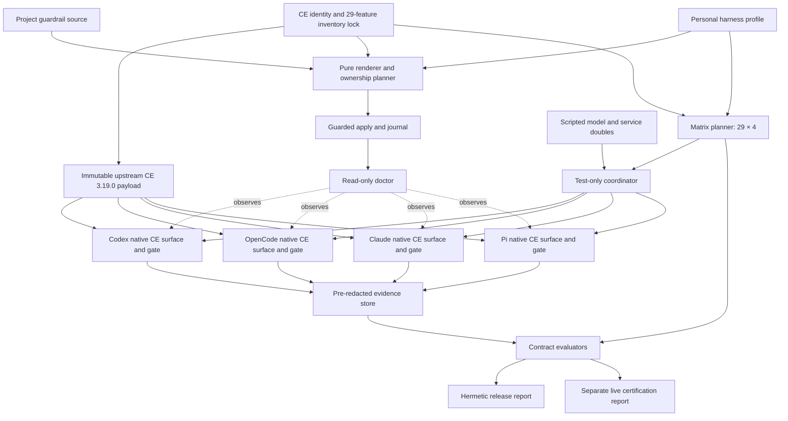
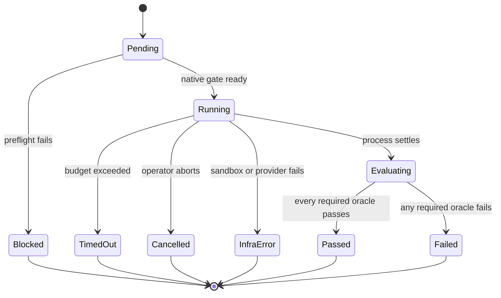
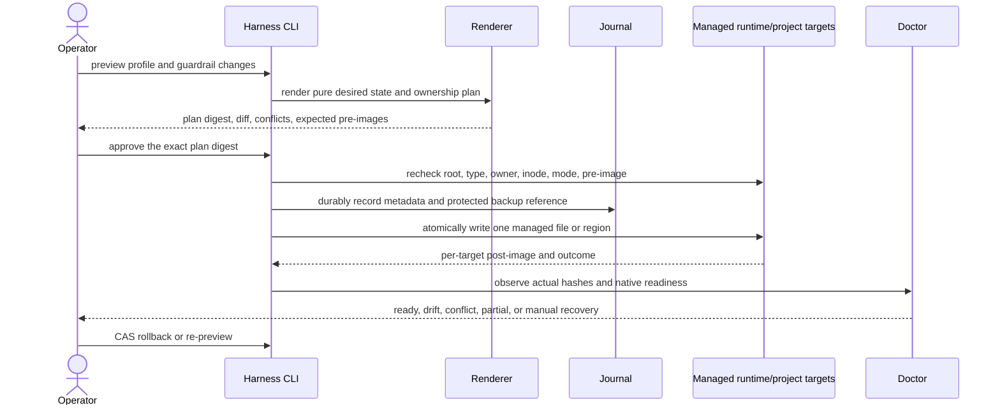

<!-- markdownlint-disable MD013 MD025 MD036 -->

# Oh My Harness - Plan

## Goal Capsule

- **Objective:** `oh-my-pi`를 Compound Engineering 3.19.0 전체 기능이 Codex, OpenCode, Claude Code, Pi에서 동일한 워크플로·산출물 계약으로 동작하는 개인용 Runtime-Neutral Harness Core로 확장한다.
- **Authority hierarchy:** 사용자 확정 결정과 Product Contract가 최우선이며, 고정된 Compound Engineering tag·commit·tree, 이 계획의 KTD, 저장소 가드레일 순서로 구현 판단을 제한한다.
- **Execution profile:** Deep, contract-first, hermetic-test-first 작업이다. 공통 계약과 ownership 경계를 직렬로 고정한 뒤 runtime별 독립 파일만 병렬화한다.
- **Stop conditions:** upstream CE skill을 복사·변형해 재구현하려는 변경, native hard gate를 우회하는 fallback, secret이 포함된 lock/evidence, 성공으로 정규화된 skip, 사용자 설정의 무단 overwrite가 발견되면 범위를 확장하지 말고 중단한다.
- **Tail ownership:** ZZA-70은 여러 PR로 나눌 수 있지만 마지막 PR의 closeout 전까지 Linear는 `In Review`를 유지한다. Merge와 GitHub 저장소 rename은 각 실행 시점의 별도 승인 대상이다.

---

## Product Contract

### Summary

`oh-my-harness`는 Compound Engineering 3.19.0의 native plugin/package 표면을 네 코딩 에이전트에 고정하고, 개인 runtime 설치와 프로젝트 공통 가드레일을 재현 가능한 선언으로 관리한다.
릴리스는 29개 CE 기능과 네 runtime의 116개 hermetic conformance cell을 모두 통과해야 하며 hosted model·credential·hardware 검증은 별도 certification으로 투명하게 보고한다.

### Problem Frame

현재 `oh-my-pi`는 개인의 Pi 환경을 profile, lock receipt, capability registry, setup doctor, safety policy로 재현하지만 패키지와 runtime 통합은 Pi에 종속되어 있다.
사용자는 Compound Engineering을 Pi, OpenCode, Claude Code에서 유용하게 사용해 왔지만 runtime마다 설치를 반복하고 `ce-compound`로 얻은 학습 중 가드레일로 승격할 내용을 각 에이전트 형식에 다시 반영해야 한다.
Codex는 새 호환 대상이며 현재 로컬에 설치되어 있지 않다.

Upstream Compound Engineering은 이미 Claude Code와 Codex의 native plugin manifest, OpenCode plugin, Pi package extension을 제공한다.
따라서 문제는 CE skill을 다시 변환하는 일이 아니라 하나의 고정된 upstream, 공통 guardrail, runtime readiness, 실제 실행 증거를 관리하는 일이다.

### Key Decisions

- **워크플로와 산출물 계약을 동일성의 기준으로 삼는다.** (session-settled: user-directed — chosen over environment-only or byte-identical parity: 모델별 표현 차이는 허용하되 단계, 의미, 구조, 품질 기준의 drift는 허용하지 않기 위해서다.)
- **개인 1인 파일럿으로 시작한다.** (session-settled: user-directed — chosen over a team- or organization-first rollout: 같은 사용자와 저장소에서 runtime 차이만 분리해 검증하기 위해서다.)
- **Runtime-Neutral Harness Core를 먼저 만든다.** (session-settled: user-directed — chosen over porting all existing Pi connectors and providers: 전체 기능 이식 전에 공통 계약과 Runtime Adapter 경계를 증명하기 위해서다.)
- **계약·conformance와 native 설정 generator를 v1에 함께 포함한다.** (session-settled: user-directed — chosen over a contract-only first release: 검증뿐 아니라 설치와 가드레일 중복 반영 비용도 함께 해결하기 위해서다.)
- **전체 Compound Engineering 기능을 네 runtime에서 자동 검증한다.** (session-settled: user-directed — chosen over validating only a representative workflow: 어느 에이전트에서도 Compound Engineering 전체가 정상 동작한다는 약속을 v1 완료 기준으로 삼기 위해서다.)
- **필수 공통 코어는 엄격하게 차단하고 native 기능은 선택 확장으로 격리한다.** (session-settled: user-directed — chosen over best-effort degradation or runtime-specific workflow forks: 지원 부족이 동일성 보증을 조용히 낮추지 않게 하기 위해서다.)
- **중앙 통합 실행기를 만들지 않는다.** 각 에이전트의 native 사용 경험을 유지하고 `oh-my-harness`는 공통 정의, 배포, 검증만 책임진다.

### Actors

- A1. **Operator:** 네 runtime을 번갈아 사용하고 공통 워크플로·가드레일 원본을 관리하는 사용자다.
- A2. **Runtime Adapter:** 고정된 upstream과 공통 overlay를 각 runtime의 native install, skill, instruction, approval, event 표면에 연결한다.
- A3. **Surface Generator:** 공통 원본에서 harness-owned 설정을 생성하고 ownership과 drift를 관리한다.
- A4. **Conformance Evaluator:** runtime 실행 증거와 산출물을 정규화해 공통 계약 충족 여부를 판정한다.
- A5. **Compound Engineering Distribution:** v1이 지원할 29개 기능과 기준 워크플로를 제공하는 immutable upstream이다.

### Requirements

**Canonical workflow and guardrails**

- R1. v1은 Compound Engineering 3.19.0 tag의 29개 사용자 실행 가능 skill을 누락 없는 inventory로 관리해야 한다.
- R2. 공통 원본은 각 기능의 워크플로 단계, 입력, 산출물 계약, handoff, 필수 capability, side-effect class, 실패 경계를 선언해야 한다.
- R3. `ce-*` 기능 이름과 단계 의미는 네 runtime에서 native하게 발견되고 호출되어야 하며 runtime 문법 차이는 Runtime Adapter가 설명해야 한다.
- R4. 공통 가드레일은 한 곳에서 관리되어 프로젝트의 runtime별 instruction surface로 파생되어야 한다.
- R5. `ce-compound`로 검증된 학습 중 사용자가 공통 가드레일로 승격한 항목은 한 번의 원본 변경으로 네 runtime에 전파되고 검증되어야 한다.
- R6. 생성된 native surface를 직접 수정해 공통 원본과 달라진 상태는 drift로 판정되어야 한다.

**Runtime delivery and capability handling**

- R7. Codex, OpenCode, Claude Code, Pi adapter는 runtime version, native CE discovery, companion capability, enforcement seam, headless evidence surface를 기계 판독 가능한 형태로 보고해야 한다.
- R8. 필수 capability나 호환 version이 없으면 CE surface 노출 또는 side effect 전에 native gate가 실행을 차단하고 복구 조건을 설명해야 한다.
- R9. runtime 고유 hook, subagent, approval UI는 공통 산출물과 성공 기준을 바꾸지 않는 선택 확장으로만 제공되어야 한다.
- R10. 같은 선언에서 같은 harness-owned 설정이 생성되어야 하며 반복 적용해도 사용자 소유 설정을 덮어쓰지 않아야 한다.
- R11. 설치·동기화 진단은 기대 version, 실제 version, 기능 준비 상태, 생성물 drift, native gate 상태, 다음 복구 행동을 runtime별로 보여줘야 한다.
- R12. 기존 Pi connector와 provider는 v1 공통 코어의 필수 범위가 아니지만 Pi 전용 capability pack과 `oh-my-pi`/OMP 호환 표면은 마이그레이션 기간에 보존되어야 한다.

**Automated conformance**

- R13. 29개 Compound Engineering 기능은 Codex, OpenCode, Claude Code, Pi 각각에서 필수 hermetic end-to-end conformance scenario를 가져야 한다.
- R14. 각 feature contract는 발견·호출, scripted interaction, 산출물, handoff, approval·safety, 예상 실패, evidence oracle의 필수 scenario set을 선언해야 한다.
- R15. `Plan → Work → Review`는 동일한 fixture 저장소와 요구사항을 네 runtime에서 독립 실행하는 대표 비교 scenario여야 한다.
- R16. 결과 비교는 문구나 code diff의 byte identity가 아니라 단계 완료, 필수 문서 구조, stable ID, 검증 증거, seeded review finding과 false-positive budget을 평가해야 한다.
- R17. 외부 서비스나 hardware가 필요한 기능은 hermetic test-double lane과 credential-gated hosted/live certification을 분리해 자동 보고해야 한다.
- R18. 실제 agent 실행은 HOME, config, session, auth, temp, workspace, port, network가 cell별로 격리되어야 한다.
- R19. hermetic release gate는 116개 required cell이 모두 통과할 때만 성공해야 하며 skip, silent fallback, timeout, quota, infrastructure error를 pass로 세지 않아야 한다.
- R20. CE source, runtime, overlay, feature contract, fixture, oracle, coordinator 중 하나가 바뀌면 stale evidence가 무효화되고 필요한 cell이 다시 실행되어야 한다.
- R21. report는 feature와 runtime별 verdict, terminal reason, 실행 identity, redacted evidence, artifact hash, 재현 정보를 제공해야 한다.

### Key Flows

- F1. **개인 runtime과 프로젝트 overlay 준비**
  - **Trigger:** A1이 v1 profile을 preview하고 apply를 승인한다.
  - **Actors:** A1, A2, A3, A5
  - **Steps:** immutable source를 검증하고 개인 runtime의 native CE install을 확인한 뒤 프로젝트 guardrail을 생성·적용하고 doctor를 실행한다.
  - **Outcome:** 네 runtime은 같은 upstream과 프로젝트 계약을 사용하거나 명시적인 blocked 상태를 가진다.
  - **Covered by:** R1–R12
- F2. **전체 hermetic conformance**
  - **Trigger:** source, contract, overlay, adapter, fixture, oracle, runtime version이 변경된다.
  - **Actors:** A2, A4, A5
  - **Steps:** 116개 cell을 격리 실행하고 scenario별 deterministic oracle을 판정한다.
  - **Outcome:** 누락과 강등 없이 hermetic release verdict가 생성된다.
  - **Covered by:** R13, R14, R18–R21
- F3. **동일 작업 4종 비교**
  - **Trigger:** 대표 `Plan → Work → Review` benchmark를 시작한다.
  - **Actors:** A1, A2, A4
  - **Steps:** 같은 starting SHA와 요구사항을 네 workspace에 제공하고 durable artifact와 review quality를 비교한다.
  - **Outcome:** workflow와 산출물의 semantic parity가 증거와 함께 판정된다.
  - **Covered by:** R15, R16, R18, R21
- F4. **학습을 공통 가드레일로 승격**
  - **Trigger:** A1이 검증된 학습을 공통 가드레일로 채택한다.
  - **Actors:** A1, A3, A4
  - **Steps:** 공통 원본을 갱신하고 프로젝트 native surface를 preview·apply한 뒤 affected scenario를 재실행한다.
  - **Outcome:** 한 번의 결정이 네 runtime에 같은 정책 의미로 반영된다.
  - **Covered by:** R4–R6, R10, R20
- F5. **지원 부족의 엄격 차단**
  - **Trigger:** adapter가 필수 capability, native gate, sandbox backend 또는 호환 version을 제공하지 못한다.
  - **Actors:** A1, A2, A4
  - **Steps:** model·tool side effect 전에 부족한 조건을 탐지하고 기능 실행과 hermetic release 통과를 차단한다.
  - **Outcome:** 사용자는 보증이 낮아진 결과를 정상 성공으로 오인하지 않는다.
  - **Covered by:** R7–R9, R18–R20

### Acceptance Examples

- AE1. **Covers R13–R16, R18, R19.** 동일한 fixture에서 네 runtime의 `Plan → Work → Review`가 같은 단계·산출물·검증 계약과 review quality budget을 충족해야 한다.
- AE2. **Covers R7, R8, R19.** runtime version 또는 필수 capability가 없으면 native gate가 model/tool side effect 전에 실행을 차단하고 release cell도 실패해야 한다.
- AE3. **Covers R1, R13, R20.** checkout의 tag·commit·tree 또는 파생 inventory가 고정 lock과 다르면 무조건 실패해야 한다. 별도로 승인한 새 CE support lane도 lock을 갱신한 뒤 네 runtime mapping과 feature contract가 모두 완성될 때까지 release-blocked 상태여야 한다.
- AE4. **Covers R4–R6, R10.** 공통 가드레일 변경은 project overlay를 재생성하며 managed drift와 unmanaged collision을 구분해야 한다.
- AE5. **Covers R9, R16.** runtime 고유 subagent나 hook 사용 여부는 공통 산출물 verdict를 바꾸지 않아야 한다.
- AE6. **Covers R17, R19, R21.** live certification이 실행되지 않으면 `not-run`으로 남고 hermetic pass 또는 live pass로 위장되지 않아야 한다.

### Success Criteria

- CE tag `compound-engineering-v3.19.0`, commit `1756c0b9f3cf94493f287ea29ae766ad668fb7cf`, tree `808d20cc08a2b45e0200e68f5b9f604c55cf8a06`가 하나의 lock identity로 검증된다.
- 29개 feature와 네 runtime의 116개 required hermetic cell이 모두 자동 판정을 가지며 성공으로 처리된 skip이 없다.
- 동일 `Plan → Work → Review` fixture의 네 결과가 공통 단계·산출물·검증·review quality 계약을 통과한다.
- 공통 원본에서 project overlay를 재생성해 no-op reapply와 intentional drift detection을 증명한다.
- hosted model·credential·hardware certification은 hermetic verdict와 독립적인 identity·age·status를 가진다.

### Scope Boundaries

#### Deferred for later

- 기존 Pi connector, Quotio provider, workspace profile을 다른 runtime에 동등하게 이식하는 capability pack
- 팀·직군·조직별 계층 profile, 중앙 배포, telemetry, GUI portal
- Codex, OpenCode, Claude Code, Pi 외의 추가 coding agent와 CE 3.19.0 외의 추가 support lane
- credential/hardware live certification 인프라의 상시 운영과 조직 공유

#### Outside this product's identity

- model output이나 최종 code diff를 byte 단위로 동일하게 만드는 시스템
- 네 agent를 숨기고 사용자 업무를 대신 실행하는 중앙 agent runner
- Compound Engineering skill, converter, writer를 fork하거나 중복 구현하는 일
- OAuth consent, credential 입력, CAPTCHA, OS permission, 실제 merge/publish를 묵시적으로 자동 승인하는 일

### Dependencies / Assumptions

- Codex 0.144.4, OpenCode 1.18.0, Claude Code 2.1.210, Pi 0.80.7을 v1 baseline으로 고정한다.
- Pi multi-agent scenario는 `pi-subagents` 0.34.0을 필수 companion으로, rich blocking-question path는 `pi-ask-user` 0.13.0과 fallback path를 함께 검증한다.
- hermetic lane은 OpenAI-compatible 및 Anthropic-compatible scripted provider로 deterministic tool/question/handoff transcript를 공급할 수 있다고 가정한다.
- 각 runtime이 우회 불가능한 native install/session/tool/permission gate 중 하나를 제공해야 한다. 제공하지 못하면 해당 runtime support를 실패로 남긴다.
- GitHub 저장소 rename과 기존 설치 migration은 실제 외부 변경 전에 별도 승인을 받는다.

### Sources / Research

- `docs/brainstorms/2026-07-15-oh-my-harness-requirements.md`
- `docs/solutions/workflow/local-pi-distribution-parallel-prs.md`
- `docs/solutions/conventions/pi-extension-toggle-cwd-env-2026-06-12.md`
- `docs/solutions/integration-issues/connector-login-direct-browser-oauth-access-key-fallback.md`
- [Compound Engineering 3.19.0 README and native install surfaces](https://github.com/EveryInc/compound-engineering-plugin/blob/1756c0b9f3cf94493f287ea29ae766ad668fb7cf/README.md#L145-L389)
- [Compound Engineering native target registry](https://github.com/EveryInc/compound-engineering-plugin/blob/1756c0b9f3cf94493f287ea29ae766ad668fb7cf/src/targets/index.ts)
- [Codex non-interactive JSON contract](https://github.com/openai/codex/blob/e4711f2a3be8d6910df0e3ee956eb3a8330dbbf1/codex-rs/exec/src/lib.rs)
- [OpenCode commands, plugins, and skills](https://opencode.ai/docs/commands/)
- [Claude Code local plugin testing](https://github.com/anthropics/claude-code/blob/b7784f2c63ed4585c32bc20b94d3b64cf4fe6df3/plugins/plugin-dev/README.md)
- [Pi packages, skills, JSON mode, and RPC mode](https://github.com/earendil-works/pi-mono/tree/main/packages/coding-agent/docs)

---

## Planning Contract

### Product Contract Preservation

Product Contract scope and R/A/F/AE IDs are preserved from the origin document.
Planning resolves the exact upstream identity, runtime baseline, verdict tiers, model boundary, native gate rule, and install scope without reducing R1–R21.

### Key Technical Decisions

- KTD1. **Pin the immutable CE 3.19.0 release identity.** (session-settled: user-directed — chosen over the current checkout SHA or latest-main tracking: the tag's 29-feature inventory must remain reproducible.) The lock records tag, commit, tree, manifest version, feature inventory digest, and source URL.
- KTD2. **Reuse upstream native CE surfaces.** (session-settled: user-directed — chosen over porting or rewriting CE converters: upstream already ships Claude/Codex manifests, an OpenCode plugin, and a Pi package extension.) Runtime Adapters describe install, discovery, gate, invocation, and evidence; they do not copy skill bodies.
- KTD3. **Ship contract and Surface Generator together.** (session-settled: user-directed — chosen over contract-only v1: installation and guardrail drift are part of the observed user cost.) The generator owns only harness profile, project guardrail, adapter metadata, receipts, and evidence configuration.
- KTD4. **Require the full 116-cell hermetic Conformance Matrix.** (session-settled: user-directed — chosen over representative-only validation: every CE 3.19.0 feature must work in every selected runtime.) A vertical slice is sequencing evidence, not a reduced completion target.
- KTD5. **Use a two-tier verdict.** (session-settled: user-directed — chosen over making all live integrations release-blocking or deferring live verification entirely: deterministic release confidence and real-environment evidence need separate truth.) Hermetic failure blocks release; live certification never upgrades a hermetic failure.
- KTD6. **Use scripted providers for hermetic execution and hosted models for certification.** (session-settled: user-directed — chosen over hosted-model release gating or a fixed local model: the release gate needs deterministic conversations while quality still needs real-model evidence.) Deterministic structural/state checks take precedence over model judges.
- KTD7. **Require a native hard gate.** (session-settled: user-directed — chosen over a launcher wrapper, CE skill mutation, or doctor-only warnings: native use must not silently bypass readiness.) A runtime without an enforceable install/session/tool/permission seam remains unsupported.
- KTD8. **Install CE per user and generate guardrails per project.** (session-settled: user-directed — chosen over all-project, all-user, or dual-scope v1: plugin duplication and cross-project policy leakage must both be avoided.) Runtime homes carry the pinned plugin; repository files carry the common policy.
- KTD9. **Compare semantic contracts, not byte output.** (session-settled: user-directed — chosen over exact prose or diff parity: model variation is expected.) Generated configuration remains byte-deterministic; agent output is checked by schema, IDs, state, evidence, seeded findings, and bounded quality rubrics.
- KTD10. **Keep the coordinator test-only.** The coordinator provisions isolation, launches native CLIs, replays scripted interactions, captures evidence, and exits. It depends on neutral core ports and Runtime Adapters but is absent from production exports and user installation artifacts; the ordinary CLI cannot import it or use it as a common runner.
- KTD11. **Use pure render, explicit ownership planning, and a transaction journal.** Preview is a byte-deterministic ownership plan bound to expected pre-image hashes. Apply requires approval of that plan digest, rechecks file identity immediately before each atomic managed write, and records partial outcomes. Rollback is compare-and-swap against the recorded post-image; stale or sensitive pre-images require manual recovery rather than destructive repair.
- KTD12. **Use exact v1 runtime/platform locks.** Each passing baseline is the tuple `(runtime version, OS, architecture, executable digest, immutable acquisition identity)`. Canonical hermetic release uses Linux x64 tuples; this operator's personal install uses Darwin arm64 tuples. Codex 0.144.4, OpenCode 1.18.0, Claude Code 2.1.210, and Pi 0.80.7 are the only v1 versions. Any uncovered tuple is blocked until a separately reviewed support lane and U16 receipt are added.
- KTD13. **Treat harness-controlled runtime payloads and evidence as untrusted boundaries.** A pinned digest proves reproducibility, not trust. Upstream provenance, executable identity, shell-free argv, minimal environment, fail-closed cell isolation, capture-before-persist redaction, and live target fingerprints must all pass before native agent execution or publication of evidence. The threat model covers untrusted workspace/plugin/model output inside a harness-controlled run; it excludes a compromised kernel/container runtime, substituted locked binary, or concurrent malicious process already running as the same OS user.
- KTD14. **Use a digest-pinned Linux OCI container as the canonical hermetic backend.** Release cells run with read-only root, dropped capabilities, no-new-privileges, resource/PID limits, isolated mounts and default-deny external network; the scripted provider shares only a cell-local network namespace. macOS development invokes that backend through a characterized OCI runtime and reports blocked when unavailable; deprecated host `sandbox-exec` is not a passing backend.

### High-Level Technical Design

The Runtime-Neutral Harness Core owns declarations and evidence while upstream CE and each coding agent continue to own workflow execution.



The doctor observes and reconciles readiness; it is not the gate. Every test enters through the normal native CLI and hits the same fail-closed install/session/tool/permission seam as interactive use. The Matrix Planner rejects any duplicate, extra, filtered, missing, or lock-mismatched `(feature_id, runtime_id)` key before launch, and the hermetic report can pass only at cardinality 116 with every cell passed. Live results never fill or upgrade hermetic cells.

Dependency direction is enforced as a build invariant: neutral contracts, inventory, desired-state planning, journal metadata, and evidence schemas import no adapter or runtime SDK; Runtime Adapters depend inward on neutral ports; only the Pi adapter may import Pi APIs; the test coordinator depends on adapters but is excluded from production exports, package contents, and the user CLI dependency graph.

A conformance cell uses an explicit lifecycle so timeout, cancellation, infrastructure failure, and live non-execution cannot collapse into pass.



Project overlay apply is preview-first and records partial outcomes instead of claiming cross-file atomicity.



User-home plugin installation and repository guardrails are separate ownership domains. Stale pre-images, symlink/hardlink/non-regular targets, path races, user-owned collisions, or partial writes never produce `ready`.

### Output Structure

```text
harness/
├── adapters/
│   ├── claude-code.json
│   ├── codex.json
│   ├── opencode.json
│   └── pi.json
├── baselines/
│   ├── <runtime>-<version>-darwin-arm64.json
│   ├── <runtime>-<version>-linux-x64.json
│   └── linux-oci.json
├── contracts/
│   ├── conformance-result.schema.json
│   ├── feature-contract.schema.json
│   ├── harness-profile.schema.json
│   └── runtime-adapter.schema.json
├── fixtures/
│   ├── services/
│   └── workflows/
├── guardrails/
│   └── common.md
├── inventory/
│   └── compound-engineering-v3.19.0.json
├── locks/
│   └── compound-engineering-v3.19.0.lock.json
├── profiles/
│   └── personal-v1.profile.json
└── scenarios/
    └── <feature-id>/
runtime-gates/
├── claude-code/
├── codex/
├── opencode/
└── pi/
scripts/
└── harness/
    ├── apply.mjs
    ├── canonical.mjs
    ├── characterize.mjs
    ├── cli.mjs
    ├── coordinator.mjs
    ├── doctor.mjs
    ├── evidence.mjs
    ├── install.mjs
    ├── live-broker.mjs
    ├── render.mjs
    ├── upstream.mjs
    ├── evaluators/
    ├── providers/
    └── runtimes/
tests/
└── harness/
    ├── adapters/
    ├── characterize.test.mjs
    ├── contracts.test.mjs
    ├── coordinator.test.mjs
    ├── evaluator-parity.test.mjs
    ├── generator.test.mjs
    ├── install.test.mjs
    ├── inventory.test.mjs
    ├── live-broker.test.mjs
    ├── matrix.test.mjs
    ├── migration.test.mjs
    ├── plan-work-review.test.mjs
    └── security-boundary.test.mjs
docs/
└── operations/
    └── oh-my-harness.md
```

### Implementation Constraints

- Neutral core and test-only coordinator use Node ESM and built-in test primitives, following `scripts/profile-pack.mjs` rather than introducing a runtime framework before evidence requires it.
- Contract data lives in committed, secret-free JSON and Markdown. Timestamps, tokens, auth headers, prompt bodies from private workspaces, and credential paths never enter deterministic locks.
- Runtime-specific files may import neutral data, but neutral modules must not import Pi `ExtensionAPI`, another runtime SDK, or coordinator modules. Import-boundary and package-content tests enforce this direction.
- Canonical hermetic cells run inside the U16-proven digest-pinned Linux OCI backend with isolated mounts, process/PID/resource limits and default-deny external network; redirected HOME, a runtime's own sandbox flag, or host `sandbox-exec` alone is insufficient.
- The coordinator never invokes a shell. It resolves an allowlisted absolute executable identity, passes structured argv, uses a minimal environment and fixed cwd, and strips inherited credential, socket, preload and startup variables.
- Scripted providers bind to a cell-specific loopback endpoint, require a per-cell capability token, and implement only the locked provider protocols using checked-in transcripts.
- Upstream repository owner, release provenance, complete tree, dependency lock and install lifecycle are verified before plugin load; unexpected executable or lifecycle changes block the run.
- Exact native hook names, event payloads, and argv remain adapter-local and are characterized before feature work. If the native gate or OCI backend cannot be enforced, the adapter stops at failed characterization.
- Shared-file ownership is sequential and region-specific: U1 bootstraps package scripts, U10 owns the Pi 0.80.7 dependency/lock update, U13 owns migration and compatibility regions, U12 owns final release scripts/docs, and only U4 writes the bounded managed `AGENTS.md` block.

### Phased Delivery

1. **Contract and existential proof:** U1–U3 establish immutable identity, schemas, profile and 116 expected keys; U16 provisions ephemeral exact baselines and proves each native gate/evidence seam plus the canonical OCI backend before broader control-plane work.
2. **Safety/control primitives:** U4–U6 and U14 prove ownership planning, guarded apply, provider protocols, shell-free spawn, OCI isolation, evidence handling, and one fake-runtime vertical cell.
3. **Native support implementation:** U7–U10 implement production native gate artifacts and normal-CLI adapters. Any mismatch with U16 characterization stops breadth expansion.
4. **Production vertical slice, breadth and conformance:** U10 implements the first Pi production adapter; U11 fixes evaluator semantics on that path; U7–U9 implement remaining adapters; U18 confirms cross-runtime evaluator parity; U17 owns per-user native installation; U13 integrates doctor/migration; U15 supplies the 29 feature-contract families and executes all 116 cells.
5. **User-value proof and release:** U12 adds the four-way workflow benchmark, target-bound hosted/live certification, docs, and aggregate release validation.

Each phase may ship as a separate PR under ZZA-70.
Shared contract, lock, generated inventory, ownership engine, package manifest, and report schema changes remain serial. Runtime adapter files may proceed in isolated worktrees only after U16 and U14 stabilize. A single vertical cell proves architecture but never reduces the final 116-cell obligation.

---

## Implementation Units

| Unit | Title | Primary files | Depends on |
| --- | --- | --- | --- |
| U1 | Immutable upstream lock, inventory, and provenance | `harness/locks/`, `harness/inventory/` | — |
| U2 | Neutral contracts and profile | `harness/contracts/`, `harness/profiles/` | U1 |
| U3 | Runtime descriptors and expected cell keys | `harness/adapters/` | U1, U2 |
| U16 | Exact-baseline, native-gate, provider, and OCI feasibility proof | `harness/baselines/`, `scripts/harness/characterize.mjs` | U1–U3 |
| U4 | Project overlay generator and ownership | `harness/guardrails/`, `scripts/harness/render.mjs` | U2, U3, U16 |
| U5 | Guarded apply journal and rollback | `scripts/harness/apply.mjs` | U3, U4 |
| U6 | Scripted provider doubles | `scripts/harness/providers/` | U1–U3, U16 |
| U14 | Secure coordinator and evidence lifecycle | `scripts/harness/coordinator.mjs`, `scripts/harness/evidence.mjs` | U5, U6, U16 |
| U10 | First production Pi adapter and native gate | `scripts/harness/runtimes/pi.mjs`, `runtime-gates/pi/` | U4, U14, U16 |
| U11 | First production evaluator vertical slice | `scripts/harness/evaluators/` | U10, U14 |
| U7 | Codex Runtime Adapter and native gate | `scripts/harness/runtimes/codex.mjs`, `runtime-gates/codex/` | U4, U11, U14, U16 |
| U8 | Claude Code Runtime Adapter and native gate | `scripts/harness/runtimes/claude-code.mjs`, `runtime-gates/claude-code/` | U4, U11, U14, U16 |
| U9 | OpenCode Runtime Adapter and native gate | `scripts/harness/runtimes/opencode.mjs`, `runtime-gates/opencode/` | U4, U11, U14, U16 |
| U18 | Cross-runtime evaluator confirmation | `tests/harness/evaluator-parity.test.mjs` | U7–U11, U14 |
| U17 | Per-user native install and sync | `scripts/harness/install.mjs` | U5, U7–U10 |
| U13 | Neutral doctor and Pi migration integration | `scripts/harness/doctor.mjs`, `extensions/setup-doctor/` | U5, U7–U10, U17 |
| U15 | Full feature contracts and 116-cell matrix | `harness/scenarios/`, `tests/harness/matrix.test.mjs` | U18 |
| U12 | Four-way benchmark, certification, and release integration | `harness/fixtures/workflows/`, `package.json`, `README.md` | U13, U15, U17 |

The Unit Index order is the execution order; detailed sections retain stable U-IDs so review and work evidence references do not change when sequencing is refined.

Actor trace is explicit rather than inferred: A1 maps to U5/U13/U17/U12 operator evidence; A2 to U3/U7–U10/U16 adapter evidence; A3 to U4/U5/U17 ownership evidence; A4 to U6/U11/U14/U15/U18/U12 conformance evidence; A5 to U1/U3/U16 upstream identity and discovery evidence.

### U1. Immutable upstream lock and inventory

- **Goal:** Pin CE 3.19.0 by tag, commit, tree, manifest and source-derived 29-feature inventory, with a reviewable provenance trust root.
- **Requirements:** R1, R20; KTD1, KTD4, KTD13.
- **Dependencies:** None.
- **Files:** Create `harness/contracts/upstream-lock.schema.json`, `harness/locks/compound-engineering-v3.19.0.lock.json`, `harness/inventory/compound-engineering-v3.19.0.json`, `scripts/harness/canonical.mjs`, `scripts/harness/upstream.mjs`, `tests/harness/inventory.test.mjs`; modify `package.json`.
- **Approach:** Resolve the immutable git object only from the pinned canonical host/owner/repository and authenticated transport, derive skill IDs independently from `skills/*/SKILL.md`, canonicalize and hash the result, and compare it byte-for-byte with committed lock artifacts. The provenance policy also records a separately reviewed release-attestation digest, complete tree/dependency-lock digest, and lifecycle-script decision. A version string without matching identity or provenance is invalid.
- **Patterns to follow:** `scripts/profile-pack.mjs` canonicalization, SHA-256 receipt, secret-field rejection, and verify-before-write behavior; upstream `tests/real-plugin-conversion.test.ts` independent source inventory derivation.
- **Test scenarios:**
  - Exact tag, commit, tree and 29 feature IDs produce the committed lock.
  - Current post-tag checkout with the same `package.json` version fails identity verification.
  - Added, removed, duplicated, invalid-frontmatter, or platform-filtered skills cause inventory drift.
  - Mutable branch refs and secret-like fields are rejected.
  - Spoofed origin, unauthenticated transport, missing/tampered review attestation, dependency drift, unexpected executable, and unapproved lifecycle script fail before plugin load.
- **Verification:** The inventory and provenance verdict are reproducible from a clean checkout and any source/trust mismatch exits non-zero with no file mutation.

### U2. Neutral contracts and personal profile

- **Goal:** Define the declarative Product Contract surface consumed by generator, doctor, coordinator, adapters, and evaluators.
- **Requirements:** R2, R7, R9, R14, R17, R20, R21; KTD3–KTD6.
- **Dependencies:** U1.
- **Files:** Create `harness/contracts/harness-profile.schema.json`, `harness/contracts/feature-contract.schema.json`, `harness/contracts/runtime-adapter.schema.json`, `harness/contracts/conformance-result.schema.json`, `harness/profiles/personal-v1.profile.json`, `tests/harness/contracts.test.mjs`.
- **Approach:** Separate source identity, capability readiness, safety class, managed ownership, scenario requirements, terminal status, evidence identity, and live certification status. Reuse project vocabulary without extending Pi-specific profile fields into the neutral schema.
- **Patterns to follow:** `extensions/capability-registry.ts`, `extensions/runtime-safety-policy-ledger.ts`, `extensions/workspace-connectors/readiness.ts`, and `CONCEPTS.md`.
- **Test scenarios:**
  - A valid personal profile resolves exact runtime/platform tuples and companion versions without secrets.
  - Required and optional capabilities remain distinct.
  - `blocked`, `timeout`, `cancelled`, `infra-error`, `not-run`, and `expired` cannot normalize to `passed`.
  - Evidence identity changes when any source, runtime, overlay, fixture, oracle, provider, or coordinator digest changes.
- **Verification:** Every contract validates independently and cross-references only declared stable IDs.

### U3. Runtime descriptors and expected cell keys

- **Goal:** Describe native install, discovery, invocation, hard gate, headless evidence, companion requirements, and exact platform tuple for four runtime baselines; construct the expected Cartesian cell keys without depending on not-yet-created scenarios.
- **Requirements:** R3, R7–R9, R11, R13, R19; KTD2, KTD4, KTD7, KTD8, KTD12.
- **Dependencies:** U1, U2.
- **Files:** Create `harness/adapters/codex.json`, `harness/adapters/opencode.json`, `harness/adapters/claude-code.json`, `harness/adapters/pi.json`, `tests/harness/adapters/descriptor.test.mjs`, `tests/harness/adapters/descriptor-coverage.test.mjs`.
- **Approach:** Reference upstream native plugin/package loading and exact binary tuples. Each descriptor keys support by version, OS, architecture, executable digest, and immutable acquisition identity; it records a native enforcement seam instead of conversion rules. Expand inventory IDs by descriptor IDs and reject missing, duplicate, extra, filtered, platform-unreceipted, or lock-mismatched expected keys; scenario completeness belongs to U15.
- **Patterns to follow:** Upstream CE native manifests and OpenCode/Pi skill-path loaders; current readiness assertion pattern.
- **Test scenarios:**
  - All four adapters resolve exactly one supported Linux x64 release tuple and one Darwin arm64 personal tuple plus one CE source identity.
  - Missing binary, version mismatch, missing Pi companion, missing native gate, or undiscoverable skill returns a blocked result.
  - No descriptor embeds or copies CE SKILL.md content.
  - Inventory × adapter expansion yields exactly 116 stable unique keys; duplicate, missing, extra, filtered, or lock-mismatched keys fail.
- **Verification:** Descriptor validation and expected-key generation pass before generator or runtime execution can start.

### U16. Exact-baseline, native-gate, and OCI feasibility proof

- **Goal:** Retire the two existential v1 risks—an exact runtime lacking an unavoidable native gate/evidence path, or the release host lacking the required hermetic backend—before building the broader control plane.
- **Requirements:** R3, R7–R9, R13, R18–R20; F5; AE2; KTD7, KTD12, KTD14.
- **Dependencies:** U1–U3.
- **Files:** Create `harness/baselines/<runtime>-<version>-linux-x64.json`, `harness/baselines/<runtime>-<version>-darwin-arm64.json` for all four runtimes, `harness/baselines/linux-oci.json`, `scripts/harness/characterize.mjs`, `tests/harness/characterize.test.mjs`, `tests/harness/fixtures/characterize/`.
- **Approach:** Provision each exact platform tuple and immutable CE payload into ephemeral homes, install a minimal probe through the documented native extension/plugin/hook mechanism, prove pre-model or pre-tool fail-closed interception, and remove the probe. In the cell-local network namespace, expose the minimum locked OpenAI-compatible or Anthropic-compatible probe endpoint; each runtime must select it, complete one native model request, emit an authenticated machine-readable control envelope, and show zero external egress. The Linux x64 tuple runs inside the digest-pinned OCI image; the Darwin arm64 tuple runs discovery/gate/headless-event smoke against the operator binary while still using an ephemeral home. Record tuple, acquisition and proof hashes—not speculative hook names—in baseline receipts.
- **Test scenarios:**
  - Missing binary, mismatched version/OS/architecture/digest/acquisition identity, mutable plugin source, absent gate, provider-routing failure, unauthenticated headless envelope, external egress, or cleanup residue marks that tuple unsupported and blocks U4/U6/U14/U7–U10.
  - The OCI proof denies host home/workspace, external DNS/IP/Unix sockets, other loopback ports, remote git and background daemon persistence while allowing one token-protected provider endpoint.
  - macOS without a supported OCI runtime reports blocked; host `sandbox-exec` alone cannot satisfy the baseline.
  - Forged event-shaped stdout/stderr/tool output, duplicate or out-of-order terminal/approval events, and payload nesting changes cannot satisfy the native control-envelope proof.
  - Characterization uses ephemeral homes only and leaves personal runtime configuration unchanged.
- **Verification:** Eight platform-specific gate/provider/evidence receipts and one OCI backend receipt pass before any breadth unit begins; a failed receipt stops v1 rather than selecting a wrapper or weaker lane.

### U4. Project overlay generator and ownership

- **Goal:** Render deterministic project guardrails and runtime configuration fragments without owning CE skill content or unrelated user settings.
- **Requirements:** R4–R6, R10; KTD3, KTD8, KTD9, KTD11.
- **Dependencies:** U2, U3, U16.
- **Files:** Create `harness/guardrails/common.md`, `scripts/harness/render.mjs`, `tests/harness/generator.test.mjs`, `tests/harness/fixtures/ownership/`; modify `AGENTS.md` only through a bounded managed block after preview and add a generated Claude-compatible project surface without replacing user content.
- **Approach:** Purely render into an isolated desired-state directory, compute a digest-bound ownership plan with expected pre-images, and classify managed drift, unmanaged collision, semantic precedence conflict, unsafe file type, and no-op. First install may append only to marker-free content after preview; subsequent replacement requires exactly one correctly ordered managed block whose ownership ID matches the receipt. Shared `AGENTS.md` consumers use that block; Claude-specific projection remains derived from the same source. U4 uses U1 canonicalization only and does not own runtime evidence persistence.
- **Patterns to follow:** Upstream managed-install manifests, stale-owned cleanup, backup, symlink preservation, path containment; current profile canonical JSON.
- **Test scenarios:**
  - Repeated render from the same input is byte-identical.
  - No-op reapply produces no diff.
  - Managed edits are reported as drift; unmanaged same-name files or symlinks are preserved and reported as conflict.
  - Parent/nested instruction precedence conflicts are surfaced instead of overwritten.
  - Duplicate, nested, unmatched, reordered, or spoofed managed markers fail closed without changing user text.
  - Parent/final symlink, hardlink, non-regular file, absolute or `..` path, alternate owner/mode, changed preview pre-image, journal-root, backup-root, and store-root escape fixtures fail closed.
  - An outside-root canary hash remains unchanged across every hostile fixture. Apply performs no project code execution, and the threat model does not claim protection from an already-running malicious same-UID process.
- **Verification:** Clean, drifted, and hostile ownership fixtures produce deterministic verdicts without touching the real home directory; receipts use target-relative paths and secret-free root/file identity metadata.

### U5. Guarded apply journal and rollback

- **Goal:** Apply an explicitly approved ownership plan without corrupting user settings or exposing sensitive pre-images.
- **Requirements:** R6, R8, R10; F1, F4; AE2, AE4; KTD8, KTD11, KTD13.
- **Dependencies:** U3, U4.
- **Files:** Create `scripts/harness/apply.mjs`, `scripts/harness/cli.mjs`, `tests/harness/apply.test.mjs`, `tests/harness/fixtures/transactions/`.
- **Approach:** Require approval of the exact preview digest, execute no project code, revalidate trusted root and every path component immediately before write, and journal metadata before each mutation. Use platform no-follow support for the final target where available and otherwise refuse unsafe file types. Store sensitive pre-images only in an owner-only repository-external backup store; the committed/evidence journal holds hashes and references. Retain backups while a transaction is partial, in manual recovery, or inside an explicit rollback window; confirmed apply/rollback/uninstall or expiry makes them prune-eligible through list/prune operations. Rollback is compare-and-swap against the transaction's post-image and refuses concurrent edits, unsafe targets, corrupt/missing backup, or root mismatch. The OS account and absence of a concurrent same-UID attacker during apply are explicit trust assumptions.
- **Patterns to follow:** `extensions/workspace-connectors/setup-state.ts` atomic state writes and symlink refusal, strengthened with no-follow containment and CAS semantics.
- **Test scenarios:**
  - Preview performs no writes; stale plan digest or changed pre-image forces re-preview.
  - Each write-point crash leaves a recoverable or explicit manual-recovery state.
  - User edit between preview/apply, secret-bearing pre-image, corrupt/missing journal, permission/owner change, repeated rollback, hardlink, and replaced target preserve user data and outside-root canaries.
  - A later target failure remains explicit partial state; doctor cannot report ready.
  - Repository and evidence secret scans remain clean while protected backup permissions remain owner-only.
  - Backup pruning never removes partial/manual-recovery or in-window transactions; expired completed backups are deleted while metadata-only journals remain auditable.
- **Verification:** Apply and CAS rollback preserve user changes, file mode/owner, and owned boundaries; list/prune enforces the recovery window, and unsafe recovery is refused instead of guessed.

### U6. Scripted provider doubles

- **Goal:** Provide deterministic OpenAI-compatible and Anthropic-compatible model/service behavior without coupling protocol simulation to process isolation.
- **Requirements:** R13, R14, R17, R20; KTD5, KTD6, KTD13.
- **Dependencies:** U1–U3, U16.
- **Files:** Create `scripts/harness/providers/openai-compatible.mjs`, `scripts/harness/providers/anthropic-compatible.mjs`, `tests/harness/providers.test.mjs`, `tests/harness/fixtures/providers/`.
- **Approach:** Serve checked-in transcripts through only the provider protocols required by the locked runtimes. Bind each provider to a random loopback port, require a per-cell capability token, reject unknown scenario state, and expose deterministic protocol events to the later coordinator port.
- **Test scenarios:**
  - Tool calls, blocking questions, denials, handoffs, malformed responses, disconnects, replayed/wrong token, and unmodeled input have deterministic terminal outcomes.
  - Wildcard bind, unexpected endpoint, redirect, oversized payload, and transcript path escape fail before a runtime starts.
  - Protocol logs pass field-level redaction before persistence.
- **Verification:** Protocol fixtures produce stable normalized events and no listener survives test teardown.

### U14. Secure coordinator and evidence lifecycle

- **Goal:** Implement the shell-free launch boundary, canonical OCI isolation, process lifecycle, resume identity, and bounded capture-before-persist evidence pipeline proven by U16.
- **Requirements:** R13, R14, R17–R21; F2, F5; KTD6, KTD10, KTD13, KTD14.
- **Dependencies:** U5, U6, U16.
- **Files:** Create `scripts/harness/coordinator.mjs`, `scripts/harness/evidence.mjs`, `tests/harness/coordinator.test.mjs`, `tests/harness/security-boundary.test.mjs`, `tests/harness/fixtures/processes/`, `tests/harness/fixtures/secrets/`.
- **Approach:** Resolve an allowlisted absolute executable and digest, spawn structured argv without a shell, use a minimal environment and fixed cwd, and launch the U16-pinned Linux OCI image under its recorded policy. Accept control events only from the U16-characterized native envelope or dedicated control channel, preserving source labels and payload nesting; model/tool stdout, stderr and artifact bytes remain untrusted payload. Capture accepted events through allowlisted fields and streaming redaction before an owner-only repository-external evidence store. Ingest only coordinator-generated opaque names under pre-opened trusted roots; accept no-follow regular files whose before/after identity remains contained, and enforce per-stream, event, artifact, file-count and total-cell byte ceilings. Retries append attempts and never erase prior failures; coordinator modules are absent from production exports and user CLI imports.
- **Execution note:** Unsupported OCI runtime or policy mismatch is an infrastructure failure; the coordinator never falls back to an unsandboxed host process.
- **Test scenarios:**
  - Spaces, quotes, newline, `$()`, semicolon, leading-dash values, PATH shadowing, preload/startup variables, inherited agent/socket variables, and forged provider URLs cannot create an extra process or file.
  - Real home, parent workspace, DNS, IPv4/IPv6, metadata address, other loopback ports, Unix/Docker/SSH sockets, remote git, background/double-fork processes, and timeout orphans remain unreachable; outside-root canaries and residual PID scans stay clean.
  - Artifact symlink/hardlink, FIFO/device, traversal name, sparse/oversized file, excessive file count, and stdout/stderr flood terminate non-pass without reading or modifying outside-root canaries.
  - Forged event-shaped stdout/stderr/tool payload, duplicate or out-of-order terminal/approval records, wrong channel/source label, and changed payload nesting cannot become control evidence or a passing verdict.
  - Canary secrets and personal paths injected into env, prompt, provider header/body, stdout/stderr, malformed response, crash stack, tool result, diff, and artifact produce zero matches in repository, evidence, report, and lock outputs.
  - Changed evidence-key input invalidates resume; unchanged interrupted work resumes completed immutable cells only. Quota, infrastructure failure, retry exhaustion, timeout, and cancellation remain non-pass.
  - Import-boundary and package-content fixtures prove neutral core independence and test-only coordinator exclusion.
- **Verification:** A vertical fake-runtime cell has deterministic verdict/artifact hashes, no leaked process/network/file/secret, and a receipt containing sandbox, executable, argv, environment-key, redactor, scanner, and evidence-key digests.

### U7. Codex Runtime Adapter

- **Goal:** Characterize and implement Codex 0.144.4 native CE discovery, hard gate, sandbox/approval mapping, non-interactive JSON execution, and evidence normalization.
- **Requirements:** R3, R7–R9, R13, R14, R18, R21; AE2; KTD2, KTD7, KTD12.
- **Dependencies:** U4, U11, U14, U16.
- **Files:** Create `scripts/harness/runtimes/codex.mjs`, `runtime-gates/codex/`, `tests/harness/adapters/codex.test.mjs`, `tests/harness/fixtures/codex/`; update `harness/adapters/codex.json` with U16-characterized facts and native install operations.
- **Approach:** Implement the ordinary-CLI native gate artifact proven by U16, install it and the pinned CE marketplace plugin into an isolated `CODEX_HOME`, validate skill discovery, and use `codex exec --json` for evidence. Map AGENTS instructions, approval policy, sandbox and plugin state into the native gate; do not use legacy converted prompts or tool-map blocks. U17, not the test coordinator, applies the same install operations to the personal runtime home.
- **Execution note:** Start with a failing native-gate characterization test. If no unavoidable gate exists, stop this adapter and report the settled support requirement as blocked.
- **Test scenarios:**
  - Missing Codex, wrong version, wrong plugin ref, stale marketplace, legacy tool-map shadowing, and missing skill fail before side effect.
  - JSON events and terminal status normalize without parsing human text; event-shaped stdout/tool payload, wrong source label, duplicate/out-of-order control records, and changed nesting cannot forge native evidence.
  - Denied write and sandbox escape remain blocked under native policy.
  - Clean isolated profile discovers all 29 pinned skills.
- **Verification:** Codex passes discovery, strict preflight, scripted smoke, denial, timeout, and cleanup fixtures at the locked version.

### U8. Claude Code Runtime Adapter

- **Goal:** Implement Claude Code 2.1.210 native plugin loading, hard gate hooks, structured headless execution, and evidence normalization.
- **Requirements:** R3, R7–R9, R13, R14, R18, R21; AE2; KTD2, KTD7, KTD12.
- **Dependencies:** U4, U11, U14, U16.
- **Files:** Create `scripts/harness/runtimes/claude-code.mjs`, `runtime-gates/claude-code/`, `tests/harness/adapters/claude-code.test.mjs`, `tests/harness/fixtures/claude-code/`; update `harness/adapters/claude-code.json` with U16-characterized hooks, modes and native install operations.
- **Approach:** Implement the ordinary-CLI native gate artifact proven by U16, load the immutable checkout through native plugin support, use print/stream JSON plus JSON Schema for machine evidence, and enforce readiness through plugin/session/tool hooks and permission mode without `--dangerously-skip-permissions`. U17 owns personal-home installation.
- **Execution note:** Characterize print-mode skill and hook parity before expanding scenarios; known headless regressions remain explicit adapter failures.
- **Test scenarios:**
  - Wrong plugin identity, invalid schema, missing hook, disallowed tool, malformed stream JSON, and unmodeled question fail closed.
  - Event-shaped stdout/stderr/tool payload, wrong source label, duplicate/out-of-order control records, and changed nesting cannot forge native stream evidence.
  - Project guardrail and plugin skill both appear in captured context provenance.
  - Native approval denial is distinguishable from scripted answer injection.
  - Clean isolated profile discovers all 29 pinned skills.
- **Verification:** Claude Code passes native gate, structured-output, scripted smoke, denial, timeout, and plugin-cleanup fixtures.

### U9. OpenCode Runtime Adapter

- **Goal:** Implement OpenCode 1.18.0 native plugin loading, permission/plugin gate, JSON run execution, and evidence normalization.
- **Requirements:** R3, R7–R9, R13, R14, R18, R21; AE2; KTD2, KTD7, KTD12.
- **Dependencies:** U4, U11, U14, U16.
- **Files:** Create `scripts/harness/runtimes/opencode.mjs`, `runtime-gates/opencode/`, `tests/harness/adapters/opencode.test.mjs`, `tests/harness/fixtures/opencode/`; update `harness/adapters/opencode.json` with U16-characterized events, permissions and native install operations.
- **Approach:** Implement the ordinary-CLI native gate artifact proven by U16, point the native CE plugin at the immutable checkout, restart in isolated config, use `opencode run --format json`, and enforce readiness through plugin config, session, permission, and `tool.execute.before` surfaces. Do not run with broad `--auto` approval. U17 owns personal-home installation.
- **Test scenarios:**
  - Missing plugin, mutable source, wrong platform tuple, skill permission deny, malformed JSON event, and missing hard-gate plugin fail closed.
  - Event-shaped stdout/stderr/tool payload, wrong source label, duplicate/out-of-order control records, and changed nesting cannot forge native JSON evidence.
  - Plugin load order and project instruction collision are reported.
  - Native permission denial and external-command attempt produce deterministic evidence.
  - Clean isolated config discovers all 29 pinned skills.
- **Verification:** OpenCode passes plugin discovery, native gate, scripted smoke, denial, timeout, and cache-isolation fixtures.

### U10. Pi Runtime Adapter and compatibility pack

- **Goal:** Implement Pi 0.80.7 native package discovery, RPC/JSON evidence, extension hard gates, companion readiness, and existing Pi capability preservation.
- **Requirements:** R3, R7–R14, R18, R21; AE2, AE5; KTD2, KTD7, KTD8, KTD12.
- **Dependencies:** U4, U14, U16.
- **Files:** Create `scripts/harness/runtimes/pi.mjs`, `runtime-gates/pi/`, `tests/harness/adapters/pi.test.mjs`, `tests/harness/fixtures/pi/`; update `harness/adapters/pi.json`, `package.json`, and the package lock for Pi 0.80.7. Setup-doctor, settings, profiles and migration surfaces remain owned by U13.
- **Approach:** Implement the ordinary-CLI Pi extension gate proven by U16, pin the CE git package, use Pi resource discovery rather than copied skills, drive RPC or JSON events with strict LF framing, and enforce readiness with project trust, session/input/tool gates. Lock `pi-subagents` and test `pi-ask-user` plus fallback behavior. Keep existing Pi extensions in an optional capability pack; U17 owns personal-home installation.
- **Test scenarios:**
  - Missing project trust, missing companion, wrong runtime/package ref, duplicate CE load, and unavailable question UI fail or fall back exactly as declared.
  - Extension order, toggle absent/false/true, CWD `.env` override, connector/provider disabled state, and OMP compatibility do not change common verdict.
  - RPC `agent_settled`, extension UI requests, tool denials, timeout, and process cleanup normalize correctly.
  - Event-shaped tool/UI payload, wrong RPC source, duplicate/out-of-order terminal or approval records, and changed LF-framed nesting cannot forge native RPC evidence.
  - Clean isolated Pi home discovers all 29 pinned skills.
- **Verification:** Pi passes native package discovery, hard gate, companion readiness, scripted smoke, denial, RPC framing, and legacy compatibility fixtures.

### U17. Per-user native install and sync

- **Goal:** Remove repeated manual CE setup by applying the exact upstream CE payload and harness native gate to each personal runtime home through a production-facing, preview-first path that is separate from the test coordinator.
- **Requirements:** R3, R7, R8, R10, R11; F1, F5; AE2, AE4; KTD2, KTD7, KTD8, KTD11.
- **Dependencies:** U5, U7–U10.
- **Files:** Create `scripts/harness/install.mjs`, `tests/harness/install.test.mjs`, `tests/harness/fixtures/install/`; consume adapter-declared install operations without editing adapter-owned artifacts.
- **Approach:** Render user-home desired state independently from project guardrails, preview four runtime-specific native operations, bind approval to one plan digest, and delegate writes/backups/CAS rollback to U5. Preserve unrelated user plugins and config, reject duplicate CE or gate loads, and verify ordinary interactive discovery plus native gate state after apply. Partial install is visible per runtime and never normalized to ready.
- **Test scenarios:**
  - Fresh install, no-op sync, exact-tuple upgrade, mutable/mismatched source, unmanaged collision, symlink, partial failure, concurrent user edit and rollback preserve user-owned content.
  - Installed ordinary CLI discovers 29 CE skills and hits the same gate without coordinator involvement; doctor blocks a tuple without its matching U16 receipt.
  - Confirmed uninstall removes only receipt-owned CE/gate surfaces, makes completed backups prune-eligible, and leaves profiles, credentials, recovery-required backups and unrelated plugins intact.
- **Verification:** The operator can preview/apply/sync/rollback all four personal runtime installations once, and doctor observes exact CE/gate plus platform tuple identity from normal runtime homes; backup list/prune preserves active recovery state and deletes eligible sensitive pre-images.

### U13. Neutral doctor and Pi migration integration

- **Goal:** Integrate completed adapter probes into one machine-readable doctor and preserve existing Pi behavior during the product rename without moving Pi UI concerns into the neutral core.
- **Requirements:** R8, R10–R12; F1, F4; AE2, AE4; KTD7, KTD8, KTD11.
- **Dependencies:** U5, U7–U10, U17.
- **Files:** Create `scripts/harness/doctor.mjs`, `tests/harness/doctor.test.mjs`, `tests/harness/migration.test.mjs`; after U10's Pi baseline update, modify `extensions/setup-doctor/index.ts`, `skills/omp/SKILL.md`, migration/compatibility regions of `package.json`, `settings.example.json`, and `docs/profiles/*.profile.json`.
- **Approach:** Neutral evaluators consume typed adapter/apply/ownership reports and produce data-only readiness plus exit status. Pi setup doctor formats that report for `ExtensionAPI` without neutral imports of Pi APIs. Preserve `oh-my-pi`, OMP aliases, extension order, toggles, CWD `.env`, profiles, connector/provider opt-in state, and local auth paths through v1.
- **Execution note:** Capture current behavior first in `extensions/setup-doctor/setup-doctor.test.ts`, `extensions/setup-doctor/omp-namespace.test.ts`, and `extensions/workspace-connectors/setup-state.test.ts`.
- **Patterns to follow:** `extensions/workspace-connectors/readiness.ts` evaluator → typed report → formatter → assertion split and current setup-doctor presentation adapter.
- **Test scenarios:**
  - Exact adapter readiness, partial apply, drift, native-gate failure, OCI failure, and version/OS/architecture/executable-digest/acquisition mismatch map to distinct JSON verdicts and exit statuses.
  - Legacy-only, dual-loaded, migrated, rollback, and stale-receipt states remain distinguishable.
  - Existing connector/provider toggles remain opt-in, env-loader remains first, and Pi UI strings are absent from neutral modules.
- **Verification:** Machine doctor and Pi UI render the same facts and block any platform tuple without a matching U16 receipt; existing characterization and workspace connector tests pass unchanged or with explicitly reviewed compatibility expectations.

### U11. Evaluator vertical slice

- **Goal:** Fix deterministic evaluator semantics on the first production Pi adapter before implementing the remaining adapter breadth.
- **Requirements:** R14, R16, R19–R21; F2; AE3, AE5; KTD4–KTD6, KTD9.
- **Dependencies:** U10, U14.
- **Files:** Create `scripts/harness/evaluators/artifact.mjs`, `scripts/harness/evaluators/git.mjs`, `scripts/harness/evaluators/review.mjs`, `scripts/harness/evaluators/safety.mjs`, `tests/harness/evaluators.test.mjs`, `tests/harness/fixtures/evaluators/`.
- **Approach:** Use one fixed fixture to establish contract loading, terminal-status fail-closed behavior, artifact/git/review/safety oracle precedence, stale evidence identity, seeded finding recall, false-positive budget, and stylistic normalization. Deterministic state checks decide before any version-locked judge rubric.
- **Test scenarios:**
  - Missing stage, invalid artifact, dirty scope, denied safety decision, stale key, non-pass terminal state, and receipt mismatch fail deterministically.
  - Seeded defects prove required recall and false-positive bounds; equivalent stylistic variants pass.
  - One vertical cell runs through Pi's normal native CLI path and cannot bypass its native gate.
- **Verification:** The first production evaluator result is stable across repeated Pi fixtures and freezes the interface that U7–U9 consume; U18 later confirms cross-runtime parity without redefining status or evidence semantics.

### U18. Cross-runtime evaluator confirmation

- **Goal:** Confirm that Codex, Claude Code, OpenCode, and Pi feed the U11 evaluator contract with equivalent authenticated event, artifact, git, review, and safety semantics before the 29-feature expansion.
- **Requirements:** R14, R16, R19–R21; F2; AE3, AE5; KTD4–KTD6, KTD9.
- **Dependencies:** U7–U11, U14.
- **Files:** Create `tests/harness/evaluator-parity.test.mjs`, `tests/harness/fixtures/evaluator-parity/`; reuse U11 evaluator modules without changing their public contract unless a reviewed blocker returns the work to U11.
- **Approach:** Replay the same fixed semantic fixture through all four ordinary native CLI paths, validate authenticated control-event provenance and normalized artifacts, and compare deterministic verdicts. Adapter-specific payloads remain adapter-local; the evaluator sees one frozen neutral contract.
- **Test scenarios:**
  - All four adapters produce the same stage, terminal, approval, artifact and seeded-review verdict for equivalent input.
  - Forged event-shaped payload, missing source label, duplicate terminal event, platform tuple mismatch, schema drift, or adapter-only field dependency fails confirmation.
  - A required evaluator contract change invalidates U11 evidence and blocks U15 rather than being patched only in one adapter.
- **Verification:** Four production native paths pass one evaluator-parity fixture with identical semantic verdicts and distinct source receipts.

### U15. Full feature contracts and hermetic Conformance Matrix

- **Goal:** Add explicit required scenario sets for all 29 features and execute exactly 116 locked hermetic cells using the U18-confirmed evaluator and coordinator contracts.
- **Requirements:** R13, R14, R16–R21; F2; AE3, AE5, AE6; KTD4–KTD6, KTD9.
- **Dependencies:** U18.
- **Files:** Create `harness/scenarios/<feature-id>/contract.json`, feature transcript/fixture files, `tests/harness/matrix.test.mjs`, `tests/harness/fixtures/matrix/`.
- **Approach:** Generate the source feature list but review every committed contract. Group reusable fixtures by artifact, git, review, browser/media, external service, optimization, and lifecycle while keeping feature-specific happy, expected-failure, approval/safety, handoff, and evidence requirements explicit.
- **Test scenarios:**
  - Coverage rejects missing or duplicate cell keys, missing scenario sets, orphan files, filtered/extra cells, lock mismatch, success-valued skip, and stale evidence.
  - Browser, Xcode, GitHub, Proof, issue-tracker, and media paths use hermetic doubles and preserve human-only gates.
  - A guardrail-promotion fixture changes one stable policy ID, previews/applies every projection, proves the same policy meaning in all four native contexts, invalidates prior evidence keys, and reruns the declared affected cells.
  - Sharding, resume, cancellation, bounded concurrency, cost budget, and failure aggregation retain every cell verdict.
  - A report with cardinality other than 116 or any non-passed required cell cannot pass.
- **Verification:** `29 × 4 = 116` required cells pass with retained evidence and zero pass-valued skip.

### U12. Four-way benchmark, live certification, release integration, and rename docs

- **Goal:** Prove end-user workflow parity, add separate hosted/live certification, integrate release gates, and document migration to `oh-my-harness`.
- **Requirements:** R15–R21; F3; AE1, AE6; all Success Criteria; KTD5, KTD6, KTD9, KTD13.
- **Dependencies:** U13, U15, U17.
- **Files:** Create `harness/fixtures/workflows/plan-work-review/`, `scripts/harness/evaluators/workflow.mjs`, `scripts/harness/live-broker.mjs`, `tests/harness/plan-work-review.test.mjs`, `tests/harness/live-broker.test.mjs`, `docs/operations/oh-my-harness.md`; after U13, modify release-script regions of `package.json`, `README.md`, non-managed documentation outside U4's `AGENTS.md` block, `CONCEPTS.md`, and migration documentation. U12 does not re-own U13's settings/profile compatibility regions.
- **Approach:** Run four independent copies from the same SHA and requirement digest and compare durable artifacts and review quality. Hosted/live certification uses a sanitized allowlisted fixture copy and is default `not-run`. A target manifest allowlists service, account/tenant, repository/project, endpoint, request/data classification, read-only operation class, egress and cost ceiling. Dry-run resolves a target fingerprint; approval is bound to that fingerprint and expiry. A target-bound local broker retains the real credential outside the agent sandbox and gives the cell only a one-use capability token; it enforces request schema, data policy, redirect denial, expiry and budget. Merge, publish, OAuth consent, mutation credentials, production-like targets, non-fixture data, and actual GitHub repository rename remain outside certification and require dedicated approval.
- **Test scenarios:**
  - Covers AE1. Four runtimes produce implementation-ready plan, scoped work evidence, validation evidence, and actionable review artifacts from the same fixture.
  - Missing stage, unstable ID, scope escape, absent test evidence, missed seeded defect, or excess false positives fails the workflow evaluator.
  - Hosted certification records model/provider, runtime, source, sanitized fixture, oracle and resolved target fingerprint; stale/replayed approval, wrong account/remote, redirect, DNS rebinding, ambiguous or production-like target, non-fixture canary, mutation request, and cost excess fail before provider call.
  - Runtime env/home/tools/evidence never receive the real credential; replayed or cross-cell capability tokens and outbound fields outside the approved data schema are rejected by the broker.
  - Live `not-run`, `expired`, `failed`, and `passed` have documented exit semantics and cannot affect hermetic pass; certification proves zero external mutation.
  - Fresh install, upgrade from `oh-my-pi`, dual-load detection, rollback, and legacy alias use are documented and tested.
- **Verification:** Aggregate release validation proves profile compatibility, existing connector tests, harness contracts, 116 hermetic cells, workflow benchmark, secret scanning, and separate certification summaries.

---

## Verification Contract

| Gate | Command | Applies to | Passing signal |
| --- | --- | --- | --- |
| Existing profile lock | `npm run profile:verify` | U1–U5, U10, U12–U17 | Existing profiles and lock remain deterministic and secret-free |
| Existing Pi integrations | `npm run test:workspace-connectors` | U10, U12, U13 | `extensions/setup-doctor/setup-doctor.test.ts`, `extensions/setup-doctor/omp-namespace.test.ts`, connector and setup-state regressions pass |
| Harness contracts and unit tests | `npm run test:harness` | U1–U18 | The U1-added Node ESM runner executes `tests/harness/**/*.test.mjs`; contract, lock, characterization, generator, apply, install, doctor, provider, coordinator, adapter, evaluator/parity and migration tests pass |
| Existential baseline proof | `npm run harness:characterize` | U16 | Eight Linux x64/Darwin arm64 native gate/provider/evidence receipts and the digest-pinned Linux OCI backend pass from ephemeral homes with no personal mutation |
| Desired-state verification | `npm run harness:verify` | U1–U5, U13, U17 | Source identity, provenance, inventory, profile, overlay, user install ownership and actual managed hashes match committed receipts |
| Generated-tree cleanliness | `git diff --exit-code -- harness/` and `git status --porcelain` | U1–U18 | Verify produces no generated drift; only explicitly expected worktree paths are present |
| Runtime readiness | `npm run harness:doctor -- --format json` | U7–U10, U13, U14, U16, U17 | Four exact baselines, ordinary-CLI native gates, OCI backend, CE pin, companions, user install and project overlay report ready |
| Hermetic matrix | `npm run harness:conformance -- --tier hermetic` | U6–U16 | Exactly 116 required cells pass inside the pinned OCI backend; every other terminal state is release-nonpassing |
| Evaluator parity | `npm run harness:evaluator-parity` | U11, U18 | The first Pi vertical contract remains identical across all four authenticated native event paths |
| Workflow benchmark | `npm run harness:benchmark -- plan-work-review` | U11, U12, U15, U18 | Four runtime outputs satisfy stage, artifact, validation and review-quality contracts |
| Hosted/live certification | `npm run harness:certify -- --tier hosted` | U12 | Report always emits all statuses; `failed` exits non-zero, `not-run`/`expired` never count as pass, and none alter hermetic release state |
| Aggregate release | `npm run release:validate` | U12 | Existing and new hermetic gates pass, generated tree is clean, no secret or unmanaged overwrite is detected; hosted/live summary is reported separately |
| Static document checks | `git diff --check` | All units | No whitespace errors |

### Evidence Requirements

Every hermetic cell receipt includes CE tag/commit/tree and provenance verdict, runtime version/OS/architecture/executable digest/acquisition identity, authenticated control-channel identity, adapter and overlay digests, sandbox backend/version/policy, allowed endpoint, structured argv, environment-key allowlist, scripted provider protocol/version, feature/fixture/oracle/coordinator/redactor/scanner digests, workspace identity, attempt history, exit/terminal reason, duration/cost class, artifact hashes, git diff, permission decisions, escape-probe and residual-PID results, and redacted event paths.

Redaction is capture-before-persist and field-allowlist based; raw provider payload, private prompt, credential value/path, inherited environment, and unredacted stdout/stderr are not stored by default. Evidence lives outside the repository with directory mode 0700 and file mode 0600, has retention/deletion rules, and fails publication/release if the final repository/evidence secret scan is not clean.

Hosted/live receipts add model/provider, a secret-free resolved target fingerprint, account/tenant, request data classification and operation class, cost/egress decision, credential class without value, timestamp, approval scope/expiry, and zero-external-mutation verification. The local live broker—not the agent sandbox—holds the short-lived, least-privilege, target-specific credential; the cell receives only a one-use capability token and sanitized fixture data. Real credentials are absent from argv and every hermetic cell.

---

## Definition of Done

### Global

- Product Contract R1–R21 and applicable A/F/AE IDs are traced to implementation units and passing evidence.
- CE 3.19.0 immutable identity and 29-feature inventory are reproducible from a clean checkout.
- Four runtime baselines expose upstream native CE skills without copied or modified skill bodies.
- U16 proves eight exact Linux x64/Darwin arm64 native gate/provider/evidence tuples and the digest-pinned Linux OCI backend before breadth work; any failed proof stops v1.
- Native hard gates are installed for ordinary interactive CLI use; the test coordinator is not required for enforcement.
- Per-user CE/gate install and project overlay generation are deterministic, preview-first, managed-only, drift-aware, rollback-capable, and secret-free.
- All 116 hermetic cells and the four-way `Plan → Work → Review` benchmark pass.
- Hosted/live certification is separate, keyed, expiring, and truthful about `not-run`.
- Existing Pi profile, connector, provider, extension order, toggle, CWD `.env`, doctor, OMP and auth-path behavior remains preserved or has a tested compatibility path.
- README, operations guide, Linear ZZA-70, local plan/work evidence, and canonical Notion plan/ticket documents reflect the final scope and validation state.
- Dead-end experiments, temporary runtime homes, leaked processes, test credentials, caches, generated artifacts outside owned paths, and abandoned approach code are removed before completion.

### Per Unit

| Unit | Done when |
| --- | --- |
| U1 | Tag/commit/tree and 29-feature lock verifies and drift fixtures fail |
| U2 | Neutral schemas validate cross-references, statuses and evidence identity |
| U3 | Four exact descriptors construct 116 expected cell keys with native-gate declarations |
| U16 | Eight platform tuples prove native gate/provider/evidence seams and the pinned OCI backend without personal mutation |
| U4 | Pure overlay render and receipt-bound marker grammar pass hostile ownership fixtures |
| U5 | Digest-bound apply and CAS rollback preserve user state and protected backups |
| U6 | Both scripted provider protocols pass transcript, token, endpoint and teardown tests |
| U14 | Coordinator passes spawn, sandbox, lifecycle, evidence, secret and package-boundary tests |
| U7 | Codex baseline passes native discovery, gate, JSON, denial and cleanup fixtures |
| U8 | Claude baseline passes plugin, hook, structured-output, denial and cleanup fixtures |
| U9 | OpenCode baseline passes plugin, permission, JSON, denial and cache-isolation fixtures |
| U10 | Pi 0.80.7 baseline passes package, companion, RPC, native gate and compatibility fixtures |
| U17 | Personal native install/sync/rollback passes all four runtime-home ownership fixtures |
| U13 | Neutral doctor, Pi presentation, migration and existing compatibility tests agree |
| U11 | The first production Pi path freezes deterministic evaluator semantics before remaining adapter breadth |
| U18 | All four ordinary native CLI paths confirm the frozen evaluator contract and authenticated event provenance |
| U15 | Every feature contract exists and exactly 116 hermetic cells pass |
| U12 | Four-way benchmark, target-bound certification, release gate and migration docs pass review |

---

## System-Wide Impact

- **Global runtime homes:** Native plugin/package install mutates personal Codex, OpenCode, Claude Code, and Pi state. User-home installation and repository guardrails are separate ownership domains with preview, plan digest, protected backup, partial state, CAS recovery and manual-recovery boundaries.
- **Project instructions:** Generated guardrails participate in runtime-specific precedence chains. Conflicts with user or nested instructions must be reported, not overwritten.
- **Dependency surfaces:** Neutral core cannot import runtime SDKs or the test coordinator; the coordinator is excluded from production exports and user CLI imports; only adapters own native process and event details.
- **Security and privacy:** Workspace/plugin/model data inside a harness-controlled run is untrusted. Provenance, shell-free spawn, the pinned OCI backend, endpoint tokens, bounded no-follow evidence ingestion, capture-before-persist redaction, owner-only evidence and secret scanning precede execution. A compromised host/kernel/container runtime or pre-existing malicious same-UID process remains outside the v1 threat model.
- **State lifecycle:** Expected matrix keys, attempt history, resume identity, apply transactions, protected backups, evidence retention and certification expiry have explicit immutable IDs and non-pass terminal states.
- **Cost and capacity:** Full matrix and hosted certification can spawn many model turns and subagents. Concurrency, timeout, attempt and cost budgets remain explicit while preserving every failed verdict.
- **Backward compatibility:** Existing `oh-my-pi` package identity and Pi-only capability packs remain functional during v1 migration. Duplicate loading must be detectable.
- **External systems:** Hermetic runs have no real credentials or external egress. Live runs use sanitized fixtures, a credential-holding target broker, approved fingerprints and read-only sandbox accounts; publish, merge, mutation, OAuth consent, non-fixture data and production targets remain outside certification.

---

## Risks & Dependencies

| Risk | Impact | Mitigation |
| --- | --- | --- |
| A runtime lacks an unavoidable native gate | Settled strict-support requirement cannot be met | Characterize gate first; stop that adapter and keep support failed without wrapper/fork fallback |
| Scripted provider proves wiring but misses real-model behavior | False confidence in practical quality | Separate hosted certification, seeded benchmark defects, deterministic oracle priority, locked judge rubric |
| Runtime CLI, platform build or plugin format changes | Parser, install, gate or event drift | Exact version/OS/architecture/executable/acquisition tuple, adapter-local contracts, source/evidence digests, upgrade as new support lane |
| Full matrix cost and duration explode | Slow feedback and abandoned certification | Hermetic scripted provider, deterministic sharding, cache only by complete evidence key, bounded concurrency |
| Multi-target apply partially fails or rollback is stale | Mixed runtime state, lost settings, or secret-bearing backup exposure | Plan/pre-image digest, no-follow containment, metadata-only journal, owner-only backup, partial verdict, CAS rollback, manual recovery |
| Hostile path, changed pre-image, or argv/env injection | Write or execute outside the owned target | Execute no project code during apply; revalidate root/type/inode/mode; shell-free absolute executable, structured argv, minimal environment, hostile fixtures and canaries |
| OCI runtime or pinned policy is unavailable | Canonical hermetic isolation cannot start | U16 proves the Linux OCI image/policy before breadth; macOS requires a characterized OCI runtime and blocks instead of falling back to host execution |
| Pinned upstream/plugin is compromised or drifts | Reproducible malicious code executes with agent privileges | Trusted owner/provenance review, tree and dependency lock, lifecycle-script deny, unexpected executable check, sandbox/tool policy precedence |
| User instructions conflict with generated guardrails | Runtime-dependent behavior | Managed blocks, precedence scan, conflict verdict, project-scoped policy source |
| Secret or private prompt data enters evidence | Credential or data exposure | No real hermetic credential, capture-before-persist allowlist/redaction, owner-only evidence, canary scan across every channel, retention/delete policy |
| Live target, data, credential or approval is confused/replayed | Production mutation, confidential exfiltration, wrong-account access, or uncontrolled cost | Sanitized fixture, credential-holding broker, one-use token, data/request schema, fingerprint-bound expiring approval, egress/cost allowlist, zero-mutation receipt |
| Codex is absent and OpenCode/Pi are behind baseline | Four-runtime gate cannot start | Provision Codex 0.144.4 and upgrade exact baselines before claiming readiness |
| macOS/Xcode/browser/external service availability varies | Live lane cannot run everywhere | Two-tier verdict, explicit target identity, `not-run`/`expired`, dedicated credential/hardware lane |

---

## Documentation / Operational Notes

- `README.md` becomes the `oh-my-harness` entry point and explains personal runtime install, project guardrail generation, doctor, hermetic release, and hosted/live certification.
- `docs/operations/oh-my-harness.md` documents preview/apply/rollback, exact platform tuples, native gate failures, evidence retention, sensitive-backup rollback windows/list/prune, migration, uninstall, and manual recovery.
- Existing `oh-my-pi` commands and OMP aliases remain compatibility surfaces for v1 and display deprecation guidance without changing their behavior.
- The GitHub repository rename, package source migration, and removal date for compatibility aliases require a separate user approval packet with before/after install paths.
- Each PR updates its `docs/works/` evidence and the Notion ticket document. The final closeout updates `docs/kb/`, Notion feature status, ZZA-70, and remaining PR state before marking the ticket Done.
