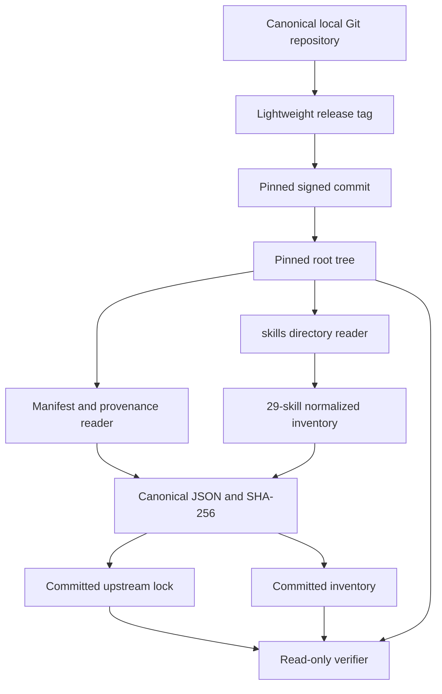

# Immutable Upstream Lock and Inventory - Plan

## Goal Capsule

- **Objective:** Implement only parent-plan U1: pin Compound Engineering 3.19.0 as an immutable, reviewable source identity and derive its complete 29-skill inventory without copying skill bodies.
- **Authority:** The parent Product Contract and its KTD1/KTD2/KTD4/KTD13 govern this slice; this document narrows delivery without changing those decisions.
- **Execution profile:** Contract-first and hermetic-test-first. The implementation reads immutable Git objects, produces deterministic artifacts, and fails without mutation on any identity, provenance, inventory, or secret-policy mismatch.
- **Stop conditions:** Stop if the pinned tag no longer resolves to the settled commit/tree, the source does not contain exactly 29 valid skills including `lfg`, provenance evidence cannot be bound independently of mutable working-tree state, or verification requires plugin execution.
- **Tail ownership:** This PR ships U1 only. ZZA-70 remains open for U2–U18 after this PR.

---

## Product Contract

### Summary

The harness needs one immutable Compound Engineering source identity before contracts, runtime adapters, gates, or conformance cells can be trusted. This slice commits a source-derived inventory and a lock that binds the upstream repository, lightweight release tag target, commit, root tree, manifest version, dependency lock, signed-commit evidence, executable inventory, lifecycle policy, and canonical inventory digest.

### Problem Frame

The locally installed Compound Engineering checkout follows `main` and can advance independently of the version the harness certifies. A package version string or a committed list alone cannot prove which source tree supplied the skills, and deriving expected and actual inventories from the same committed artifact would make drift checks circular.

U1 therefore reads the pinned Git objects directly, discovers every `skills/*/SKILL.md`, validates path/frontmatter identity, and compares regenerated canonical artifacts with committed bytes. It never loads the plugin, runs lifecycle scripts, installs dependencies, or maps features to runtimes.

### Requirements

**Immutable source and provenance**

- R1. The lock must bind canonical repository `EveryInc/compound-engineering-plugin`, HTTPS source URL, tag `compound-engineering-v3.19.0`, commit `1756c0b9f3cf94493f287ea29ae766ad668fb7cf`, root tree `808d20cc08a2b45e0200e68f5b9f604c55cf8a06`, and manifest identity `compound-engineering@3.19.0`.
- R2. The lock must bind the release commit's signed payload/signature evidence, GitHub's reviewed verification receipt, complete-tree identity, `bun.lock` blob identity, executable-file inventory digest, and a default-deny package-script execution policy without claiming that offline verification proves authenticated acquisition.
- R3. Offline verification must reject mutable or abbreviated refs, wrong configured owner/repository or non-HTTPS origin, tag/commit/tree/version drift, signature or payload drift, dependency-lock drift, executable drift, and package-script drift before plugin code can load; authenticated acquisition remains a separately reviewed receipt captured in the lock.

**Inventory and deterministic artifacts**

- R4. Inventory derivation must inspect every direct `skills/*/SKILL.md` from the pinned tree, validate directory/frontmatter names, reject duplicates or malformed metadata, and produce exactly 29 lexicographically sorted IDs including `lfg` with no platform filtering.
- R5. Canonical hashing must recursively sort object keys, preserve array order, use UTF-8 JSON bytes, and keep semantic canonical bytes distinct from deterministic pretty-printed committed bytes.
- R6. The committed inventory and lock must be secret-free, contain no copied skill bodies, and regenerate byte-for-byte from the pinned source.

**Failure and scope boundaries**

- R7. The default verification path and every pre-write validation failure must exit non-zero without changing the source checkout, lock, inventory, or unrelated repository files.
- R8. Artifact generation must require an explicit write flag, validate the complete generation before mutation, replace each artifact atomically, publish inventory before its digest-binding lock, and leave any interruption as a detectable mixed generation that verification rejects and a later explicit write repairs.
- R9. This slice must not create U2 schemas/profiles, U3 runtime descriptors, U16 baselines, runtime adapters, native gates, scenario contracts, or conformance cells.

### Acceptance Examples

- AE1. Given the canonical checkout containing the settled Git objects, verification derives 29 IDs including `lfg`, reproduces both committed artifacts, and exits successfully without writes.
- AE2. Given a checkout whose current branch has advanced while the pinned objects still exist, verification reads the pinned tag/commit/tree rather than the working tree and still reproduces the same artifacts.
- AE3. Given a synthetic source with an added, removed, duplicate, malformed, path-mismatched, or platform-filtered skill, inventory verification fails and leaves pre-existing artifacts unchanged.
- AE4. Given a changed tag target, tree, manifest version, signed payload/signature digest, GitHub verification receipt, dependency lock, executable mode/path set, or package-script policy, verification fails before any source code execution.
- AE5. Given secret-like fields or credential material in a generated model, validation rejects it before hashing or writing while normal Git hashes, HTTPS URLs, and signature material remain allowed.

### Success Criteria

- The pinned tag resolves to the settled commit/tree and all manifest identities agree on version 3.19.0.
- The source-derived inventory contains exactly 29 unique, sorted skill IDs and includes `lfg`.
- Repeated generation produces byte-identical artifacts and read-only verification leaves the worktree clean.
- All drift, hostile metadata, secret, and no-mutation fixtures pass without network, model, runtime SDK, dependency installation, or plugin execution.

### Scope Boundaries

#### Deferred to Follow-Up Work

- U2 neutral feature/profile/result schemas
- U3 runtime descriptors and 116 expected matrix keys
- U16 native-gate, provider-routing, OCI, and Tart characterization
- Runtime installation, adapters, evidence execution, and conformance scenarios

#### Outside This Slice

- Copying or transforming upstream `SKILL.md` bodies
- Trusting the current checkout, README count, package version, or committed inventory as the derivation source
- Running upstream package scripts, lifecycle hooks, plugin code, agents, models, or tools
- Fetching or mutating the upstream repository during default verification

### Sources

- `docs/plans/2026-07-15-ZZA-70-oh-my-harness-plan.md`
- `scripts/profile-pack.mjs`
- `docs/solutions/workflow/local-pi-distribution-parallel-prs.md`
- Compound Engineering tag `compound-engineering-v3.19.0` at commit `1756c0b9f3cf94493f287ea29ae766ad668fb7cf`
- GitHub commit verification record: <https://api.github.com/repos/EveryInc/compound-engineering-plugin/commits/1756c0b9f3cf94493f287ea29ae766ad668fb7cf>

---

## Planning Contract

### Product Contract Preservation

The parent plan's R1 and R20 obligations and KTD1/KTD2/KTD4/KTD13 decisions are unchanged. This slice implements parent U1 only and does not reduce the later 116-cell or four-runtime completion contract.

### Key Technical Decisions

- KTD1. **Ship U1 as an independent first PR.** (session-settled: user-approved — chosen over widening the first implementation PR to U1–U3 or U16: a focused immutable source boundary gives later units one reviewable trust root.)
- KTD2. **Pin Compound Engineering 3.19.0 by tag, commit, tree, manifest, and derived inventory.** (session-settled: user-approved — chosen over following the currently installed latest checkout: reproducible certification requires an immutable source identity.)
- KTD3. **Reuse upstream source without copying skill bodies.** (session-settled: user-approved — chosen over vendoring or converting CE skills: upstream owns workflow behavior while the harness owns identity and conformance contracts.)
- KTD4. **Read Git objects, not the working tree.** The verifier resolves the lightweight tag target, commit tree, manifests, lockfile, executable modes, and skill blobs from the object database so branch state and checkout mutations cannot influence expected content.
- KTD5. **Treat the lock as a reviewed trust receipt, not a self-issued attestation.** It records a reviewed GitHub API verification receipt and binds the local commit's signature/payload digests plus configured repository identity. Offline verification proves pinned content identity and expected origin configuration, not authenticated acquisition from GitHub.
- KTD6. **Keep canonical semantic bytes separate from committed presentation bytes.** Digests cover compact recursively canonicalized JSON; committed JSON is stable two-space formatting with a trailing newline and is compared byte-for-byte after semantic validation.
- KTD7. **Separate verify from write and make partial publication detectable.** Verification is always read-only. Generation requires `--write`, validates the complete model first, writes inventory before the lock that binds its digest, atomically replaces each file, and rejects or repairs a mixed generation only on a later explicit invocation.

### High-Level Technical Design

The production path exposes pure canonicalization and model-building functions plus a small CLI. Tests use synthetic Git repositories and independently fixed expected IDs/digests; they do not reuse committed artifacts to decide which skills should exist.

### Artifact Contracts

The inventory artifact has these normative fields:

| Field | Meaning |
| --- | --- |
| `schemaVersion` | Exact U1 artifact schema version |
| `source` | Tag, commit, and tree identity used for derivation |
| `derivation` | Direct `skills/*/SKILL.md` pattern, lexical ordering, expected count 29, and explicit `runtimeFilters: []` |
| `skills` | Ordered records containing stable `id`, source `path`, and Git blob object ID; never skill body content |

The lock artifact has these normative fields:

| Field | Meaning |
| --- | --- |
| `schemaVersion` | Exact U1 lock schema version validated by `upstream-lock.schema.json` |
| `source` | Owner, repository, HTTPS URL, lightweight tag, commit, and root tree |
| `manifest` | `package.json` path, blob object ID, name, and version |
| `provenance` | Provider `github`, commit API URL, reviewed `verified`/`reason`/`verifiedAt`, and SHA-256 digests of the signed payload and armored signature |
| `dependencyLock` | `bun.lock` path and Git blob object ID |
| `executables` | Ordered path/mode/blob records plus their canonical SHA-256 digest |
| `packageScripts` | Ordered package script records plus canonical digest and `executionPolicy: deny-all` |
| `inventory` | Inventory path, count, and canonical SHA-256 digest |

The schema validates the lock's closed structural shape. Inventory structure, cross-artifact references, Git relationships, cardinality, canonical digests, and secret policy are explicit semantic checks in `scripts/harness/upstream.mjs`.

### Implementation Constraints

- Use Node ESM and built-in modules, following `scripts/profile-pack.mjs`; add no runtime framework or YAML dependency for the restricted frontmatter fields required here.
- Resolve one trusted absolute Git executable and invoke it with shell-free structured argv, fixed cwd, bounded output, no prompting/pager/optional locks/lazy fetch, replacement objects disabled, isolated empty global/system config, and inherited Git directory/object-store/namespace variables removed.
- Treat the host Git executable and absence of a concurrent malicious same-UID process as explicit trust assumptions; local remote configuration is evidence of expected origin only, not authenticated acquisition.
- Before writing, `lstat` every existing path component from repository root through each artifact parent, reject symlinks/non-directories, verify resolved parents remain within the repository root, create same-directory temporary files with mode `0600`, and rename only after complete validation.
- Publish inventory first and lock last. An interruption can leave a mixed generation, but the lock's inventory digest makes it non-passing and a later explicit `--write` may repair it after revalidation.
- Inventory derivation accepts no runtime/platform filter and treats all 29 direct skill directories, including `lfg`, as canonical.
- Package-script execution is default-deny with no exceptions in U1. Record every `package.json` script and its canonical digest, but never execute one.
- Secret rejection normalizes field names and checks credential-bearing values while allowing expected Git hashes, public HTTPS URLs, and armored signature text.

---

## Implementation Units

### U1. Immutable upstream lock and source-derived inventory

- **Goal:** Create the complete parent-U1 trust root and its hermetic drift tests as one atomic implementation unit.
- **Requirements:** R1–R9; AE1–AE5; parent-plan R1/R20 and KTD1/KTD2/KTD4/KTD13.
- **Dependencies:** None.
- **Files:** Create `harness/contracts/upstream-lock.schema.json`, `harness/locks/compound-engineering-v3.19.0.lock.json`, `harness/inventory/compound-engineering-v3.19.0.json`, `scripts/harness/canonical.mjs`, `scripts/harness/upstream.mjs`, and `tests/harness/inventory.test.mjs`; modify `package.json`.
- **Approach:** Implement canonical JSON/hash and secret rejection first. Add an immutable Git-object reader that validates repository identity and builds provenance plus inventory models from the pinned tree. Render the two generated artifacts only after schema and semantic validation, then expose read-only verification and explicit generation commands. Generate the committed artifacts from the canonical CE 3.19.0 repository and verify them through an independent test oracle.
- **Execution note:** Start with failing canonicalization, source-identity, 29-skill, drift, and no-mutation tests. Do not broaden into U2/U3/U16 when characterization questions appear.
- **Patterns to follow:** `scripts/profile-pack.mjs` for recursive canonicalization, SHA-256, deterministic rendering, secret rejection, explicit write mode, and byte comparison; `extensions/workspace-connectors/setup-state.ts` for safe atomic replacement and unsafe target refusal.
- **Test scenarios:**
  - Covers AE1. Exact tag/commit/tree/manifests produce 29 sorted IDs including `lfg`, the expected canonical digests, and byte-identical committed artifacts.
  - Covers AE2. Advancing the fixture's checked-out branch without changing pinned objects does not change derivation.
  - Covers AE3. Added, removed, duplicate, malformed, nested, path/frontmatter-mismatched, or filtered skills fail and preserve artifact hashes.
  - Covers AE4. Mutable/abbreviated ref, spoofed configured owner/repository, non-HTTPS source, changed tag target, wrong commit/tree/version, signature/payload or GitHub receipt drift, `bun.lock`, executable set, or package-script drift fails before execution or write.
  - Covers AE5. Nested and case-varied secret keys, bearer/basic authorization values, private keys, and known token shapes fail; public URLs, Git hashes, signature text, and redacted placeholders pass.
  - Object key permutations hash identically, array permutations do not, unsupported JSON values fail, and pretty output always has two-space indentation plus one trailing newline.
  - Replacement refs, object alternates, hostile Git config/environment, lazy-fetch-required objects, missing/corrupt object database, subprocess timeout/overflow, final/ancestor symlink, non-regular output target, concurrent parent swap, and stale pre-image remain non-pass without changing outside-root canaries.
  - Interruption before publication changes neither artifact; interruption after inventory publication leaves a mixed generation that verify rejects; a later explicit write safely republishes inventory then lock.
  - Verification and tests run with network-disabled assumptions and do not execute package scripts, plugin code, or skill contents.
- **Verification:** The U1 test suite passes from a clean checkout, read-only verification exits zero against the canonical CE repository, explicit generation followed by verification is a no-op, existing profile and connector tests remain green, and `git diff --check` reports no errors.

---

## Verification Contract

| Gate | Command | Passing signal |
| --- | --- | --- |
| U1 unit and fixture tests | `npm run test:harness` | Canonicalization, identity, inventory, provenance, drift, hostile target, secret, and no-mutation tests pass |
| Canonical source verification | `npm run harness:upstream:verify -- --source <compound-engineering-checkout>` | Pinned objects regenerate both committed artifacts with no writes |
| Existing profile compatibility | `npm run profile:verify` | All existing profiles and lock remain deterministic and secret-free |
| Existing Pi integrations | `npm run test:workspace-connectors` | Existing connector, setup doctor, OMP, and compatibility tests pass |
| Generated tree cleanliness | `git diff --exit-code -- harness/` after verify | Read-only verification creates no generated drift |
| Static checks | `git diff --check` | No whitespace errors |

---

## Definition of Done

### Global

- The source lock schema, lock, and inventory are committed, secret-free, deterministic, and traceable to the exact CE 3.19.0 objects.
- All 29 direct skills, including `lfg`, are represented once without copied bodies or runtime filtering.
- Verification and pre-write validation are read-only; all such failure fixtures prove no mutation of source, artifacts, or outside-root canaries.
- Interrupted explicit generation is either unchanged or a detectable mixed generation; it never passes verification and is repairable only by another validated explicit write.
- No U2/U3/U16 or runtime adapter files enter the diff.
- Existing profile and connector behavior remains unchanged and verified.
- Temporary Git fixtures, generated test repositories, subprocesses, and abandoned experiment code are removed.

### Per Unit

| Unit | Done when |
| --- | --- |
| U1 | Exact CE identity and provenance bind to a reproducible 29-skill inventory; committed bytes verify; every identity, drift, secret, and no-mutation fixture passes |
