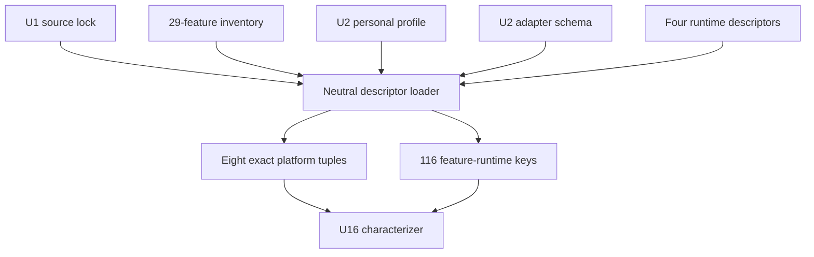

<!-- markdownlint-disable MD013 MD025 -->

# Runtime descriptors and expected cell keys - Plan

## Goal Capsule

- **Objective:** Implement parent-plan U3 by committing exact Codex, OpenCode, Claude Code, and Pi descriptor instances and a deterministic 29-feature × 4-runtime expected-key planner.
- **Authority:** Parent ZZA-70 Product Contract and KTD2/KTD4/KTD7/KTD8/KTD12 remain authoritative; U1 trust receipt and U2 profile are immutable inputs, while the runtime-adapter contract undergoes the reviewed 1.0→1.1 migration required by U3.
- **Execution profile:** Contract-first and source-backed. Start with failing descriptor/cross-reference/cardinality tests, then fill only facts supported by the eight reviewed immutable release assets.
- **Stop conditions:** Stop if a descriptor needs copied CE skill bodies, mutable acquisition identity, shell command strings, an invented native hook, an unsupported schema field, platform filtering, or U16 runtime execution.
- **Tail ownership:** ZZA-72 ships U3 as an independent PR. ZZA-73/U16 may research in parallel but its implementation branch must consume the finalized U3 descriptor and helper contracts.

---

## Product Contract

### Summary

U3 turns the U2 runtime-adapter schema and `personal-v1` intent into four source-backed descriptor instances and one deterministic expected-cell planner. It declares what each exact runtime/platform baseline must expose without claiming that native gates or binaries have already passed characterization.

### Problem Frame

U1 proves which 29 Compound Engineering skills exist and U2 defines the neutral descriptor shape, but the profile currently points to absent files under `harness/adapters/`. No later generator, doctor, characterizer, or matrix planner can resolve an exact runtime tuple or distinguish a complete 116-key expectation from a filtered or fabricated one.

Descriptor instances must bind immutable acquisition and executable identity while keeping observed runtime proof in U16. Mixing declarations with characterization would let speculative hooks or current-machine state become product truth.

### Requirements

#### Descriptor identity and native declarations

- R1. Exactly four committed descriptors must exist with stable IDs `claude-code`, `codex`, `opencode`, and `pi`, matching the exact versions in `personal-v1.profile.json`.
- R2. Every descriptor must bind exactly `linux-x64-release` and `darwin-arm64-personal` to one named immutable GitHub release asset, its provider-published archive digest, normalized archive member path, runtime variant/ABI, and extracted executable SHA-256.
- R3. Every descriptor must declare structured native install, discovery, invocation, pre-model gate candidate, and headless evidence protocol without copying Compound Engineering skill bodies or embedding shell command strings. The pre-model declaration must carry an exact runtime surface ID, immutable source reference, configuration scope, and `candidate` status so U16 can characterize it without inventing semantics.
- R4. Descriptor companions must exactly match the profile; Pi requires `pi-subagents@0.34.0` and preserves optional `pi-ask-user@0.13.0` with `plain-text-question` fallback.
- R5. Native declarations are characterization candidates, not passing readiness claims; U16 owns behavioral proof and may block a declared lane.

#### Cross-reference and expected-key planning

- R6. A shared neutral helper must load and semantically validate U1 inventory, U2 profile, the amended adapter schema, and all four descriptor instances before returning tuples or keys. The bounded schema evaluator currently embedded in U2 tests must be extracted into a shared neutral module with parity coverage rather than reimplemented.
- R7. Profile IDs, versions, descriptor refs, platform refs, OS/architecture, variants, archive members, companions, descriptor IDs, gate source refs, and source identity must agree exactly; duplicate, missing, extra, unknown, filtered, or membership-drifted sets fail closed. Equivalent input permutations normalize to the same canonical output.
- R8. Expected keys use the exact grammar `<feature-id>::<runtime-id>` and are the lexicographically ordered Cartesian product of the 29 source-derived feature IDs and four runtime IDs, yielding exactly 116 unique stable keys independent of scenarios or platform lanes.
- R9. Expected-key generation must fail for a changed CE lock/inventory identity, descriptor coverage drift, malformed or duplicate key, missing runtime, extra runtime, runtime filter, non-canonical supplied output order, or cardinality other than 116.

#### Scope and compatibility

- R10. U3 must not execute a coding-agent binary, provider, native gate, model request, OCI/Tart backend, scenario, or conformance cell.
- R11. Existing U1, U2, Pi profile, connector, setup-doctor, OMP, and package behavior must remain compatible.
- R12. Committed JSON and helper output must remain deterministic and secret-free and must not include local paths, credentials, auth headers, timestamps, mutable URLs, shell interpreters, or unreviewed redirects. Release acquisition is allowlisted by canonical HTTPS host/owner/repository/tag/asset and reviewed checksum or GitHub asset digest.

### Acceptance Examples

- AE1. Given the committed U1 inventory and `personal-v1`, loading all descriptors returns four exact runtime records, eight platform tuples, and 116 unique expected keys in canonical order.
- AE2. Given one descriptor with a wrong version, platform ID, OS/architecture/variant, release owner/tag/asset/archive member/digest, executable digest, gate surface/source/status, companion, native declaration, or evidence protocol, validation fails before keys are returned.
- AE3. Given a 29-skill inventory with one item added, removed, duplicated, filtered, or bound to a different source identity, expected-key verification fails rather than adapting cardinality.
- AE4. Given a descriptor containing copied skill content, shell interpreter/metacharacters, POSIX/Windows/home-relative local paths, `file:` URL, secret-bearing field/value, mutable branch/install identity, unreviewed redirect, or undeclared property, validation fails.
- AE5. Given unchanged committed artifacts, repeated load and key generation produce byte-identical canonical JSON and do not mutate the repository or user configuration.

### Success Criteria

- Four descriptor instances validate under the narrowly amended closed adapter schema and semantic cross-reference rules.
- Eight exact platform tuple declarations are backed by immutable provider release-asset acquisition evidence.
- The expected-key planner returns exactly 116 stable unique feature/runtime keys and rejects every coverage-drift fixture.
- U16 can import one helper boundary rather than reimplement profile, tuple, descriptor, or expected-key semantics.
- Current harness, profile, and connector regression suites remain green.

### Scope Boundaries

#### Included

- An intentional `runtime-adapter` contract migration from `1.0.0` to `1.1.0` for exact release-asset/member, typed action tokens, and pre-model source identity; the repository has no committed 1.0 descriptor instances, while the U2 1.0 fixture remains as an explicit rejected legacy fixture
- Four runtime descriptor JSON instances
- Shared bounded JSON Schema evaluator plus neutral descriptor/profile/inventory loader and semantic validator
- Deterministic expected feature/runtime key planner
- Offline release-metadata fixtures, descriptor fixtures, and coverage tests

#### Deferred to Follow-Up Work

- ZZA-73/U16 behavioral proof for exact binary, native pre-model gate, provider routing, headless evidence, OCI, and Tart
- U7–U10 product runtime adapters and native gate artifacts
- U15 feature scenarios and full conformance execution

#### Outside This Slice

- Copying or converting upstream `SKILL.md` bodies
- Treating a declaration or current local installation as passing runtime readiness
- Installing into personal runtime homes
- Changing the U1 source lock, U2 profile contract, baseline versions, Pi dependency/lockfile, or any adapter schema field beyond the reviewed U3 provenance/member/gate-source amendment

### Dependencies and Assumptions

- U1 lock and inventory at CE tag `compound-engineering-v3.19.0`, commit `1756c0b9f3cf94493f287ea29ae766ad668fb7cf`, and tree `808d20cc08a2b45e0200e68f5b9f604c55cf8a06` remain unchanged.
- Exact packages/releases exist for Codex `0.144.4`, OpenCode `1.18.0`, Claude Code `2.1.210`, and Pi `0.80.7`; implementation verifies downloaded bytes rather than trusting installed local versions.
- A descriptor may name a native gate candidate only when exact-version source or official documentation supports the surface; U16 still decides whether it is unavoidable and fail-closed.

---

## Planning Contract

### Product Contract Preservation

This slice preserves parent requirements R3, R7–R9, R11, R13, R19 and KTD2/KTD4/KTD7/KTD8/KTD12. It narrows parent U3 without reducing the later U16 proof or 116-cell release obligation.

### Key Technical Decisions

- KTD1. **Keep descriptors declarative and U16 non-passing by construction.** Descriptor instances name expected immutable identities and native surfaces; they carry no readiness verdict or observed proof.
- KTD2. **Use provider-published GitHub release archives as U3 acquisition authority.** Each tuple selects one exact tag/asset and binds the provider-published archive digest, normalized executable member, and extracted executable digest. Current local binaries, NPM wrappers, postinstall scripts, and moving installers are diagnostic inputs only.
- KTD3. **Add one neutral helper module for schema and semantic resolution.** The U2 bounded schema evaluator is extracted into a shared module, then profile/descriptor cross-references, tuple normalization, and expected-key generation share one implementation so U16 and later units do not create divergent parsers.
- KTD4. **Define expected keys at feature/runtime granularity.** The required matrix is 29 features × 4 runtimes; Linux and Darwin lanes belong to execution/certification receipts and must not double the key count. The public key is `<feature-id>::<runtime-id>`.
- KTD5. **Reject semantic drift while canonicalizing equivalent permutations.** Missing, extra, duplicate, filtered, malformed, mismatched, or non-canonical supplied outputs fail; shuffled equivalent source sets produce the same canonical generated list.
- KTD6. **Use typed native action tokens.** Schema `1.1.0` replaces free-string argv with an allowlisted `executableId` plus token objects: `{kind:"literal", value:<closed safe token>}` or `{kind:"placeholder", id:<enum>}`. Placeholders are limited to `runtime-root`, `payload-root`, `workspace-root`, and `evidence-endpoint`; POSIX/Windows/home paths, URL userinfo/credential query, control/NUL characters, shell interpreters/metacharacters, mutable refs, and unknown tokens fail semantic validation.
- KTD7. **Perform one explicit U2 contract migration.** `runtime-adapter.schema.json` moves from `1.0.0` to `1.1.0` and gains release asset/member/variant provenance, typed actions, and exact pre-model surface/source/candidate fields. There are no committed 1.0 descriptors to preserve; the old U2 fixture becomes a rejected legacy-version regression. Behavioral proof, control envelopes, providers, and readiness verdicts remain U16 receipts.

### Assumptions

- Immutable GitHub release assets are reachable during implementation for digest derivation; committed tests use captured provider metadata and small hostile archives and do not require network.
- Release archives can be extracted without running package lifecycle scripts; extraction is bounded to regular files/directories and rejects links, devices, FIFOs, sockets, traversal, normalized-path collisions, unsafe modes, and file-count/size/ratio overflow.
- The exact OpenCode and Claude Code pre-model surfaces remain `candidate` declarations pending U16 black-box characterization rather than passing readiness claims.

### High-Level Technical Design



The loader validates every input and cross-reference before returning a tuple or key. Descriptor declarations flow forward to U16, but no U16 observation flows back into U3 except through a later separately reviewed descriptor update.

### Exact Acquisition Decisions

| Runtime/platform | Immutable asset | Archive SHA-256 | Variant |
| --- | --- | --- | --- |
| Codex Linux x64 | `openai/codex@rust-v0.144.4/codex-x86_64-unknown-linux-musl.tar.gz` | `37c985be9d89e8c4f43b3aa0594c1213eac212d30ae2b95221f08fec807515d1` | `musl` |
| Codex Darwin arm64 | `openai/codex@rust-v0.144.4/codex-aarch64-apple-darwin.tar.gz` | `77c8969a481302f9db1d9ea2a6c21c083abae3f1a8fc8a7275dc38323699391e` | `darwin` |
| OpenCode Linux x64 | `anomalyco/opencode@v1.18.0/opencode-linux-x64-baseline.tar.gz` | `83216f77d9fb7f6aaa2642074905814f7aca52483dd2f0678f1ade5c4dc84eb9` | `baseline-glibc` |
| OpenCode Darwin arm64 | `anomalyco/opencode@v1.18.0/opencode-darwin-arm64.zip` | `2b2b5e2da7a3bc82cad8551373114683e8632df09f5ea6af1b9ea36961795abd` | `darwin` |
| Claude Code Linux x64 | `anthropics/claude-code@v2.1.210/claude-linux-x64.tar.gz` | `3db32c13a1e16b2d867d096a9808f42d8678c5597d10799a1904fd897e043beb` | `glibc` |
| Claude Code Darwin arm64 | `anthropics/claude-code@v2.1.210/claude-darwin-arm64.tar.gz` | `0d30caeef4dd693b331da31e0e0250e4ca6c5ec811f58ce961c2441d27efb1a2` | `darwin` |
| Pi Linux x64 | `earendil-works/pi@v0.80.7/pi-linux-x64.tar.gz` | `c5f5a9a77a38e68fcb089dd4e3505abb64c98d19595b55818c961be779889719` | `standalone` |
| Pi Darwin arm64 | `earendil-works/pi@v0.80.7/pi-darwin-arm64.tar.gz` | `0f15771ef76ecd69b03e28fecf0c512593ff6e2477acf39e35bc2c8a4056d1e3` | `standalone` |

For each row, U1 records the normalized archive member path and extracted executable digest using the retained offline derivation helper. Exactly one regular executable with the runtime's expected basename is allowed; a different or ambiguous layout is a stop condition rather than an inferred choice. The committed descriptor then makes that member path exact.

### Exact Native-Surface Decisions

| Runtime | Gate candidate and immutable source anchor | Configuration scope/status | Invocation/headless protocol |
| --- | --- | --- | --- |
| Codex | `UserPromptSubmit`; `openai/codex@315195492c80fdade38e917c18f9584efd599304`, `codex-rs/hooks/src/events/user_prompt_submit.rs` and `codex-rs/hooks/src/engine/output_parser.rs` | `managed-hooks`; `candidate` | runtime tokens `exec`, `--json`; JSONL |
| OpenCode | `chat.message`; `anomalyco/opencode@3a1c6df9e24672f0761a6ced18e1315d89334baf`, `packages/plugin/src/index.ts::Hooks["chat.message"]` and `packages/opencode/src/session/prompt.ts` call site | `project-plugin`; `candidate-deny-unproven` | runtime tokens `run`, `--format`, `json`; JSON |
| Claude Code | `UserPromptSubmit`; `anthropics/claude-code@67f390c9a0b1440d369aebe2ff6a5023db35bf8e`, `plugins/plugin-dev/skills/hook-development/SKILL.md` supported-events/output contract and `plugins/hookify/hooks/hooks.json` | `managed-plugin-hooks`; `candidate` | runtime tokens `-p`, `--output-format`, `stream-json`, `--verbose`; JSONL |
| Pi | `input`; `earendil-works/pi@216e672e7c9fc65682553394b74e483c0c9e47f7`, `packages/coding-agent/src/core/extensions/types.ts::InputEvent` and `packages/coding-agent/src/core/extensions/runner.ts` | `package-extension`; `candidate` | runtime tokens `--mode`, `rpc`; RPC |

Install and discovery actions use `executableId: harness-lifecycle` with exact literal operations `install-native-payload` and `verify-native-discovery` plus a typed `payload-root` placeholder; invocation uses `executableId: runtime` and only the literal tokens above. U16, not U3, determines whether each candidate blocks before provider access. In particular, OpenCode `permission.ask` is not declared because exact-version source does not prove it is invoked.

### Output Structure

```text
harness/
├── adapters/
│   ├── claude-code.json
│   ├── codex.json
│   ├── opencode.json
│   └── pi.json
└── contracts/
    └── runtime-adapter.schema.json
scripts/
└── harness/
    ├── acquisition.mjs
    ├── descriptors.mjs
    └── schema.mjs
tests/
└── harness/
    ├── descriptor-coverage.test.mjs
    ├── descriptor.test.mjs
    └── fixtures/adapters/
        ├── release-metadata/
        └── hostile-archives/
```

### Implementation Constraints

- Use Node ESM and built-in modules plus exact dev dependencies `tar-stream@3.2.0` and `yauzl@3.4.0`; commit lockfile changes and import them only from the offline acquisition helper, not runtime product paths.
- Stream-inspect archives without materializing non-selected members. Limits are: 256 MiB compressed archive, 256 entries, 512 MiB total declared/uncompressed bytes, 384 MiB selected member, and 100:1 maximum member ratio. These two implementation-time bounds are the narrow minimum proven by exact assets: Pi Linux contains 243 entries and Codex Linux contains one 298,553,392-byte executable. Validate normalized NFC/case-folded names, type, mode, and declared sizes before allocation/write; use repository-external `mkdtemp`, component-wise no-follow checks, and unconditional cleanup if temporary materialization is required.
- Reuse `canonicalSha256` and `assertSecretFree` from `scripts/harness/canonical.mjs`, and extend deterministic validation with explicit path/URL/shell/mutable-ref rules rather than assuming `assertSecretFree` covers them.
- Extract the bounded U2 JSON Schema evaluator to `scripts/harness/schema.mjs`; schema and semantic validation remain separate gates with parity tests.
- Resolve paths relative to repository-owned profile/descriptor refs and reject absolute, home-relative, `file:` or escaping paths across POSIX and Windows syntax.
- Pin GitHub release asset ID/API URL plus reviewed digest for each row. Public download permits at most three HTTPS redirects only across `github.com`, `api.github.com`, `objects.githubusercontent.com`, and `release-assets.githubusercontent.com`; strip auth/cookie headers on every redirect, reject userinfo/fragments/unexpected query inputs, then require the final archive SHA-256 before parsing.
- Do not execute package lifecycle scripts or coding-agent binaries while deriving descriptor artifacts.
- Keep descriptor/action facts adapter-local; neutral helpers must not import runtime SDKs or Pi APIs.

### Sources and Research

- `docs/plans/2026-07-15-ZZA-70-oh-my-harness-plan.md` parent U3 and KTD2/KTD4/KTD7/KTD12
- `harness/contracts/runtime-adapter.schema.json` closed descriptor shape
- `harness/profiles/personal-v1.profile.json` exact runtime/platform/companion intent
- `harness/inventory/compound-engineering-v3.19.0.json` 29-feature source set
- `docs/solutions/architecture-patterns/immutable-upstream-trust-receipts.md` immutable-object and claim-boundary precedent
- [Compound Engineering 3.19.0 native target registry](https://github.com/EveryInc/compound-engineering-plugin/blob/1756c0b9f3cf94493f287ea29ae766ad668fb7cf/src/targets/index.ts)
- [Codex 0.144.4 release](https://github.com/openai/codex/releases/tag/rust-v0.144.4)
- [OpenCode 1.18.0 release](https://github.com/anomalyco/opencode/releases/tag/v1.18.0)
- [Claude Code 2.1.210 release](https://github.com/anthropics/claude-code/releases/tag/v2.1.210)
- [Pi 0.80.7 release](https://github.com/earendil-works/pi/releases/tag/v0.80.7)

---

## Implementation Units

### U0. Runtime-adapter 1.1 migration and shared schema evaluator

- **Goal:** Repair only the U2 fields and duplicated validator boundary that U3 evidence proved insufficient.
- **Requirements:** R2, R3, R6, R12; AE2, AE4; KTD3, KTD7.
- **Dependencies:** Merged U2 schema and test evaluator.
- **Files:** `harness/contracts/runtime-adapter.schema.json`, `scripts/harness/schema.mjs`, `tests/harness/contracts.test.mjs`.
- **Approach:** Extract the current bounded evaluator without semantic changes, then migrate the adapter contract to `1.1.0` with closed release provenance/member/variant, typed action-token, and exact pre-model `surfaceId`, immutable `sourceRef`, `configurationScope`, and candidate-status fields. Keep the schema runtime-neutral and reject unknown evidence claims.
- **Test scenarios:** Existing non-adapter U2 fixtures retain parity; each added required field has missing/malformed/unknown-property mutations; the old 1.0 adapter fixture, self-asserted generic gate, free-string argv, or incomplete artifact record fails with a focused migration error.
- **Verification:** The amended schema can express all eight exact acquisition rows and four exact candidate surfaces while still carrying no U16 behavioral verdict.

### U1. Immutable runtime descriptor instances

- **Goal:** Commit four exact, source-backed descriptor instances under runtime-adapter schema `1.1.0`.
- **Requirements:** R1–R5, R12; AE2, AE4; KTD1, KTD2, KTD6, KTD7.
- **Dependencies:** U0 plus merged U1/U2 parent artifacts.
- **Files:** `harness/adapters/claude-code.json`, `harness/adapters/codex.json`, `harness/adapters/opencode.json`, `harness/adapters/pi.json`, `scripts/harness/acquisition.mjs`, `tests/harness/descriptor.test.mjs`, `tests/harness/fixtures/adapters/**`.
- **Approach:** Verify the eight exact release archives against the decision table, derive normalized member/executable digests without running lifecycle scripts, and retain a pure offline derivation helper plus small safe/hostile archive fixtures. Populate native actions and candidate gate surfaces only from exact-version source or immutable official documentation, preserving U16 as behavioral proof owner.
- **Execution note:** Begin with failing fixtures for one valid descriptor family and one-field mutations, then derive committed values from downloaded immutable artifacts.
- **Patterns to follow:** U1 immutable-object derivation and U2 closed-schema fixtures.
- **Test scenarios:**
  - Exact four descriptors validate with two platform receipts each.
  - One-field mutations for ID, version, platform, OS, architecture, executable digest, acquisition kind/ID/digest, native action, gate phase, evidence protocol, companion, and optional extension fail.
  - Copied skill content, unknown properties, shell strings, absolute local paths, timestamps, secrets, and mutable branch identities fail.
  - Repeated offline derivation from the same exact archive bytes yields the same member path and executable digest.
  - Hardlink, symlink, device/FIFO/socket entry, traversal, absolute path, Unicode/case collision, unsafe mode, file-count/size/ratio overflow, wrong owner/tag/asset/digest, and redirect outside the reviewed release identity fail.
- **Verification:** Every descriptor passes schema and semantic validation, and each digest has a reproducible immutable artifact breadcrumb.

### U2. Neutral descriptor resolver and exact tuple validation

- **Goal:** Provide one reusable loader that resolves profile, inventory, lock, schema, and descriptor semantics.
- **Requirements:** R6, R7, R10–R12; AE1, AE2, AE5; KTD3, KTD5, KTD7.
- **Dependencies:** U0–U1.
- **Files:** `scripts/harness/descriptors.mjs`, `scripts/harness/schema.mjs`, `tests/harness/descriptor.test.mjs`.
- **Approach:** Load repository-relative refs, run the shared closed-shape evaluator, enforce stable IDs and exact cross-references, normalize equivalent input ordering, and return immutable runtime/platform records plus canonical digests.
- **Test scenarios:**
  - Profile runtime/version/descriptor/platform/companion references resolve exactly.
  - Unknown, duplicate, missing, extra, path-escaping, symlinked, lock-mismatched, and secret-bearing inputs fail before output.
  - Descriptor platform sets must equal the profile platform set and preserve exact OS/architecture.
  - Helper imports no runtime SDK, connector module, Pi API, or U16 coordinator code.
- **Verification:** U16 can import the helper and obtain eight exact tuple declarations without reading current user configuration.

### U3. Deterministic 116-key planner and coverage drift tests

- **Goal:** Generate and verify the exact source-feature/runtime key set without scenario or platform coupling.
- **Requirements:** R8–R12; AE1, AE3, AE5; KTD4, KTD5.
- **Dependencies:** U2.
- **Files:** `scripts/harness/descriptors.mjs`, `tests/harness/descriptor-coverage.test.mjs`.
- **Approach:** Expand lexicographically sorted inventory feature IDs against sorted runtime IDs, encode exactly `<feature-id>::<runtime-id>`, assert source identity and cardinality, and compare expected and supplied keys for exact membership and canonical output order when verification is requested.
- **Test scenarios:**
  - Committed inputs yield exactly 116 sorted unique keys in the fixed grammar.
  - Added, removed, duplicated, filtered, malformed, or lock-mismatched semantic feature/runtime sets cannot produce a passing verification.
  - Shuffled equivalent source arrays produce the same canonical output; a supplied expected-key list in non-canonical order fails.
  - Platform lanes do not multiply or reduce expected keys.
  - Missing, duplicate, extra, or lock-mismatched supplied keys fail with focused reasons.
  - Repeated generation is byte-identical and read-only.
- **Verification:** The planner proves 29 × 4 cardinality and rejects all expected-key drift before any runtime process is started.

### U4. Regression and scope audit

- **Goal:** Prove U3 adds declarations and planning only while preserving existing Pi compatibility and U1/U2 contracts.
- **Requirements:** R10–R12; KTD1, KTD7.
- **Dependencies:** U0–U3.
- **Files:** `package.json`, `package-lock.json`, `tests/harness/descriptor.test.mjs`, `tests/harness/descriptor-coverage.test.mjs`.
- **Approach:** Keep U3 tests directly under `tests/harness/` so the existing `test:harness` glob executes them, add the descriptor verification script and exact archive-parser dev dependencies, run all existing suites, and audit package/diff boundaries for runtime execution or personal-state access.
- **Test scenarios:**
  - Existing U1/U2 harness tests stay green.
  - Existing profile and workspace connector tests stay green.
  - Descriptor verification performs no model, provider, runtime, network-at-test, home, auth, session, OCI, or Tart access.
  - Package and import scans show no U16/runtime-adapter product implementation.
- **Verification:** All listed gates pass and the diff contains only the plan, four descriptors, neutral helper, focused tests, and minimal package script metadata.

---

## Verification Contract

| Gate | Command | Passing signal |
| --- | --- | --- |
| U3 descriptor and coverage tests | `npm run test:harness` | All U1/U2/U3 tests pass, including one-field descriptor mutations and exact 116-key drift fixtures |
| Descriptor read-only verification | `npm run harness:descriptors:verify` | Four descriptors, eight tuples, and 116 expected keys verify with no writes |
| U1 committed source compatibility | `npm run test:harness` | Offline lock/inventory identity tests remain byte-identical; no external checkout is required in CI |
| U1 independent supply-chain evidence | `npm run harness:upstream:verify -- --source "$CE_SOURCE_DIR"` | During implementation, a separately acquired canonical CE checkout reproduces the committed lock/inventory; command and source commit are recorded in work evidence rather than hidden behind a placeholder |
| Existing profile compatibility | `npm run profile:verify` | Four Pi distribution profiles and profile lock remain deterministic and secret-free |
| Existing integration compatibility | `npm run test:workspace-connectors` | Connector, setup-doctor, OMP, and compatibility tests pass |
| Static and scope checks | `git diff --check` plus diff/import audit | No whitespace issue, secret, runtime execution, U16 baseline, personal-state access, or copied CE body enters the diff |

Browser testing is not applicable because U3 adds declarative JSON and Node helpers/tests with no route or UI change.

---

## Definition of Done

- ZZA-72 has an implementation-ready local/Notion plan, synchronized ticket document, and reviewable U3-only branch.
- The explicit runtime-adapter 1.1 migration and shared bounded evaluator have parity tests and express exact release provenance/member, typed actions, and candidate gate source identity without U16 verdicts.
- Four exact descriptors carry reproducible immutable release archive and executable identity for both platform lanes.
- One neutral helper validates all source/profile/descriptor cross-references and exposes eight exact tuple declarations.
- Exactly 116 `<feature-id>::<runtime-id>` keys are generated in canonical order; semantic membership drift fails while equivalent input permutations normalize deterministically.
- No descriptor claims passing readiness and no runtime/model/provider/backend is executed by U3.
- U1/U2, profile, connector/setup/OMP, static, secret, and scope gates pass.
- Downloaded archives, temporary extraction directories, and experimental code are removed from the branch; the supported offline derivation helper and small non-secret fixtures remain for reproducibility.
- ZZA-73 can consume the finalized helper and descriptors without reimplementing their semantics.
