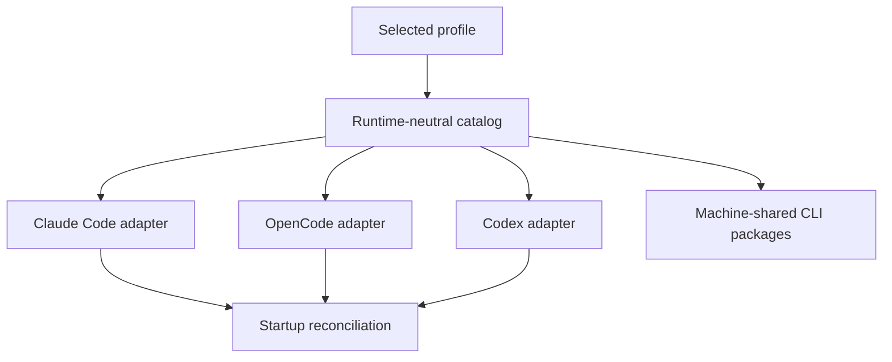
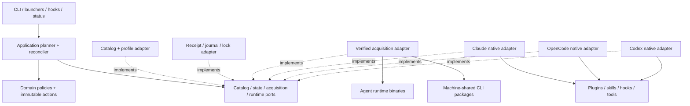
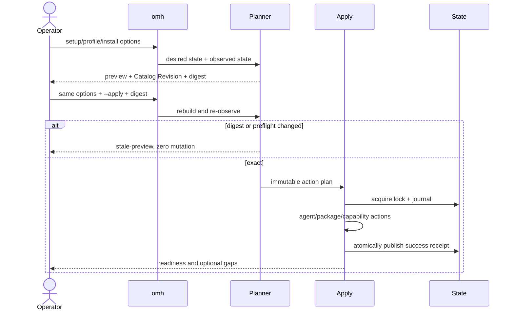
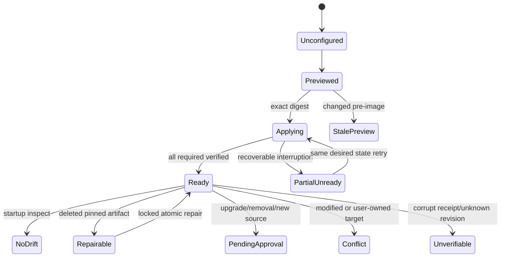
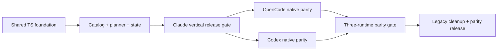

# Claude-first Oh My Harness v2 - Plan

## Goal Capsule

- **Objective:** Rebuild `omh` as a strict TypeScript CLI that configures a selected coding-agent environment from a profile, delivers Claude Code first, and completes OpenCode and Codex runtime-native parity in the same implementation plan.
- **Product authority:** This Product Contract supersedes the four-runtime, Pi, and Compound Engineering distribution scope in `docs/plans/2026-07-15-ZZA-70-oh-my-harness-plan.md`. Older plans and external project pages remain historical records.
- **Execution profile:** Deep, cross-platform product reset with strict TypeScript migration, persistent local state, external package acquisition, three runtime-native integrations, and supply-chain-sensitive startup synchronization.
- **Stop conditions:** Stop rather than mutate when an exact preview is stale, provenance is unresolved, a required preflight fails, ownership is ambiguous, or the selected runtime cannot satisfy the declared capability contract.
- **Tail ownership:** U15 owns final cross-platform gates, packed-artifact verification, canonical documentation, and removal of temporary compatibility shims that no longer have an explicit consumer.
- **Open blockers:** None. The user explicitly selected one plan containing all three runtime adapters, with Claude Code remaining the first delivery gate.

---

## Product Contract

### Summary

Oh My Harness v2 installs selected coding agents, shared external CLI packages, and a curated cross-runtime capability set from built-in or published custom profiles.
The implementation extends the repository's preview-first and immutable-provenance patterns into a strict TypeScript core, completes Claude Code as the first vertical slice, and then delivers OpenCode and Codex parity from the same contracts.

### Problem Frame

The current product grew around four runtimes, Pi compatibility, a broad Compound Engineering snapshot, connector extensions, and a 116-cell compatibility model.
That breadth makes the common job—preparing a new machine with a preferred agent environment—hard to understand, maintain, and verify.
The management CLI is also implemented as untyped JavaScript even though the highest-risk surfaces are structured contracts, platform variants, version pins, and adapter outputs.

### Key Decisions

- **Claude Code first:** The first releasable path covers profile selection, Claude Code installation, official plugin reuse, managed skills, startup synchronization, and readiness checks before equivalent OpenCode and Codex adapters are completed.
- **One three-runtime implementation plan:** OpenCode and Codex are ordered after the Claude vertical slice but are not deferred to another planning artifact or optional follow-up.
- **Node.js with strict TypeScript:** The CLI stays in the repository's existing JavaScript ecosystem but moves its maintained source to strict TypeScript. A .NET rewrite is deferred because it would add a second build and distribution ecosystem without removing the Node-based plugin surfaces or npm-installed tools.
- **Runtime-neutral source of truth:** Profiles and capabilities express user intent independently of any agent's manifest format. Claude Code is the first adapter and upstream source preference, not the schema that other runtimes must copy.
- **Upstream first, repository-managed when absent:** A maintained official or upstream plugin or skill is referenced with reviewed provenance. Capabilities without an acceptable upstream implementation are created and published in this repository.
- **Profile-scoped package importance:** `personal` requires Linear, Notion, and GitHub CLI and treats Jira, Confluence, and GitLab CLI as optional. `company` reverses those groups. A custom profile declares its own classification.
- **Approved additive startup sync:** Initial setup previews every change and records the user's selected profile and sync consent. Agent startup may repair missing pinned content and add newly published, reviewed profile content within that consent, but version upgrades, removals, and unreviewed remote code require a new preview.
- **History-preserving reset:** Superseded Linear and Notion artifacts are canceled or archived rather than deleted, and a new v2 issue and wiki become canonical.

The source-of-truth fan-out is:



### Actors

- A1. **Operator** chooses agents and a profile, approves changes, and receives readiness evidence.
- A2. **Profile author** defines and validates a custom combination of agents, packages, capabilities, and synchronization policy.
- A3. **Registry maintainer** reviews upstream provenance and repository-managed capabilities before publication.
- A4. **Runtime adapter** translates the selected catalog into one agent's native installation and startup surfaces.
- A5. **Upstream provider** publishes an official or community CLI, plugin, skill, or language server referenced by the catalog.

### Requirements

**Agent selection and lifecycle**

- R1. The supported agent catalog contains Claude Code, OpenCode, and Codex, and the operator may select any non-empty combination.
- R2. Pi is absent from new setup, profile, status, and synchronization flows, while migration identifies existing Pi-managed state without deleting user-owned files.
- R3. Every setup, install, profile-change, and removal command is preview-only unless the operator applies the exact preview.
- R4. Claude Code reaches complete end-to-end readiness before OpenCode and Codex parity is declared.
- R33. A preview is bound to the Catalog Revision, selected profile and agents, platform, and observed managed state; apply rejects a changed or caller-mutated preview before the first external mutation.
- R34. The selected-agent override is persisted as desired state in the Managed-state Receipt rather than treated as a one-command transient.

**External CLI packages**

- R5. The package catalog contains Notion CLI, Linear CLI, Jira CLI, Confluence CLI, GitHub CLI (`gh`), and GitLab CLI (`glab`).
- R6. Every package entry provides a plain-language description, supplied executable names, supported platforms, reviewed installation sources, authentication guidance, version or provenance policy, and required or optional status for each built-in profile.
- R7. A missing required package prevents profile readiness, while a missing optional package remains visible without making the profile unready.
- R8. External CLI executables are installed once per machine and shared through trusted `PATH`, regardless of how many agents use them.
- R9. Authentication remains owned by each external CLI, and the harness neither stores credentials nor accepts tokens, passwords, or authorization headers as tool arguments.
- R10. Platform limitations are reported as unsupported with an actionable alternative instead of being reported as successful installation.

**Plugins, skills, and language servers**

- R11. The capability catalog contains LSP support for jdtls, Kotlin, C#, clangd, gopls, Pyright, and TypeScript.
- R12. The capability catalog also contains goal, deep-research, ideation, brainstorm, plan, code-review, doc-review, skill-creator, ralph-loop, and security-guidance.
- R13. For Claude Code, an acceptable official plugin or skill is preferred and pinned with reviewed provenance before a repository-managed replacement is considered.
- R14. A capability without an acceptable upstream implementation is created in this repository with a portable semantic contract and runtime-native packaging.
- R15. OpenCode and Codex adapters preserve each capability's trigger, intent, inputs, outputs, and safety behavior while using their native plugin, skill, hook, or configuration mechanisms.
- R16. An adapter must report unsupported behavior rather than label a partial or inert installation as ready.
- R17. LSP readiness distinguishes agent plugin configuration from the corresponding language-server executable and validates both.
- R18. Repository-managed capabilities are published through this repository and enter built-in profiles only after validation and review.

**Profiles and publication**

- R19. The built-in profile catalog contains `personal` and `company`, and setup allows the operator to override their default agent selection.
- R20. A profile declares selected agents, required and optional packages, enabled capabilities, platform conditions, and startup synchronization policy.
- R21. A custom profile can be created, validated, and previewed locally before publication.
- R22. Publishing a custom profile produces a reviewable repository change, and a merged profile becomes selectable by subsequent CLI releases or approved catalog synchronization.
- R23. Profile validation rejects unknown catalog IDs, contradictory requirements, unsupported runtime claims, and unresolved provenance.

**Synchronization, ownership, and evidence**

- R24. Initial bootstrap installs only the agents and profile content shown in an explicitly applied preview.
- R25. After bootstrap, each installed agent receives a native startup integration that detects drift from the approved profile.
- R26. Startup synchronization is idempotent and may automatically repair missing pinned content or apply reviewed additive profile changes covered by the recorded consent.
- R27. Startup synchronization never silently removes content, overwrites user-owned files, changes an approved version pin, or executes unreviewed remote code.
- R28. Status and doctor output identify the selected profile, catalog revision, per-agent adapter state, required and optional package state, capability provenance, drift, and the exact remediation path.
- R29. Managed files and receipts have explicit ownership so migration, repair, and removal preserve unrelated user configuration.
- R35. Startup synchronization uses a bounded cross-process single-writer lock, crash-safe atomic publication, and structured outcomes shared by runtime context, `status`, and `doctor`.
- R36. Runtime tool exposure is derived from the selected Environment Profile, and an unexposed backend is rejected again at execution time.
- R37. A managed launcher reconciles approved content before runtime discovery; a native direct-launch hook detects drift and reports honestly when repaired content requires another restart.

**Distribution and reset**

- R30. This repository is the canonical versioned source for the catalog, built-in profiles, custom-profile contributions, provenance records, and repository-managed capabilities.
- R31. A release identifies the exact catalog revision used for preview, installation, synchronization, and diagnosis.
- R32. The old Linear initiative and Notion wiki are marked superseded and retained under an archive, while a new Claude-first v2 issue and wiki link back to this plan.
- R38. Root project guardrails, canonical documentation, CLI help, schemas, and tests describe the v2 three-runtime TypeScript product and contain no active Pi or four-runtime conformance claim.

### Key Flows

- F1. New-machine Claude Code setup
  - **Trigger:** An operator runs `omh` without an approved local profile.
  - **Actors:** A1, A4
  - **Steps:** The operator chooses `personal`, selects Claude Code, reviews agents, required and optional packages, official and managed capabilities, startup policy, and exact sources, then applies the preview.
  - **Outcome:** Claude Code and all required profile content are ready, optional gaps are visible, and an approved receipt anchors later synchronization.
  - **Covered by:** R1, R3-R9, R11-R20, R24, R28-R31, R33-R34, R37
- F2. Agent-start repair
  - **Trigger:** An installed agent starts with profile drift.
  - **Actors:** A1, A4
  - **Steps:** The managed launcher compares managed state with the approved receipt and applies consented additive expansion before runtime discovery. A direct native startup integration performs local inspection and safe pinned repair only, reports actions that still require approval, and emits `restart-required` when discovery already occurred.
  - **Outcome:** Missing approved content is restored without destructive or unreviewed changes, and only the managed pre-discovery path claims same-session readiness.
  - **Covered by:** R25-R29, R35-R37
- F3. Custom-profile publication
  - **Trigger:** A profile author wants a reusable environment not covered by `personal` or `company`.
  - **Actors:** A2, A3
  - **Steps:** The author creates and validates the profile, previews it locally, and submits its catalog change for repository review.
  - **Outcome:** After merge and distribution, the profile has a stable catalog identity and is selectable by other operators.
  - **Covered by:** R20-R23, R30-R31
- F4. Capability sourcing
  - **Trigger:** A required capability has no current catalog entry.
  - **Actors:** A3, A5
  - **Steps:** The maintainer evaluates official Claude Code support first, records acceptable upstream provenance, or creates a portable repository-managed capability when no acceptable implementation exists.
  - **Outcome:** The catalog exposes one reviewed semantic capability with honest per-runtime support.
  - **Covered by:** R11-R18, R30
- F5. v1-to-v2 reset
  - **Trigger:** v2 becomes the active product direction.
  - **Actors:** A1, A3
  - **Steps:** Maintainers archive or cancel old planning surfaces, publish the v2 canonical issue and wiki, and detect v1 Pi state, Compound Engineering snapshots, legacy Claude/OpenCode/Codex registrations, receipts, and static runtime-tool profiles without deleting user-owned files.
  - **Outcome:** Contributors see one current direction while historical decisions remain recoverable.
  - **Covered by:** R2, R29, R32, R38

### Acceptance Examples

- AE1. **Covers R4, R5-R18, R24, R28.** Given a clean supported machine, when the operator applies `personal` with Claude Code selected, then Claude Code, Linear CLI, Notion CLI, `gh`, the selected official plugins, repository-managed skills, and startup integration are ready or the command exits with an exact required-item failure.
- AE2. **Covers R6-R7, R19-R20.** Given `personal`, when Jira CLI is unavailable, then the result remains ready and reports Jira CLI as an optional gap; when Linear CLI is unavailable, the result is not ready.
- AE3. **Covers R10, R17.** Given a platform unsupported by an upstream package or language server, when readiness runs, then it reports the unsupported component and does not create a success receipt for it.
- AE4. **Covers R25-R27, R29.** Given an approved Claude Code profile whose managed skill was deleted, when Claude Code restarts, then synchronization restores the pinned skill and leaves unrelated user configuration unchanged.
- AE5. **Covers R26-R27, R31.** Given a reviewed additive skill published to the approved profile, when startup synchronization is allowed by recorded consent, then it installs the pinned addition; a version upgrade or removal remains pending until previewed and applied.
- AE6. **Covers R14-R16, R18.** Given no acceptable official implementation of `goal`, when maintainers publish a repository-managed capability, then Claude Code receives a native working package and OpenCode and Codex remain explicitly pending until their adapters pass the same behavioral contract.
- AE7. **Covers R21-R23.** Given a custom profile that references an unknown capability, when its author validates or publishes it, then validation fails before any agent or external package is changed.
- AE8. **Covers R2, R32.** Given an existing v1/Pi workspace, when v2 reset and migration run, then current v2 surfaces become canonical, the historical artifacts remain recoverable, and Pi-owned state is only reported for an explicit removal preview.
- AE9. **Covers R3, R33.** Given a preview whose catalog or observed installation state changed, when apply runs with the old digest, then it exits as `stale-preview` before any agent, package, plugin, or receipt changes.
- AE10. **Covers R7, R24, R34-R35.** Given a required package installation that fails after an earlier step succeeded, when apply exits, then no success receipt exists, a `partial-unready` journal preserves completed work, and a repeated exact desired state converges without reinstalling verified artifacts.
- AE11. **Covers R20, R28, R36.** Given a `personal` receipt, when Claude, OpenCode, or Codex lists workspace CLI tools, then only Linear, Notion, and GitHub backends are exposed and a hidden Jira, Confluence, or GitLab invocation is rejected.
- AE12. **Covers R7, R24.** Given an unavailable installer for an optional package, when required agents, packages, and capabilities succeed, then the result is `ready-with-optional-gaps` rather than failed.
- AE13. **Covers R25-R29, R35.** Given a corrupt receipt or unknown Catalog Revision, when an agent starts, then synchronization performs no mutation and all surfaces report `unverifiable` with an exact preview-first remediation path.
- AE14. **Covers R25-R27, R35.** Given two concurrent agent starts that detect one missing managed skill, when reconciliation runs, then exactly one writer repairs it and both processes observe the same final revision.
- AE15. **Covers R27, R29.** Given a managed file whose content was user-modified, when startup synchronization inspects it, then it reports a conflict and does not overwrite it; a simply deleted pinned file remains repairable.
- AE16. **Covers R9, R28.** Given a required CLI that is installed but not authenticated, when readiness runs, then installation readiness and `installed-unconfigured` service state are distinct and no credential is read, stored, or printed.
- AE17. **Covers R4, R15-R16.** Given Claude readiness before the other adapters complete, when overall status runs, then Claude milestone readiness may be true while v2 parity remains false; after OpenCode and Codex contract suites pass, parity becomes true.
- AE18. **Covers R2, R29, R38.** Given v1 Pi, Compound Engineering, and legacy Claude/OpenCode/Codex registrations, when migration preview runs, then it lists only proven harness-owned targets and preserves user-owned configuration.
- AE19. **Covers R21-R23, R30.** Given a custom profile with a secret-like field, unknown ID, duplicate ID, unresolved provenance, or path escape, when publication is attempted, then repository mutation is rejected before a diff is written.

### Success Criteria

- A new operator can select `personal` or `company`, choose Claude Code, and reach a verified ready state through one preview-and-apply flow.
- Every named package and capability has a catalog entry with honest provenance, platform support, importance, and runtime readiness.
- Deleting any managed Claude Code capability and restarting the agent restores the approved pinned state without changing user-owned files.
- A custom profile passes the local validate-preview-publish lifecycle and becomes selectable after repository review and distribution.
- Claude Code, OpenCode, and Codex all consume the same semantic capability and Environment Profile contracts, pass their native adapter suites, and report parity without adopting Claude-specific schema.
- Linear, Notion, local documentation, and CLI help point contributors to the same v2 product direction while preserving v1 history.

### Scope Boundaries

**Sequenced within this plan**

- Claude Code is implemented and released first, followed by OpenCode and Codex; a later runtime may not weaken the shared contract or copy Claude-specific policy into its adapter.

**Deferred for later**

- A graphical profile editor, a hosted public marketplace, and organization-wide policy administration are later product layers.
- A .NET CLI may be reconsidered if Node.js installation becomes a measured deployment barrier.

**Outside this product's identity**

- Pi runtime support and Pi extension compatibility.
- Distribution of the full Compound Engineering snapshot as the default capability model.
- Credential storage, browser-based login automation, or a replacement authentication layer for external CLIs.
- A central agent runner, background daemon, or silent destructive updater.
- Vendored forks of maintained upstream packages when a pinned reference is sufficient.

### Dependencies and Assumptions

- Supported agent versions continue to expose startup hooks or plugin events sufficient for drift detection.
- Claude Code official plugins are preferred only when their behavior and licensing meet the catalog contract.
- External package managers and upstream release artifacts differ by platform, so exact sources and versions are resolved and tested during implementation planning.
- The first release targets the platforms supported by a selected component set and reports component-level limitations instead of promising uniform support.
- Users who enable additive startup synchronization trust reviewed repository publications within the selected profile, while cryptographic and release provenance remain required.
- The canonical stable catalog channel publishes an authenticated release manifest and content digests; startup never treats a mutable branch or unqualified `latest` payload as executable trust.

### Sources and Research

- Existing product contract and compatibility model: `docs/plans/2026-07-15-ZZA-70-oh-my-harness-plan.md`
- Updated root guardrails: `AGENTS.md`
- Existing domain vocabulary: `CONCEPTS.md`
- Existing CLI launcher and implementation: `omh`, `bin/omh.mjs`
- Existing package installer catalog: `scripts/tools/manage.mjs`
- Existing runtime profiles: `plugins/oh-my-harness/profiles/runtime-tools.json`
- Existing shared CLI execution policy: `plugins/oh-my-harness/mcp/cli-tools-core.mjs`
- Existing immutable publication and atomic-write patterns: `scripts/harness/canonical.mjs`, `scripts/harness/schema.mjs`, `scripts/harness/upstream.mjs`
- Project learnings:
  - `docs/solutions/workflow/unified-preview-first-management-cli.md`
  - `docs/solutions/workflow/fixed-native-runtime-installation.md`
  - `docs/solutions/architecture-patterns/one-cli-policy-multiple-agent-surfaces.md`
  - `docs/solutions/architecture-patterns/immutable-upstream-trust-receipts.md`
  - `docs/solutions/conventions/cross-platform-node-harness-boundaries.md`
- Claude Code official marketplace: `https://github.com/anthropics/claude-plugins-official`
- Claude Code plugin, marketplace, hook, and CLI documentation:
  - `https://code.claude.com/docs/en/plugins`
  - `https://code.claude.com/docs/en/plugin-marketplaces`
  - `https://code.claude.com/docs/en/hooks`
  - `https://code.claude.com/docs/en/cli-usage`
- Codex plugin and hook guidance: `https://developers.openai.com/codex`
- OpenCode plugin guidance: `https://opencode.ai/docs/plugins/`
- External CLI sources:
  - Notion CLI: `https://developers.notion.com/cli/get-started/installation`
  - Linear CLI: `https://github.com/schpet/linear-cli`
  - Jira CLI: `https://github.com/ankitpokhrel/jira-cli`
  - Confluence CLI: `https://github.com/pchuri/confluence-cli`
  - GitHub CLI: `https://cli.github.com/manual/`
  - GitLab CLI: `https://docs.gitlab.com/cli/`

---

## Planning Contract

The Product Contract is preserved and expanded only by the user's explicit choices on 2026-07-24: all three runtime adapters belong to this implementation plan, and the root project guardrails are reset to the v2 product.

### Key Technical Decisions

- K1. **Strict TypeScript is the only maintained core.**
  - `src/` becomes the canonical implementation, compiled to Node.js ESM under `dist/`.
  - Existing `.mjs` entrypoints remain only as thin compatibility launchers while named npm automation still depends on them.
  - This keeps one packaging ecosystem for the CLI, MCP servers, OpenCode plugin, and build tooling while eliminating declaration/implementation drift.
- K2. **Closed JSON contracts remain the distribution boundary.**
  - TypeScript domain types and closed JSON Schemas define Capability Catalog, Environment Profile, Apply Plan, Managed-state Receipt, runtime readiness, and release catalog manifest.
  - Canonical JSON hashing produces Catalog Revision and preview digest. Unknown fields, unknown references, contradictory requiredness, and secret-like data fail closed.
- K3. **One pure planner and one reconciler own policy.**
  - CLI commands, managed launchers, native startup integrations, `status`, `doctor`, MCP, and OpenCode tools consume the same desired-state planner and reconciliation classifications.
  - The application layer depends only on catalog, state, acquisition, and runtime ports. A composition root injects concrete adapters; domain/application modules never import a runtime, CLI, MCP, or package-manager implementation.
  - Runtime adapters receive immutable actions and return observations/results. They may translate native registration but may not read policy inputs independently or decide provenance, ownership, requiredness, readiness, or approval posture.
- K4. **Apply consumes an exact preview, not a freshly invented plan.**
  - Preview captures desired state and the observed pre-image. `--apply` also requires the printed digest.
  - The coordinator recalculates the digest and all preflight facts before mutation. A mismatch is `stale-preview`.
  - Multi-manager rollback is not promised; journaled forward recovery and last-known-good publication are the reliability model.
- K5. **Runtime acquisition and runtime integration are separate.**
  - Reviewed archive/executable versions and hashes install Claude Code, OpenCode, and Codex.
  - Native adapter modules separately register marketplaces, plugins, skills, hooks, MCP/custom tools, and launch wrappers.
  - A preinstalled acceptable runtime can be adopted without claiming ownership of its binary; native registrations retain item-level ownership.
- K6. **One package catalog drives install guidance and agent tools.**
  - The six package entries contain executable names, descriptions, sources, version/provenance policy, platform support, install methods, and authentication guidance.
  - The same entries generate installer plans, profile readiness, CLI help, MCP/OpenCode tool definitions, and trusted executable lookup.
  - Authentication state is represented as `installed-unconfigured`; installation readiness does not require probing or storing credentials.
- K7. **Capability resolution is upstream-first and provenance-exact.**
  - Claude's official marketplace is evaluated first. Current official candidates cover the seven LSP plugins plus `code-review`, `skill-creator`, `ralph-loop`, and `security-guidance`.
  - The catalog records the official marketplace repository commit and the plugin's path/content identity, not merely its displayed version.
  - `goal`, `deep-research`, `ideation`, `brainstorm`, `plan`, `doc-review`, and any rejected upstream implementation are repository-managed semantic capabilities with native Claude/OpenCode/Codex packaging.
- K8. **Same-session readiness uses a managed pre-launch boundary.**
  - `omh`-managed runtime launchers invoke the exact recorded reconciler by absolute path, run bounded reconciliation before the runtime discovers plugins and skills, and then execute the recorded real runtime binary without wrapper recursion.
  - Native Claude SessionStart, OpenCode session/plugin events, and Codex startup hooks cover direct launch with local inspection, concise context, and safe pinned repair only. They never expand from the remote catalog and report a required restart when native discovery already occurred.
  - Neither path invokes interactive authentication or silently elevates sync consent.
- K9. **Future additive sync uses an authenticated catalog release channel.**
  - An already verified OMH payload embeds the bootstrap trust root and channel policy. A fetched manifest cannot replace the root that authenticates it.
  - A release manifest binds channel/audience, monotonic sequence, prior-manifest digest, issue/not-before/expiry policy, catalog revision, repository/tag/commit/tree, compatibility range, artifact digests, and delegated publisher identity. Root/key/attestation rotation requires authorization from the previously trusted lineage and an overlap/revocation policy.
  - Discovery validates only the manifest envelope and yields an immutable candidate without downloading or changing managed state. Acquisition separately stages exact content-addressed artifacts, validates transport/redirect identity, archive and extracted-tree digests, dependency locks, and declared executable/hook/script surfaces. Reconciliation sees only a fully verified staging set.
  - The receipt stores the highest accepted sequence and manifest digest per channel. Replay, rollback, equivocation, wrong channel/audience, expired/not-yet-valid content, unknown or revoked identity, mixed-generation artifacts, and broken lineage reject the candidate without changing the last-known-good revision.
  - Automatic expansion defaults to reviewed repository-managed non-executable skills. Broader consent is scoped by profile, channel, artifact class, and executable/permission class. Existing IDs, bytes, sources, dependency edges, requiredness, profiles, adapters, hooks, MCP/tool policy, commands, and registration targets must remain unchanged for a diff to be additive.
  - Executable plugins, hooks, MCP servers, package scripts, LSP binaries, new external commands, pin/source changes, removals, shadowing, and permission expansion require a fresh exact preview.
- K10. **Environment Profile controls actual tool affordance.**
  - The selected profile and agent override live in the receipt.
  - Tool listing filters to the profile backends, and execution repeats the profile, credential-argument, trusted-PATH, interaction, and write-confirmation checks.
  - Missing or unverifiable receipt exposes only local status/setup guidance rather than guessing a default profile.
- K11. **Claude is the reference behavior, not the shared schema.**
  - Claude vertical readiness gates the first release.
  - OpenCode and Codex follow in the same plan and must pass the same semantic capability, profile selection, lifecycle, safety, and failure tests through their native surfaces.
  - Runtime-specific gaps are catalog readiness data, never implicit fallbacks.
- K12. **Custom publication is repository-local by default.**
  - `create`, `validate`, `preview`, and `publish` produce deterministic files and a reviewable local diff.
  - Commit, push, and pull request creation are separate external writes requiring explicit user intent.
  - Only merged content shipped in an authenticated catalog revision becomes globally selectable.
- K13. **Migration proves ownership before cleanup.**
  - A read-only inspector recognizes v1 Pi, Compound Engineering snapshots, legacy runtime registrations, receipts, and static runtime-tool profiles.
  - Missing or damaged ownership evidence produces `suspected`, not a deletion target.
  - Pi and v1 product surfaces are removed from maintained manifests, schemas, help, tests, and guardrails only after v2 paths are green.
- K14. **Readiness has two visible levels.**
  - `claudeMilestoneReady` becomes true when the Claude vertical slice passes.
  - `v2ParityReady` becomes true only when Claude, OpenCode, and Codex all pass shared and native contract suites.
  - `status` is local-only and fast; `doctor` performs deeper native inspection but remains read-only and does not test remote authentication.
- K15. **Revocation quarantines; it does not silently delete.**
  - Failed discovery or acquisition never changes the active revision. At least one verified last-known-good revision and its receipt/journal evidence remain available.
  - Operator rollback uses the same digest-bound preview/apply protocol.
  - Only an offline-root-authorized revocation may quarantine receipt-owned executable content before discovery. Quarantine disables loading without deleting or replacing content, launches status-only/degraded, and leaves removal or replacement to an explicit preview. Online release authority alone cannot authorize destructive cleanup or root replacement.

### High-Level Technical Design

The diagrams are architectural constraints, not exact class or function signatures.









### Output Structure

```text
src/
├── domain/
│   ├── catalog.ts
│   ├── desired-state.ts
│   └── lifecycle.ts
├── application/
│   ├── planner.ts
│   └── reconciler.ts
├── ports/
│   ├── catalog.ts
│   ├── state.ts
│   ├── acquisition.ts
│   └── runtime.ts
├── composition.ts
├── cli/
│   ├── main.ts
│   ├── arguments.ts
│   └── render.ts
├── catalog/
│   ├── load.ts
│   ├── revision.ts
│   └── types.ts
├── planning/
│   ├── preview.ts
│   ├── apply.ts
│   └── actions.ts
├── state/
│   ├── receipt.ts
│   ├── ownership.ts
│   ├── journal.ts
│   └── lock.ts
├── install/
│   ├── acquire.ts
│   ├── agents.ts
│   ├── packages.ts
│   └── capabilities.ts
├── reconcile/
│   ├── inspect.ts
│   ├── startup.ts
│   ├── release-discovery.ts
│   └── release-acquisition.ts
├── runtime/
│   ├── adapter.ts
│   ├── claude-code.ts
│   ├── opencode.ts
│   └── codex.ts
└── tools/
    ├── policy.ts
    ├── invoke.ts
    └── definitions.ts
harness/
├── catalog/
│   ├── agents.json
│   ├── packages.json
│   ├── capabilities.json
│   ├── channel.json
│   └── upstreams/*.json
├── profiles/
│   ├── personal.json
│   └── company.json
└── contracts/
    ├── capability-catalog.schema.json
    ├── environment-profile.schema.json
    ├── apply-plan.schema.json
    ├── managed-state-receipt.schema.json
    └── release-catalog.schema.json
plugins/oh-my-harness/
├── hooks/hooks.json
├── scripts/startup-sync.mjs
├── skills/<managed-capability>/SKILL.md
└── mcp/
    ├── cli-tools-server.mjs
    └── status-server.mjs
tests/
├── unit/**/*.test.ts
├── contracts/**/*.test.ts
├── integration/**/*.test.ts
├── runtime/{claude-code,opencode,codex}.test.ts
└── release/package-contents.test.ts
```

---

## Implementation Units

### U1. Establish the strict TypeScript build and compatibility boundary

- **Goal:** Make compiled strict TypeScript the canonical executable core without breaking the `omh` launcher or named npm compatibility wrappers.
- **Requirements:** R3, R30-R31, R38.
- **Dependencies:** None.
- **Files:**
  - Create `tsconfig.json`, `tsconfig.build.json`, `src/composition.ts`, `src/cli/main.ts`, `src/cli/arguments.ts`, `src/cli/render.ts`.
  - Update `package.json`, `package-lock.json`, `omh`, `omh.cmd`, `bin/omh.mjs`.
  - Add `tests/unit/cli-arguments.test.ts`, `tests/release/package-contents.test.ts`.
- **Approach:** Configure NodeNext/ES2022/strict/noUncheckedIndexedAccess and an explicit `dist/` build. Move argument parsing and orchestration seams from `bin/omh.mjs`; leave launchers with no product decisions. Package `dist`, catalogs, schemas, plugins, and launchers explicitly.
- **Execution note:** Preserve existing command aliases and preview-first default before moving later behavior. Do not mix hand-maintained `.mjs` and `.d.mts` implementations.
- **Patterns:** Existing dependency injection in `bin/omh.mjs:359-467`; cross-platform Node guidance in `docs/solutions/conventions/cross-platform-node-harness-boundaries.md`.
- **Test scenarios:**
  - Existing help and friendly aliases parse identically through the compiled CLI.
  - Invalid or contradictory options return stable non-zero errors without side effects.
  - `npm pack --dry-run` contains compiled entrypoints and excludes secrets, local state, and temporary test output.
  - Windows launcher forwards quoted paths and exit codes without a POSIX shell.
- **Verification:** `npm run typecheck` and `npm run build` succeed from a clean checkout; the existing CLI test suite runs against `dist` rather than source `.mjs`.

### U2. Define v2 contracts, catalogs, profiles, and deterministic identity

- **Goal:** Establish one runtime-neutral desired-state contract for the three agents, six packages, curated capabilities, profiles, receipts, and release channel.
- **Requirements:** R1-R2, R5-R23, R30-R31, R34, R38; AE2-AE3, AE7, AE19.
- **Dependencies:** U1.
- **Files:**
  - Create the `harness/catalog/*`, `harness/profiles/{personal,company}.json`, and five v2 schemas listed under Output Structure.
  - Create `src/domain/{catalog,desired-state,lifecycle}.ts`, `src/ports/catalog.ts`, `src/catalog/{types,load,revision}.ts`.
  - Update `CONCEPTS.md`.
  - Add `tests/contracts/catalog.test.ts`, `tests/contracts/profile.test.ts`, `tests/contracts/receipt.test.ts`.
- **Approach:** Extend `scripts/harness/canonical.mjs` and `schema.mjs` behavior into typed modules. Compute Catalog Revision from canonical catalog, profiles, upstream locks, and channel policy. Model capability semantic contract separately from per-runtime readiness/packaging. Define application-facing ports here so domain policy has no dependency on a concrete runtime or acquisition implementation.
- **Execution note:** Do not reuse the v1 `harness-profile.schema.json` cardinality or 29-by-4 conformance assumptions. Keep legacy schemas readable only for migration.
- **Patterns:** Closed schema at `harness/contracts/harness-profile.schema.json:6-31`; canonical hashing at `scripts/harness/canonical.mjs:17-45`; secret detection at `scripts/harness/canonical.mjs:55-70`.
- **Test scenarios:**
  - Key ordering does not change Catalog Revision; any semantic or provenance field does.
  - Unknown fields, duplicate IDs, unknown references, Pi runtime IDs, secret-like values, and contradictory requiredness fail closed.
  - `personal` and `company` resolve the exact required/optional package groups.
  - A selected-agent override round-trips through receipt desired state.
  - Claude-ready/OpenCode-pending/Codex-pending is valid staged readiness while three-runtime parity remains false.
- **Verification:** `npm run catalog:verify` validates every catalog/profile/schema fixture and produces the same revision twice on unchanged input.

### U3. Build exact preview, apply coordination, and managed state

- **Goal:** Make every mutation consume an immutable, revalidated preview and converge safely after interruption.
- **Requirements:** R3, R24, R27-R29, R31, R33-R35; AE9-AE10, AE13-AE15.
- **Dependencies:** U2.
- **Files:**
  - Create `src/application/{planner,reconciler}.ts`, `src/ports/{state,acquisition,runtime}.ts`, `src/planning/{actions,preview,apply}.ts`, `src/state/{receipt,ownership,journal,lock}.ts`.
  - Refactor atomic helpers from `scripts/harness/install.mjs` and `scripts/harness/upstream.mjs`.
  - Add `tests/unit/preview.test.ts`, `tests/integration/apply-recovery.test.ts`, `tests/integration/state-lock.test.ts`.
- **Approach:** Represent actions as typed acquire/register/write/remove proposals with observed pre-images and ownership. Preview hashes the full ordered plan. Apply re-observes, validates all required preflight, acquires a cross-process lock, writes a crash-safe journal, executes idempotent actions, verifies, then atomically publishes the receipt. Receipt, journal, lock, staging, and active-pointer paths validate ownership/mode and reject symlinked or replaced ancestors and targets.
- **Execution note:** Use per-target staging and atomic rename. Do not promise rollback for vendor package managers; preserve completed verified steps and retry forward.
- **Patterns:** Atomic JSON at `scripts/harness/install.mjs:119-126`; stronger fsync/pre-image publication at `scripts/harness/upstream.mjs:486-579`.
- **Test scenarios:**
  - Preview performs no filesystem, process, package-manager, or network mutation.
  - Changed catalog, selected profile, executable path, target pre-image, or caller-mutated plan fails before the first action.
  - Failure after a verified action leaves `partial-unready`, no success receipt, and a reusable journal.
  - Retry reuses verified artifacts and converges; repeated successful apply is byte-for-byte no-op.
  - Concurrent apply has one writer, bounded waiters, and no corrupt receipt.
  - Hostile CWD/environment, symlinked state paths, parent replacement, redirected locks, and recorded reconciler digest mismatch cause zero execution or publication.
  - A dependency-boundary test rejects imports from domain/application into runtime, acquisition, CLI, MCP, or plugin entrypoints and rejects cross-adapter imports.
- **Verification:** Recovery, contention, cancellation, and stale-preview suites pass without network access and preserve last-known-good fixtures.

### U4. Install or adopt selected agent runtimes

- **Goal:** Install any non-empty selection of Claude Code, OpenCode, and Codex with reviewed acquisition evidence and honest ownership.
- **Requirements:** R1-R4, R8, R10, R16, R24, R28-R29; AE1, AE3, AE17.
- **Dependencies:** U3.
- **Files:**
  - Create `src/install/{acquire,agents}.ts`, `src/runtime/adapter.ts`.
  - Update `harness/catalog/agents.json`, `harness/adapters/{claude-code,opencode,codex}.json`.
  - Refactor `scripts/harness/install.mjs`.
  - Add `tests/integration/agent-install.test.ts`, retain/adapt archive security tests.
- **Approach:** Share verified release/npm acquisition, archive traversal limits, content-addressed payloads, executable digest checks, and receipt production. Each agent descriptor supplies platform artifacts and native binary probing. Adopt acceptable PATH installations without claiming binary ownership.
- **Execution note:** Do not remove existing runtime registrations here; migration cleanup is U14. Missing support for one selected required runtime makes that desired state unready.
- **Patterns:** Archive safety at `scripts/harness/install.mjs:128-217`; content-addressed payload at `:220-323`; exact runtime artifact checks at `:466-524`.
- **Test scenarios:**
  - Every non-empty runtime combination yields deterministic preview order.
  - Exact managed artifacts install and verify on supported platform fixtures.
  - Wrong version/digest, unsafe redirect, path traversal, duplicate member, or workspace shim fails closed.
  - An acceptable preinstalled binary is reused and recorded as external ownership.
  - Unsupported platform is actionable and cannot produce a success receipt.
- **Verification:** Agent acquisition suites pass on macOS, Ubuntu, and Windows CI fixtures with no unreviewed network source.

### U5. Unify the six-package catalog, installer, and readiness model

- **Goal:** Install and explain Notion, Linear, Jira, Confluence, `gh`, and `glab` according to profile requiredness and platform support.
- **Requirements:** R5-R10, R19-R20, R24, R28; AE1-AE3, AE12, AE16.
- **Dependencies:** U2-U3.
- **Files:**
  - Create `src/install/packages.ts`, `src/tools/definitions.ts`.
  - Replace duplicated metadata in `scripts/tools/manage.mjs` and `plugins/oh-my-harness/mcp/cli-tools-core.mjs`.
  - Populate `harness/catalog/packages.json` and upstream locks.
  - Add `tests/contracts/package-catalog.test.ts`, `tests/integration/package-install.test.ts`.
- **Approach:** Each entry supplies plain description, executable names, official/community label, exact package/formula/download evidence, OS/architecture matrix, install instructions, auth owner/command, and profile classification. Resolve trusted existing executables before proposing a manager or verified download.
- **Execution note:** Notion's current platform limitations and community-maintained Linear/Jira/Confluence sources must be visible facts, not hidden by a generic success label.
- **Patterns:** Existing `TOOL_SPECS` planning in `scripts/tools/manage.mjs:38-48`; trusted command resolution in `plugins/oh-my-harness/mcp/trusted-command.mjs:102-143`.
- **Test scenarios:**
  - Required manager/source failure blocks all mutation; optional failure does not block independent required work.
  - Installed acceptable version is reused; wrong version or workspace-local shim is drift/conflict.
  - Installer success with PATH not yet refreshed becomes `restart-required`.
  - Installed but unauthenticated becomes `installed-unconfigured`; no login process or credential inspection occurs.
  - Human and JSON output contain package descriptions and platform-specific installation guidance.
- **Verification:** Package catalog coverage proves exactly six package IDs and every required field; installer fixtures cover each supported manager/OS combination.

### U6. Resolve official capabilities and create portable managed fallbacks

- **Goal:** Produce the complete curated capability set with exact upstream provenance or a repository-managed semantic contract and native packages.
- **Requirements:** R11-R18, R30-R31; AE3, AE6.
- **Dependencies:** U2.
- **Files:**
  - Populate `harness/catalog/capabilities.json`, `harness/catalog/upstreams/*.json`.
  - Create `src/install/capabilities.ts`.
  - Add repository-managed `plugins/oh-my-harness/skills/<id>/SKILL.md` and supporting plugin assets only for missing/unacceptable upstreams.
  - Add `tests/contracts/capability-contract.test.ts`, `tests/integration/capability-resolution.test.ts`.
- **Approach:** Inventory the exact official Anthropic marketplace commit. Reference acceptable official LSP, code-review, skill-creator, ralph-loop, and security-guidance plugins directly. Define portable contracts for every capability, then author missing goal/research/ideation/brainstorm/plan/doc-review capabilities once and package them natively per runtime. Provenance locks include archive/content digests, extracted tree, dependency lock, and declared executable, hook, MCP, package-script, and command surfaces.
- **Execution note:** Never copy an official plugin into this repository merely for convenience. Record license and executable requirements. Deny undeclared lifecycle scripts, mutable dependency resolution, and unexpected executable surfaces. LSP server binaries remain separate package/readiness dependencies.
- **Patterns:** Immutable trust receipts learning; current reviewed package snapshot generation in `scripts/harness/install.mjs:269-394`.
- **Test scenarios:**
  - An acceptable official candidate resolves to its pinned official source.
  - Missing or policy-rejected upstream resolves to managed content.
  - Unresolved commit/tree/content/license or unexpected executable surface blocks installation.
  - Dependency-lock drift, undeclared lifecycle script, hook/MCP/command surface, or mutable transitive dependency blocks the candidate.
  - Official content is not duplicated in managed plugin output.
  - Each semantic contract has Claude/OpenCode/Codex readiness entries and shared behavioral fixtures.
- **Verification:** Capability coverage proves all requested IDs, all seven LSP dual-readiness dependencies, and no unpinned executable content.

### U7. Preserve external CLI safety while making tools profile-aware

- **Goal:** Expose selected package backends as safe agent tools consistently across Claude, OpenCode, and Codex.
- **Requirements:** R8-R9, R15, R20, R28, R36; AE11, AE13, AE16.
- **Dependencies:** U2, U5.
- **Files:**
  - Create `src/tools/{policy,invoke}.ts`.
  - Convert `plugins/oh-my-harness/mcp/cli-tools-core.mjs` and `.d.mts` to one compiled implementation.
  - Update `plugins/oh-my-harness/mcp/cli-tools-server.mjs`.
  - Add `tests/unit/tool-policy.test.ts`, `tests/integration/profile-tool-exposure.test.ts`.
- **Approach:** Load the approved receipt before tool registration, derive the selected backends, and expose only their definitions. Invocation revalidates receipt, backend, trusted executable, arguments, interaction flags, write classification, confirmation, timeout, and redaction.
- **Execution note:** Receipt absence/corruption is status-only. Tool-list minimization is defense in depth, not the authorization boundary.
- **Patterns:** Current filter at `cli-tools-core.mjs:194-218`; hidden-tool rejection at `cli-tools-server.mjs:73-123`; shell-free confirmed execution at `cli-tools-core.mjs:421-486`.
- **Test scenarios:**
  - Personal, company, and custom receipts produce exact expected tool sets for all three runtimes.
  - Hidden tool names and direct backend substitutions are rejected.
  - Credential flags, interactive/browser flags, workspace shims, writes without `confirmedWrite`, oversized output, and timeouts retain current protections.
  - Receipt changes require a new runtime/tool session; no live stale tool set claims readiness.
- **Verification:** Shared tool-policy contract tests run once for all adapters; runtime-native list/invoke integration tests prove equivalent results.

### U8. Deliver the Claude Code reference vertical slice

- **Goal:** Make Claude Code fully ready from runtime installation through official/managed capability registration, tools, launch sync, and diagnosis.
- **Requirements:** R4, R11-R18, R24-R29, R35-R37; F1-F2, F4; AE1, AE4-AE6, AE11, AE13-AE17.
- **Dependencies:** U3-U7.
- **Files:**
  - Create `src/runtime/claude-code.ts`.
  - Update `.claude-plugin/marketplace.json`, `plugins/oh-my-harness/.claude-plugin/plugin.json`, `.mcp.claude.json`, `harness/adapters/claude-code.json`.
  - Create `plugins/oh-my-harness/hooks/hooks.json`, managed startup entrypoint.
  - Add `tests/runtime/claude-code.test.ts`, `tests/integration/claude-arbitrary-cwd.test.ts`.
- **Approach:** Register verified local marketplace snapshots and exact official plugin sources without overwriting user-owned collisions. Install selected plugins, skills, MCP/status servers, a managed pre-launch binding, and SessionStart drift detection. Native hooks invoke only the absolute receipt-recorded reconciler with a minimal allowlisted environment, local-only repair, secret-free bounded output, and no ambient `PATH` lookup. Use the shared planner and receipt for registration inspection and readiness.
- **Execution note:** Claude's plugin cache copies plugin roots, so every runtime asset must be inside its plugin or use an explicit managed absolute path. Verify actual packaged layout, not source-tree success. Treat `claude --init-only` as hook smoke evidence, not proof that a repaired plugin was discovered in that session.
- **Patterns:** Existing registration at `scripts/harness/install.mjs:693-801`; current idempotence tests at `tests/harness/install.test.mjs:154-222`; official marketplace SHA support.
- **Test scenarios:**
  - Clean personal/company setup reaches Claude milestone readiness.
  - Same plugin ID with user-owned source/version becomes conflict without uninstall.
  - Official plugin pin drift is approval-required; deleted managed content is repairable.
  - Plugin, MCP, hook, and LSP readiness work from arbitrary CWD and packaged cache layout.
  - `claude --init-only` exercises Setup/SessionStart without beginning a conversation.
  - Managed launch observes repaired content before discovery; direct launch reports `restart-required` when repair occurs after discovery.
  - Malicious PATH/environment input, nested wrapper invocation, resume/clear/compact events, and a mismatched reconciler digest cannot redirect or duplicate synchronization.
- **Verification:** The Claude runtime suite passes against a controlled real or fixture Claude binary, and `claudeMilestoneReady` is true only after native list/load checks succeed.

### U9. Implement approved startup reconciliation and release-catalog updates

- **Goal:** Repair approved state and install reviewed additive repository publications safely when any managed agent starts.
- **Requirements:** R18, R22, R25-R31, R35-R37; F2-F3; AE4-AE5, AE10, AE13-AE15.
- **Dependencies:** U3, U6, U8.
- **Files:**
  - Create `src/reconcile/{inspect,startup,release-discovery,release-acquisition}.ts`.
  - Extend the release catalog schema and channel created in U2, and add release workflow assets.
  - Add the runtime-neutral managed launcher/reconciliation core and Claude lifecycle binding; U10 and U11 own their runtime bindings.
  - Add `tests/integration/startup-sync.test.ts`, `tests/integration/release-channel.test.ts`.
- **Approach:** Classify local drift before remote work. Discovery validates the channel envelope, trust root/delegation, sequence/lineage, time/compatibility, and candidate identity without downloading artifacts. Acquisition receives only an immutable verified candidate, stages bounded exact artifacts, verifies redirect policy, archive/content/tree/dependency and executable surfaces, then hands a complete generation to reconciliation. Reconciliation computes the transitive permission-aware diff and atomically publishes only consented additions.
- **Execution note:** Keep startup bounded and non-interactive. Local required repair failure or corrupt current state is degraded/unready. Healthy local state remains ready when update discovery is offline/timeout or rejects a remote candidate, with a separate `update-check-unavailable` or security diagnostic. Partial download/acquisition is discarded and never becomes a receipt. Native post-discovery repair may require the following restart.
- **Patterns:** Immutable upstream trust receipt learning; last-known-good atomic publication from U3; Claude SessionStart fast-hook guidance.
- **Test scenarios:**
  - No receipt, no drift, repairable deletion, modified conflict, unknown revision, and pending upgrade each produce distinct results.
  - Two runtime starts repair once under a cross-process lock.
  - Unknown/revoked identity, wrong channel/audience, invalid delegation/rotation, replay, rollback, equivocation, missing lineage, expiry/not-yet-valid, clock uncertainty, and compatibility failure reject trust expansion while preserving local pinned repair.
  - Discovery performs no artifact fetch or state mutation. Manifest/artifact mix-and-match, unreviewed redirect, partial download, digest/tree/lock drift, archive bomb/traversal/collision, undeclared executable/script, staging mutation, and pre-publish replacement preserve last-known-good state.
  - An isolated reviewed managed skill within profile/channel/artifact/permission consent installs; ID shadowing, dependency or profile-policy change, executable/plugin/hook/MCP/LSP/command addition, upgrade/removal/source change, and permission expansion do not.
  - Healthy local state plus remote timeout remains ready with update-check unavailable; local repair failure, corrupt receipt, candidate rejection, and acquisition failure remain distinguishable.
  - Offline-root-authorized revocation quarantines only receipt-owned content; online release authority cannot replace the root or authorize deletion, and operator rollback remains an exact preview/apply.
  - Repeated startup after success is byte-for-byte no-op and does not spam context.
- **Verification:** Startup contract tests exercise the runtime-neutral core and Claude binding. Fixed trust/rotation/revocation vectors, release-channel fixtures, and staged-byte TOCTOU tests prove authenticated lineage, transitive additive classification, and rejection of mutable/unqualified sources before OpenCode/Codex bindings are added.

### U10. Deliver OpenCode native parity

- **Goal:** Implement OpenCode runtime acquisition, native plugin/custom tools, managed capabilities, startup integration, and readiness from the shared contracts.
- **Requirements:** R1, R4, R15-R18, R25-R31, R35-R37; AE3, AE6, AE11, AE13-AE17.
- **Dependencies:** U7-U9.
- **Files:**
  - Create `src/runtime/opencode.ts`.
  - Update `.opencode/package.json`, `.opencode/plugins/oh-my-harness.js`, `harness/adapters/opencode.json`.
  - Add the OpenCode managed launcher binding and native direct-launch lifecycle integration.
  - Add native packaged capability assets only where OpenCode requires them.
  - Add `tests/runtime/opencode.test.ts`.
- **Approach:** Map semantic skills and tools to OpenCode's TypeScript/JavaScript native plugin surface and lifecycle events. Resolve profiles from receipt before tool registration. Reuse the shared launch sync and readiness model.
- **Execution note:** Do not import Claude manifests or emulate Claude commands when OpenCode has a native surface. Unsupported lifecycle behavior remains explicit until an equivalent test passes.
- **Patterns:** Existing OpenCode plugin entrypoint and `@opencode-ai/plugin` dependency; one-policy/multiple-agent-surfaces learning.
- **Test scenarios:**
  - Every capability contract has a working native mapping or explicit unsupported result.
  - Personal/company/custom tool lists and write/credential safety match shared fixtures.
  - Startup repair, pending approval, and degraded status match Claude semantics.
  - Arbitrary CWD and packaged plugin dependency installation work without repository-relative assumptions.
  - OpenCode native suites run without Claude or Codex adapter modules and do not import their manifests or lifecycle types.
- **Verification:** OpenCode native list/invoke/lifecycle tests pass and OpenCode readiness becomes true without changing Claude results.

### U11. Deliver Codex native parity

- **Goal:** Implement Codex runtime acquisition, plugin marketplace, skills, MCP/tools, startup hooks, and readiness from the shared contracts.
- **Requirements:** R1, R4, R15-R18, R25-R31, R35-R37; AE3, AE6, AE11, AE13-AE17.
- **Dependencies:** U7-U9.
- **Files:**
  - Create `src/runtime/codex.ts`.
  - Update `.agents/plugins/marketplace.json`, `plugins/oh-my-harness/.codex-plugin/plugin.json`, `harness/adapters/codex.json`.
  - Add the Codex managed launcher binding and native direct-launch lifecycle integration.
  - Add Codex-native packaged capability assets only where required.
  - Add `tests/runtime/codex.test.ts`.
- **Approach:** Register the verified local marketplace and plugin/skill surfaces through Codex-native commands. Bind MCP and startup hook behavior to the same receipt/reconciler and verify native status rather than file presence alone.
- **Execution note:** Use current official Codex documentation as the source for supported plugin/hook fields during implementation. Do not assume Claude marketplace or hook semantics.
- **Patterns:** Existing Codex marketplace inspection at `scripts/harness/install.mjs:561-686`; OpenAI official Codex documentation.
- **Test scenarios:**
  - Every shared capability and tool contract maps natively or is honestly unsupported.
  - Marketplace source drift, disabled plugin, missing skill, and MCP registration drift are distinct.
  - Startup direct launch and managed pre-launch produce the shared lifecycle outcomes.
  - Profile change takes effect on next tool/runtime session and hidden backends remain blocked.
  - Codex native suites run without Claude or OpenCode adapter modules and do not import their manifests, commands, or lifecycle types.
- **Verification:** Codex native list/load/invoke/hook tests pass independently of OpenCode; Codex readiness is emitted for U13 to aggregate without mutating Claude or OpenCode state.

### U12. Implement custom profile contribution and trusted selection

- **Goal:** Let users create, validate, preview, and publish reusable custom profiles through a reviewable repository change.
- **Requirements:** R19-R23, R30-R31; F3; AE7, AE19.
- **Dependencies:** U2-U3, U6, U9.
- **Files:**
  - Create `src/catalog/custom-profile.ts`.
  - Extend `src/cli/arguments.ts` and renderers with profile subcommands.
  - Add profile contribution template/documentation.
  - Add `tests/integration/custom-profile.test.ts`.
- **Approach:** Generate deterministic profile files from explicit catalog IDs, validate support/provenance/platform rules, preview the exact repository diff, and apply only to unoccupied safe paths. Recompute catalog lock/revision as part of the diff.
- **Execution note:** Local unmerged profiles can be validated and previewed but are not silently trusted for global install. Remote git operations remain out of this command's implicit authority.
- **Patterns:** Preview-first management CLI learning; safe pre-image/path publication from `scripts/harness/upstream.mjs`.
- **Test scenarios:**
  - Valid profile produces deterministic content and revision changes.
  - Invalid secret, unknown ID, duplicate/built-in overwrite, unresolved support, symlink escape, or dirty overlapping file causes zero mutation.
  - Apply writes only the planned local files.
  - A merged/released fixture becomes selectable; an unmerged local draft does not appear as trusted.
- **Verification:** Profile contribution suite proves create → validate → preview → apply and release selection without commit/push/PR side effects.

### U13. Compose the final `omh` UX, status, doctor, and remediation paths

- **Goal:** Present one coherent command surface over agent, package, capability, profile, synchronization, and migration state.
- **Requirements:** R1-R10, R19-R20, R24, R28, R34-R38; F1-F2; AE1-AE3, AE9-AE13, AE16-AE17.
- **Dependencies:** U4-U12.
- **Files:**
  - Complete `src/cli/{main,arguments,render}.ts`.
  - Add `src/status/model.ts`, `src/status/doctor.ts`.
  - Update `omh`, `omh.cmd`, compatibility scripts, MCP/status context.
  - Add `tests/integration/omh-cli.test.ts`, `tests/integration/status-doctor.test.ts`.
- **Approach:** `setup` composes agent/package/capability preflights and one digest. Focused subcommands reuse the same planner. Human and JSON output render one typed status model. `status` is local-only; `doctor` invokes bounded native inspections but no mutation, login, or remote service calls. This unit aggregates independent adapter results into Claude milestone readiness and three-runtime parity without creating adapter-to-adapter dependencies.
- **Execution note:** Remediation always points to a preview command first; never print a bare mutating `--apply` shortcut that bypasses an exact digest.
- **Patterns:** Existing CLI facade at `bin/omh.mjs`; current status inspection at `scripts/harness/install.mjs:1346-1388`.
- **Test scenarios:**
  - New machine setup, no-op repeat, optional gap, required failure, stale apply, partial retry, profile change, and three-runtime selection render correct states.
  - Human/JSON outputs agree on profile, agents, revision, readiness, provenance, and remediation.
  - Corrupt/missing receipt is fail-closed and status-only to runtime tools.
  - Exit codes distinguish ready, ready-with-optional-gaps, preview-only, stale, unsupported, partial, and invalid.
- **Verification:** The end-to-end CLI suite proves all Product Contract key flows without direct calls to legacy installers.

### U14. Migrate legacy state, remove Pi, and retire superseded product surfaces

- **Goal:** Make v2 canonical while preserving recoverable v1 history and user-owned state.
- **Requirements:** R2, R29-R32, R38; F5; AE8, AE18.
- **Dependencies:** U8, U10-U13.
- **Files:**
  - Create `src/migration/v1.ts`.
  - Remove active `harness/adapters/pi.json`, `package.json#pi`, Pi dependencies, Pi selectors, four-runtime schema assumptions, and maintained Pi tests.
  - Retire v1 static profile/tool assignments and full Compound Engineering default distribution from canonical CLI/docs.
  - Keep/update `AGENTS.md`, `CONCEPTS.md`, migration docs, and historical plan links.
- **Approach:** Inspect v1 receipts and native registrations read-only, classify proven/suspected/user-owned state, and produce a separate exact removal preview. Remove repository product references only after migration fixtures exist and the three runtime adapters are green.
- **Execution note:** Legacy connector/proxy/provider code is not expanded by v2. Remove only code whose sole purpose is Pi/v1 and whose ownership/tests prove no independent consumer.
- **Patterns:** History-preserving reset already applied to Linear and Notion; v1 receipt validation at `scripts/harness/install.mjs:610-632`.
- **Test scenarios:**
  - Pi/v1 receipt and registrations are detected; missing receipt is suspected-only.
  - Mixed user files under a legacy root prevent broad removal.
  - Separate removal preview is stale-safe, idempotent, and retryable.
  - Help, schemas, catalogs, package metadata, docs, and active tests contain no Pi runtime or 116-cell product assertion.
  - Historical documents remain linked and readable.
- **Verification:** Repository-wide no-active-Pi assertions and migration suites pass; `npm pack` contains no Pi extension/dependency surface.

### U15. Finish cross-platform release gates, documentation, and tail cleanup

- **Goal:** Prove the requested environment manager ships as a coherent, supportable artifact across all supported platforms and runtimes.
- **Requirements:** R1-R38; all key flows and acceptance examples.
- **Dependencies:** U1-U14.
- **Files:**
  - Update `.github/workflows/cross-platform.yml`, `package.json`, `README.md`, CLI help, catalog/profile contribution docs, and release workflow.
  - Remove obsolete compatibility code only after all named consumers have migrated.
  - Add final package/install smoke fixtures and release manifest verification.
- **Approach:** Gate typecheck, build, contracts, unit/integration/runtime suites, package contents, clean-machine preview/apply smoke, and docs/catalog parity on macOS, Ubuntu, and Windows. Generate user-facing package/capability tables from catalog data to prevent drift.
- **Execution note:** Platform-unsupported components may be honestly unsupported; core security, ownership, preview, and schema invariants may not be skipped wholesale on any CI OS. Enable remote catalog expansion for Claude only after fixed verification vectors plus expiry, rotation, replay, revocation, offline, and crash drills pass; then enable the independently verified OpenCode and Codex bindings before declaring parity.
- **Patterns:** Existing `.github/workflows/cross-platform.yml:11-28`; package/documentation canonical-surface rule in `AGENTS.md`.
- **Test scenarios:**
  - Clean package installs and runs `omh --help`, catalog verification, and read-only setup preview on each CI OS.
  - Supported profile/runtime combinations reach their promised state; unsupported components render actionable output.
  - Generated README/help tables match catalog identities and requiredness.
  - Release manifest/artifacts verify their revision, commit/tree, digests, and compatibility range.
  - A full completion audit traces every R/F/AE to a passing test or inspected artifact.
- **Verification:** All commands in the Verification Contract pass from a clean checkout and the release artifact can recreate the verified Claude/OpenCode/Codex environment without repository source paths.

---

## Verification Contract

### Required commands

The implementation must add or preserve these deterministic gates:

```bash
npm ci --ignore-scripts
npm run typecheck
npm run build
npm run catalog:verify
npm run test:unit
npm run test:contracts
npm run test:integration
npm run test:runtime:claude
npm run test:runtime:opencode
npm run test:runtime:codex
npm run test:harness
npm run package:verify
git diff --check
```

### Observable outcomes

- A clean preview creates no managed directory, receipt, journal, marketplace entry, runtime registration, or package-manager call.
- Exact apply rejects any stale desired or observed fact before mutation.
- A successful receipt proves every required component and identifies optional gaps without secrets.
- Personal/company/custom profiles produce matching installer decisions and runtime tool affordances.
- Claude milestone readiness is independently observable before three-runtime parity.
- Claude, OpenCode, and Codex pass the same semantic and safety contracts through native integration tests.
- Startup repair is idempotent, concurrency-safe, bounded, and non-destructive; authenticated additive release changes are the only automatic expansion.
- Migration and removal never infer ownership from directory location alone.
- Packed artifacts work from arbitrary CWD and contain all compiled code, schemas, catalogs, plugins, skills, hooks, and launchers required at runtime.
- macOS, Ubuntu, and Windows CI exercise the same security invariants with platform-specific fixtures.

### Requirement trace gates

| Evidence group | Requirements and examples |
|---|---|
| Catalog/schema contract suites | R1-R23, R30-R31, R34; AE2-AE3, AE6-AE7, AE19 |
| Preview/apply/state suites | R3, R24, R27-R29, R33-R35; AE9-AE10, AE13-AE15 |
| Package installer/tool policy suites | R5-R10, R20, R28, R36; AE1-AE3, AE11-AE12, AE16 |
| Claude native suite | R4, R11-R18, R25-R29, R35-R37; AE1, AE4-AE6, AE11, AE13-AE17 |
| OpenCode/Codex native suites | R1, R4, R15-R18, R25-R29, R35-R37; AE3, AE6, AE11, AE13-AE17 |
| Custom profile/release channel suites | R18-R23, R26-R31; AE5, AE7, AE19 |
| Migration/package/docs audits | R2, R29-R32, R38; AE8, AE18 |

---

## System-Wide Impact

- **CLI and automation:** `omh` remains canonical, but bare `--apply` automation must adopt an exact preview digest. Compatibility npm scripts delegate to the compiled core.
- **Persistent state:** v2 receipts add catalog revision, selected agents, ownership, consent, and lifecycle results. v1 receipts are migration evidence, not silently upgraded authority.
- **Runtime startup:** managed runtime launchers add a bounded pre-launch check; native hooks/plugins add direct-launch drift context. Startup latency and failure output become product behavior.
- **Plugin distribution:** Claude, OpenCode, and Codex consume separate native packages sourced from the same catalog. Packed plugin roots must be self-contained.
- **External CLI execution:** package metadata and tool policy move to TypeScript. Existing credential, interaction, confirmation, redaction, timeout, and trusted-PATH boundaries remain mandatory.
- **Release engineering:** future automatic additive delivery needs authenticated catalog manifests and exact content artifacts, plus a stable compatibility policy.
- **Docs and contributor behavior:** `AGENTS.md`, `CONCEPTS.md`, README, CLI help, Linear ZZA-97, and the new Notion v2 wiki form one current direction. Old plans/issues/wiki remain historical.
- **Legacy code:** Pi and the 116-cell/full-Compound-Engineering assumptions leave maintained product surfaces. Connector/proxy/provider code is not automatically deleted unless it is proven Pi/v1-only.

---

## Risks and Dependencies

| Risk or dependency | Impact | Mitigation / owner |
|---|---|---|
| Claude/OpenCode/Codex native APIs change | A valid catalog may render into stale runtime configuration | Pin supported runtime versions, keep native probes in each adapter, and fail readiness honestly; U4/U8/U10/U11 |
| Bootstrap or delegated release identity is compromised | A valid-looking manifest could introduce executable code before agent start | Offline/embedded root, delegated online identity, authorized overlap rotation/revocation, scoped consent, non-executable default, and staged rollout; U2/U9/U15 |
| Replay, freeze, rollback, or channel equivocation | Startup could accept older or split-view content | Monotonic sequence, previous-manifest digest, validity policy, highest accepted channel state, and fixed replay/equivocation vectors; U2/U9 |
| Authenticated future catalog channel is unavailable | Update discovery could stop while local state is healthy | Keep local pinned state ready, report update-check-unavailable, and preserve local repair; U9/U15 |
| Artifact and manifest bytes change between verification and publication | A trusted manifest could activate different content | Separate discovery/acquisition, content-addressed staging, redirect/archive/tree/lock/surface verification, immediate pre-publish recheck, and atomic pointer/receipt; U3/U6/U9 |
| Plugin discovery happens before native startup hook | Repaired content may not load in the current direct-launch session | Managed pre-launch wrapper guarantees pre-discovery sync; direct hook reports restart-required; U8-U11 |
| Multiple sessions reconcile concurrently | Corrupt receipt or duplicate registration | Cross-process single writer, bounded wait, journal, atomic publication, last-known-good; U3/U9 |
| Vendor package manager partially succeeds | Environment becomes mixed and hard to resume | Preflight first, step receipts, `partial-unready`, idempotent forward retry; U3/U5 |
| User-owned plugin/config collides with managed ID | Silent data loss or hijacked source | Item-level ownership and pre-image checks; conflict requires preview; U3/U8-U11 |
| Notion or community CLI lacks a platform/release | Built-in profile may be impossible on that platform | Per-component support matrix and actionable unsupported state; custom profile override; U5 |
| Community Linear/Jira/Confluence CLI behavior drifts | Install or tool policy becomes unsafe | Exact source/version/provenance locks, executable surface review, contract fixtures; U5/U7 |
| TypeScript migration breaks packaged relative paths | Source-tree tests pass but installed plugin fails | Test emitted artifacts and `npm pack` from arbitrary CWD on three OSes; U1/U8/U10/U11/U15 |
| Pi removal breaks hidden v1 assumptions | Current verification or user state is damaged | Inventory all Pi/four-runtime references, add migration fixtures first, remove as one integrated unit; U14 |
| Scope includes three full runtime adapters | Tail work may be left half-ready after Claude success | Separate milestone readiness, stable U-IDs, explicit dependency gates, and U15 completion audit; U8/U10/U11/U15 |
| Same-UID host process controls both reconciler and local trust state | Local cryptographic checks cannot defeat total account compromise | State this boundary, harden paths/modes/digests and environment against accidental/local tampering, and never claim protection from a fully compromised user account; U3/U9 |

---

## Resolved Planning Decisions

- The implementation plan includes Claude Code, OpenCode, and Codex; Claude remains first in delivery order.
- External CLI packages are both machine-installed dependencies and profile-selected agent tool backends.
- Required CLI authentication is represented separately from installation readiness and remains human-owned.
- Managed launchers provide same-session pre-discovery reconciliation; direct native hooks may require one more restart and must say so.
- Required startup repair failure degrades the agent session instead of blocking process launch, while readiness remains false.
- A failed remote update check does not degrade a healthy local environment; it reports update availability separately.
- New repository-managed capabilities may auto-install only through an authenticated, compatible, purely additive catalog release covered by artifact/permission-scoped consent. The default automatic class is a non-executable managed skill.
- Discovery, acquisition, and reconciliation are separate phases; no partially fetched or mixed-generation content can become active state.
- Offline-root-authorized revocation may quarantine receipt-owned executable content before discovery, but deletion, replacement, and operator rollback remain exact preview/apply operations.
- Custom profile publication writes a local reviewable repository diff; commit, push, and PR are separate explicit actions.
- v1 migration includes Pi, Compound Engineering, and legacy registrations for all runtimes, but automatic removal is never inferred.
- Root `AGENTS.md` is updated now and U14/U15 keep it synchronized through the migration.

## Deferred Implementation Discovery

These items do not change product behavior and must be resolved with exact evidence during their owning unit:

- Exact reviewed versions, archive URLs, hashes, executable commands, and licenses for each supported runtime and package on each OS.
- Exact official Claude marketplace commit and per-plugin tree/content identities selected for the first catalog revision.
- The concrete signature or attestation mechanism, key custody, and release automation that implement the fixed bootstrap-root, delegation, lineage, rotation, revocation, channel/audience, and validity contract.
- Native OpenCode and Codex lifecycle fields for the pinned supported versions.
- Which legacy connector/proxy/provider directories have no independent v2 consumer and can be removed safely.

---

## Definition of Done

- U1-U15 are complete in dependency order, with no unit marked complete on file presence alone.
- Every explicit R, F, and AE is traced to current authoritative evidence and passes the Verification Contract.
- `omh` can preview and exactly apply any non-empty selection of Claude Code, OpenCode, and Codex from `personal`, `company`, or released custom profiles.
- The six package catalog entries include required/optional classification, descriptions, install methods, platform support, provenance, executable, and authentication guidance.
- All requested capabilities have an accepted official source or repository-managed implementation and pass native Claude/OpenCode/Codex contract tests.
- Managed and direct runtime starts detect drift; approved pinned repair and authenticated additive sync work without overwriting user files or applying upgrades/removals.
- Custom profile publication produces a safe local repository diff and released profiles become selectable.
- Pi and the active v1/full-Compound-Engineering/four-runtime claims are absent from maintained product surfaces, while migration preserves historical and user-owned state.
- `AGENTS.md`, `CONCEPTS.md`, README, CLI help, schemas, Linear, and Notion describe the same v2 direction.
- Clean-checkout macOS, Ubuntu, and Windows gates pass, the packed artifact runs from arbitrary CWD, `git diff --check` is clean, and no required work remains hidden under “later parity.”
