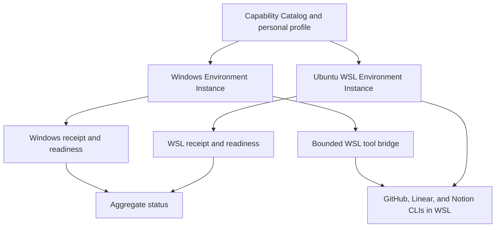
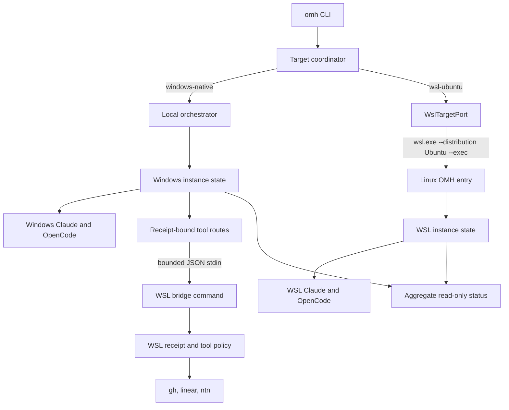

# Dual-environment Clean Install - Plan

## Goal Capsule

- **Objective:** Let one Windows desktop manage a native Windows Claude Code/OpenCode environment and a full Ubuntu WSL Claude Code/OpenCode environment without mixing ownership, platform evidence, or receipts.
- **Product authority:** This focused contract refines the clean-machine and arbitrary-runtime-selection promises in `docs/plans/2026-07-24-001-feat-claude-first-harness-v2-plan.md`.
- **Execution profile:** Implement target contracts and WSL transport first, then target-scoped desired state, exact acquisition, native registration, the tool bridge, and aggregate acceptance.
- **Stop conditions:** Do not mutate either machine environment until that target emits an exact digest. Stop before a target mutation when its Node prerequisite, upstream identity, user-owned collision, dependent WSL receipt, or pre-image is unverifiable.
- **Tail ownership:** The implementing agent owns contract migration, tests, catalog-generated documentation, live preview/apply verification, and removal of abandoned experimental code.

---

## Product Contract

### Summary

Oh My Harness will support two independent Environment Instances on one Windows desktop: a Windows-native agent environment backed by WSL CLI tools, and a full Ubuntu WSL environment.
Each instance keeps its own exact preview, Managed-state Receipt, ownership boundary, and readiness while an aggregate status reports their combined state.

### Problem Frame

The current CLI derives one platform from its own process and resolves one state root and one environment receipt.
That model cannot express a Windows-native runtime and a Linux runtime as separate managed environments on the same machine.

The built-in `personal` profile also requires Notion, while the package catalog supports Notion only on Linux and macOS.
Windows therefore cannot become ready by installing the same package set natively, even though Ubuntu WSL can host the required GitHub, Linear, and Notion CLIs.

Clean setup currently has another bootstrap gap: Claude official marketplace inspection assumes the pinned marketplace snapshot already exists and can raise an exception before the preview reports its blockers.
The operator needs a clean-machine path that either plans exact acquisition or reports a structured preflight failure without mutation.

### Key Decisions

- **Independent Environment Instances:** Windows and Ubuntu WSL use separate state roots, receipts, previews, digests, journals, and readiness. A cross-platform composite receipt would make platform ownership and partial-failure recovery ambiguous.
- **WSL-owned package backends:** Ubuntu WSL owns GitHub, Linear, and Notion CLI installation and authentication. Windows-native agents reach those exact backends through a bounded bridge rather than installing an unsupported Windows Notion package.
- **Ownership-preserving clean install:** Clean install replaces or repairs only receipt-owned OMH artifacts. External runtimes, user configuration, authentication state, and user-owned plugins remain untouched.
- **Asymmetric capability scope:** Ubuntu WSL receives the workflow skills and all seven LSP capabilities. Windows receives the workflow skills only and does not claim LSP readiness.
- **External Node prerequisite:** Ubuntu WSL must provide a trusted Node.js version satisfying the repository engine range before preview. OMH verifies and adopts it as external state without owning or repairing Node.
- **Registration-level acceptance:** Skill verification proves native registration, enablement, discovery, hook configuration, and MCP/tool exposure. It does not invoke the skills or judge generated responses.

### Actors

- A1. **Operator:** Previews, approves, applies, and diagnoses each Environment Instance.
- A2. **Windows-native agents:** Claude Code and OpenCode installed for Windows with workflow skills and WSL-backed personal tool affordances.
- A3. **Ubuntu WSL agents:** Claude Code and OpenCode installed for Linux with workflow skills, seven LSP capabilities, and Linux-native personal CLI packages.
- A4. **Ubuntu WSL tool backends:** GitHub, Linear, and Notion CLIs that retain their own authentication state and enforce the shared command policy.

### Requirements

**Target and state model**

- R1. The operator can select Windows and Ubuntu WSL as explicit Environment Instances without changing the Environment Profile's runtime-neutral meaning.
- R2. Each Environment Instance binds one platform, state root, receipt, preview digest, journal, and ownership set.
- R3. Preview and apply operate on one Environment Instance at a time, while aggregate status reads both instances without becoming a mutation authority.
- R4. A failure or stale preview for one Environment Instance causes zero mutation in the other.
- R5. Aggregate status reports each instance independently and never labels the pair ready when either required instance is unready.

**Clean-install safety**

- R6. Clean install may replace or repair only artifacts proven `managed` by the target instance's receipt.
- R7. External agent binaries, Node, CLI authentication, user configuration, and user-owned plugin registrations are preserved.
- R8. Removal, replacement, source changes, and ownership collisions remain separate exact previews and fail before mutation when their pre-images change.
- R9. A missing Claude official marketplace snapshot becomes an exact-acquisition action or a structured blocker instead of an unhandled preview exception.
- R10. Official Claude plugins remain pinned to the reviewed repository commit, marketplace digest, and plugin tree identities.

**Ubuntu WSL instance**

- R11. Ubuntu WSL requires a trusted external Node.js executable satisfying `package.json#engines` before it can preview as installable.
- R12. Ubuntu WSL installs or adopts the reviewed Claude Code and OpenCode versions without using Windows executables leaked through the WSL `PATH`.
- R13. Ubuntu WSL installs or adopts GitHub CLI, Linear CLI, and Notion CLI according to the `personal` profile and records authentication as CLI-owned external state.
- R14. Ubuntu WSL enables the workflow capabilities and all seven LSP capabilities.
- R15. WSL LSP readiness requires both native agent registration and the matching Linux language-server executable; a missing executable remains an exact required-item blocker.

**Windows instance and WSL bridge**

- R16. Windows installs or adopts the reviewed Claude Code and OpenCode versions while leaving the existing Codex installation outside this clean-install scope.
- R17. Windows enables workflow capabilities but excludes the seven LSP capabilities from its desired state and readiness calculation.
- R18. Windows exposes exactly the GitHub, Linear, and Notion tool backends selected by `personal`, with execution routed to the ready Ubuntu WSL instance.
- R19. The bridge uses no general shell surface, rejects path and command escape, preserves argument allowlists and timeouts, and rechecks write intent at execution time.
- R20. A bridged local or remote mutation requires the user's exact intent and `confirmedWrite=true` under the same policy as a native tool invocation.
- R21. The bridge never copies tokens, cookies, passwords, Authorization headers, or CLI auth stores into Windows configuration or either receipt.
- R22. If Ubuntu WSL or a required WSL backend is unavailable, Windows remains `partial-unready` and reports targeted remediation rather than falling back to an ambient Windows executable.

**Registration and readiness evidence**

- R23. Claude Code readiness verifies its managed marketplace, selected plugins, enabled state, required hooks, MCP servers, and complete skill inventory from the native surface.
- R24. OpenCode readiness verifies its native plugin entrypoint, lifecycle integration, custom tools, and complete skill inventory from the native surface.
- R25. Registration verification does not invoke workflow skills or evaluate model output.
- R26. Package verification is limited to bounded local version/readiness probes and does not automate login or call remote workspace APIs.
- R27. Reapplying an unchanged exact plan is idempotent for each Environment Instance.

### Key Flows

- F1. Target-scoped preview and apply
  - **Trigger:** The operator selects either Windows or Ubuntu WSL with the `personal` profile.
  - **Actors:** A1.
  - **Steps:** OMH inspects only that instance's platform and managed state, emits an exact preview, revalidates its digest on apply, and writes only that instance's receipt.
  - **Outcome:** The other instance remains unchanged.
  - **Covered by:** R1-R10, R27.

- F2. Ubuntu WSL clean install
  - **Trigger:** The external Node prerequisite is ready and the operator applies the WSL preview.
  - **Actors:** A1, A3, A4.
  - **Steps:** OMH acquires or adopts the reviewed agents and packages, installs the selected native capabilities, and verifies registrations plus executable readiness.
  - **Outcome:** The WSL instance is ready only when every required workflow, LSP, and package condition is satisfied.
  - **Covered by:** R11-R15, R23-R27.

- F3. Windows clean install with WSL tools
  - **Trigger:** The WSL instance is ready and the operator applies the Windows preview.
  - **Actors:** A1, A2, A4.
  - **Steps:** OMH installs or adopts Windows agents, registers workflow capabilities, and exposes the three personal tool backends through the bounded WSL bridge.
  - **Outcome:** Windows is ready without claiming native Notion or LSP support.
  - **Covered by:** R16-R26.

- F4. Aggregate diagnosis
  - **Trigger:** The operator requests aggregate status or doctor output.
  - **Actors:** A1.
  - **Steps:** OMH reads both receipts, performs bounded target-native checks, and reports per-instance plus combined readiness.
  - **Outcome:** Drift and remediation remain attributed to the owning instance.
  - **Covered by:** R3-R5, R22-R26.

### Acceptance Examples

- AE1. **Covers R1-R5, R11-R15.** Given Ubuntu WSL with trusted Node 22.19 or newer and no OMH receipt, when the operator previews the WSL `personal` environment, then the command creates no state and returns either an exact digest or itemized required blockers.
- AE2. **Covers R6-R10.** Given a missing Claude official marketplace snapshot, when either Claude target is previewed, then OMH plans reviewed acquisition or reports a structured provenance blocker without throwing an unhandled exception.
- AE3. **Covers R6-R8.** Given an external Claude installation and user-owned plugin configuration, when clean install is previewed and applied, then OMH preserves both and installs a separate managed runtime or reports a collision.
- AE4. **Covers R12-R15, R23-R27.** Given a complete WSL apply, when WSL status runs, then Claude Code and OpenCode registrations, all workflow skills, seven LSP registrations and executables, and three package versions are ready without invoking a skill or remote API.
- AE5. **Covers R16-R22.** Given a ready WSL instance, when the Windows instance is applied, then Windows Claude Code and OpenCode expose workflow skills and only the GitHub, Linear, and Notion WSL-backed tools while Codex and Windows user state remain unchanged.
- AE6. **Covers R18-R22.** Given WSL is stopped or the Notion executable drifts, when Windows status runs, then the bridge is `partial-unready` and does not fall back to a Windows npm shim.
- AE7. **Covers R3-R5, R27.** Given both instances are ready, when one instance's preview becomes stale, then its apply performs zero mutation and the other receipt remains valid.
- AE8. **Covers R19-R21.** Given a bridged write-shaped tool request without exact user intent or `confirmedWrite=true`, when execution is attempted, then it is rejected before the WSL CLI runs.

### Success Criteria

- A clean WSL preview and a clean Windows preview are both mutation-free and independently reproducible.
- Exact apply produces two secret-free receipts with no cross-platform path ownership.
- Aggregate status names both instances and reports ready only when each instance's required conditions pass.
- Repeating preview and apply without drift is idempotent.
- Native discovery proves the complete selected skill and plugin inventory on Claude Code and OpenCode in both instances without invoking model behavior.
- Windows-to-WSL tool exposure preserves profile filtering, write confirmation, authentication ownership, and failure honesty.

### Scope Boundaries

- Existing Codex installation, plugin state, skills, and readiness are not changed.
- Windows LSP installation and readiness are not included.
- Workflow skills are not invoked and model output quality is not evaluated.
- OMH does not install, own, repair, or remove Node.js.
- OMH does not automate GitHub, Linear, or Notion login.
- User-owned runtime configuration, auth stores, plugins, and caches are not reset.
- Other WSL distributions, remote Linux hosts, and multi-user Windows hosts are deferred.
- A single cross-platform composite receipt or all-target atomic apply is outside this scope.

### Dependencies / Assumptions

- Ubuntu WSL2 is installed and can be started through the trusted Windows system boundary.
- The operator upgrades Ubuntu WSL to a trusted Node.js version satisfying `package.json#engines` before applying the WSL plan.
- Reviewed Linux and Windows artifacts remain available for the pinned Claude Code and OpenCode versions.
- The official GitHub, Linear, and Notion CLIs retain the cataloged Linux installation and non-interactive execution behavior.
- The Windows instance may depend on WSL readiness but does not gain mutation authority over the WSL receipt.

### Sources / Research

- `docs/plans/2026-07-24-001-feat-claude-first-harness-v2-plan.md`
- `docs/solutions/workflow/unified-preview-first-management-cli.md`
- `docs/solutions/workflow/fixed-native-runtime-installation.md`
- `docs/solutions/architecture-patterns/one-cli-policy-multiple-agent-surfaces.md`
- `docs/solutions/conventions/cross-platform-node-harness-boundaries.md`
- `harness/profiles/personal.json`
- `harness/catalog/packages.json`
- `harness/catalog/upstreams/anthropic-official-capabilities.json`
- `src/cli/arguments.ts`
- `src/environment/orchestrator.ts`
- `src/environment/native-registration.ts`
- `src/install/official-marketplace.ts`
- `src/tools/invoke.ts`
- `src/tools/policy.ts`
- [Microsoft WSL basic commands](https://learn.microsoft.com/en-us/windows/wsl/basic-commands)
- [Claude Code official marketplace and plugin installation](https://code.claude.com/docs/en/discover-plugins)
- [Claude Code marketplace distribution and CLI commands](https://code.claude.com/docs/en/plugin-marketplaces)
- [OpenCode native skill discovery](https://opencode.ai/docs/skills/)
- [OpenCode plugin loading and custom tools](https://dev.opencode.ai/docs/plugins/)
- [OpenCode LSP configuration](https://opencode.ai/docs/config/)
- [Notion CLI installation](https://developers.notion.com/cli/get-started/installation)
- [Notion CLI authentication](https://developers.notion.com/cli/get-started/authentication)
- [Linear CLI upstream](https://github.com/schpet/linear-cli)
- [GitHub CLI Linux installation](https://github.com/cli/cli/blob/trunk/docs/install_linux.md)

---

## Planning Contract

### Key Technical Decisions

- KTD1. **Model a target as an Environment Instance, not as an OS override.** Add a closed target descriptor with `id`, `transport`, `platform`, optional WSL distribution, and target-native state-root policy. This identity is part of the preview digest, apply plan, receipt, journal, status, and remediation.
- KTD2. **Use explicit target names `windows-native` and `wsl-ubuntu`.** Mutation commands require exactly one target. `status --target all` and `doctor --target all` are read-only coordinators. Omitting `--target` preserves the current local compatibility path rather than silently changing existing receipts.
- KTD3. **Execute Linux planning and mutation inside Ubuntu.** A Windows `WslTargetPort` invokes a reviewed dependency-bounded OMH bootstrap entry through the trusted system `wsl.exe`, an explicit `--distribution Ubuntu`, and direct argv. The bootstrap source is transport-only and is not recorded as WSL ownership; apply publishes the full managed runtime into the WSL instance before native registration and all later startup paths use that target-owned generation. The Linux process computes platform evidence, paths, digest, ownership, locking, and receipt content; the Windows coordinator never writes the WSL state root.
- KTD4. **Keep target state under target-native homes.** Explicit targets default to `~/.oh-my-harness/instances/windows-native` on Windows and `~/.oh-my-harness/instances/wsl-ubuntu` inside Ubuntu. WSL paths never appear in Windows ownership entries, and Windows paths never appear in WSL ownership entries.
- KTD5. **Resolve an Environment Instance overlay without changing the profile.** Add a capability-set selector with `profile` and `workflow-only`. The WSL command uses `profile`; the Windows command uses `workflow-only`. New receipts record the exact selected package and capability IDs so status and runtime adapters do not re-expand a later profile revision.
- KTD6. **Represent Windows packages as receipt-bound WSL routes.** The Windows receipt records logical routes for `github`, `linear`, and `notion`, the expected WSL target identity, and the dependent WSL receipt fingerprint. It does not claim ownership of Linux executables or contain authentication data.
- KTD7. **Revalidate bridge policy on both sides.** The Windows adapter classifies the tool request, checks the Windows receipt, and requires `confirmedWrite=true` for a write. It launches `wsl.exe` with an allowlisted Windows environment and clears `WSLENV` so Windows credentials cannot cross implicitly. A bounded internal WSL bridge command reads JSON from stdin, loads the WSL receipt, re-derives its tool policy, resolves the trusted Linux executable, reconstructs only the selected CLI's allowlisted Linux environment, repeats classification and write confirmation, and spawns without a shell.
- KTD8. **Acquire the reviewed Claude marketplace into OMH-managed storage.** A missing user cache becomes an `acquire-official-marketplace` action. Apply stages the exact reviewed commit, verifies the full repository tree, marketplace SHA-256, and accepted plugin trees, then atomically publishes a content-addressed local marketplace. An existing registration with the same ID and another source remains a user-owned collision.
- KTD9. **Use OpenCode's native skill surface.** Install each selected workflow as a receipt-owned `~/.config/opencode/skills/<id>/SKILL.md` directory after collision checks. Keep the OMH OpenCode plugin for lifecycle context and profile-scoped CLI tools, but remove workflow-as-`omh_*`-custom-tool exposure so discovery evidence matches OpenCode's documented skill mechanism.
- KTD10. **Treat language servers and Node as external prerequisites.** OMH installs and verifies runtime registrations but does not claim ownership of Node or LSP executables. WSL preview remains blocked until Node satisfies `>=22.19.0` and all seven selected LSP executables resolve to trusted Linux files. Windows excludes LSP IDs before readiness is computed.
- KTD11. **Make clean install an exact staged ownership operation.** `--clean` adds removal intent only for managed ownership entries in the selected instance's valid receipt. Apply stages and verifies all replacement content first, switches receipt-owned native registrations with journaled compensation, removes superseded active artifacts while retaining their content-addressed repair stores, and publishes the new receipt. Any failure before durable receipt publication restores the prior registrations and active generation from that store. Obsolete store garbage collection is a retryable non-readiness tail after success. External ownership and unreceipted runtime configuration are never removed.
- KTD12. **Verify registration without model execution.** Claude evidence comes from marketplace/plugin JSON plus exact installed trees and hook/MCP/skill inventory. OpenCode starts a bounded loopback-only headless server, reads health/config, `/experimental/tool/ids`, tool schema descriptions, and `/lsp`, then shuts it down without creating a session or sending a prompt. File and adapter checks corroborate native skill frontmatter and plugin identity; no verification command calls a model or remote workspace API.

### High-Level Technical Design

The coordinator is transport-only. It accepts a target-scoped command, obtains a target-native result, and preserves the inner exit code and JSON contract. It must not reinterpret Linux paths, recalculate a Linux digest, or recover a partial Linux apply from Windows.

The bridge is execution-only. It cannot run OMH setup, arbitrary programs, login flows, or shell text. Its input names one receipt-exposed tool plus bounded arguments and write confirmation. The WSL side selects the executable from its own current receipt-derived policy.

### Target Command and State Flow

1. `omh setup --target wsl-ubuntu --profile personal --agents claude-code,opencode --capability-set profile --tools github,linear,notion --clean --json` validates `wsl.exe`, Ubuntu, target-native Node, Linux paths, catalog pins, packages, LSP executables, marketplace state, and user-owned collisions.
2. Windows receives the Linux-produced preview unchanged. Apply repeats the same command with `--apply --digest <digest>`; the Linux process rejects stale evidence before its first mutation.
3. After WSL is ready, `omh setup --target windows-native --profile personal --agents claude-code,opencode --capability-set workflow-only --tools github,linear,notion --tool-route wsl-ubuntu --clean --json` verifies the dependent WSL receipt and emits the Windows-only plan.
4. Windows apply installs or adopts the reviewed agent versions, registers workflow skills and plugins, and stores WSL routes without copying credentials.
5. `omh status --target all --json` inspects Windows plus `wsl --list --verbose`. It does not start a stopped distribution; a running Ubuntu is queried for its target-native status envelope. Combined readiness is ready only when both required instances are ready.

### Compatibility and Migration

- Existing commands without `--target` continue to resolve the current single local state root and old receipts.
- New receipt and apply-plan fields are optional for parsing legacy v2 artifacts but required for newly generated explicit-target artifacts.
- A legacy receipt is never auto-moved into an instance root. Status reports it separately and remediation produces a new explicit-target preview.
- Current Codex binaries, marketplaces, plugins, and skills are not selected, inspected for mutation, or included in either new target receipt.
- Existing OpenCode or Claude entries that are not proven owned by the selected instance block the corresponding registration action; `--clean` does not broaden ownership.

### Agent-Native Integration Assessment

| Concern | Agent-visible surface | Context delivery | Action path | Parity decision |
|---|---|---|---|---|
| Workflow discovery | Claude plugin skills and OpenCode native global skills | Receipt-selected capability IDs | Native skill loader only | Same semantic contracts, runtime-native packaging |
| Runtime health | Claude startup hook and OpenCode lifecycle hooks | Target ID, profile, revision, readiness, remediation | Status/setup affordances | Both read the owning target receipt |
| GitHub/Linear/Notion | Claude MCP tools and OpenCode custom tools | Receipt-derived backend bindings and route state | Native WSL execution or Windows-to-WSL bridge | Same definitions, classification, and confirmation |
| LSP | Claude official plugins and OpenCode native LSP config | WSL capability and executable readiness | Agent-native LSP process launch | WSL only; Windows intentionally excludes LSP |
| Startup repair | Runtime-native hook/plugin | Owning target's receipt and reconciliation envelope | Local target repair only | No cross-target repair authority |
| Aggregate diagnosis | OMH CLI | Both target status envelopes | Read-only coordinator | Operator surface only, not injected as mutable runtime state |

### System-Wide Impact

- **Catalog and revision:** Correcting Notion's official npm identity and adding marketplace acquisition metadata changes the catalog revision, invalidating older exact previews as intended.
- **Schemas and receipts:** Target identity, selected capabilities/packages, and tool routes become closed receipt/apply-plan data. Secret-like field rejection must cover the new route shapes.
- **Runtime configuration:** Claude and OpenCode user-scope files gain additive managed registrations. Collision detection precedes every write.
- **Tool policy:** The same backend may execute locally or through WSL, so route identity becomes part of the policy fingerprint and stale-session check.
- **Process boundaries:** Windows-to-WSL transport needs bounded output, timeout, cancellation, explicit distro selection, encoding normalization, and no shell.
- **Packaging:** The npm package must include the WSL bridge entry, target contracts, native OpenCode skills, and official-marketplace acquisition code from arbitrary CWDs.
- **Documentation:** README matrices must distinguish target platform, agent runtime, capability set, package owner, and bridge dependency.

### Edge Cases and Failure Semantics

- A missing, renamed, WSL1, or inaccessible Ubuntu distribution is a target preflight blocker; preview/apply may start a stopped distro but never installs or unregisters one.
- Aggregate status never starts a stopped Ubuntu distribution. It reports the WSL instance unavailable with explicit remediation; an explicit WSL preview/apply is the action that may start it.
- A WSL Node path that resolves through `/mnt/c`, a Windows `.exe`, a symlink, or a version below `22.19.0` is rejected.
- A WSL target result with invalid JSON, unexpected target identity, excess output, timeout, or mismatched catalog revision is `unverifiable`.
- A WSL receipt that changes after the Windows preview makes the Windows digest stale. A change after session startup invalidates the bridge policy until restart.
- Concurrent applies serialize independently inside each target root. Aggregate status never holds both apply locks.
- A bridged Windows working directory is accepted only when it maps to an existing WSL path inside the same workspace; otherwise the bridge uses the WSL workspace root or rejects the call.
- Tool arguments containing credential flags, browser/login commands, response files, path escape, or interactive modes remain denied before process launch.
- Bridge cancellation terminates `wsl.exe`; the Linux helper also enforces its own timeout so an orphaned backend cannot outlive the request indefinitely.
- `WSLENV` and credential-bearing Windows variables are removed from both target-management and bridge launches; the Linux helper receives authentication only from Ubuntu's own CLI environment and stores.
- A missing CLI authentication session reports `installed-unconfigured`; verification never triggers login.
- A user-disabled OpenCode skill permission or LSP setting is preserved and makes readiness degraded with remediation.
- A same-name Claude marketplace/plugin or OpenCode skill with a different source or digest is a collision, including when `--clean` is present.
- Optional package gaps remain optional on WSL. The Windows instance exposes only the three selected required routes and never inherits optional backends.

### Risks and Dependencies

| Risk | Impact | Mitigation |
|---|---|---|
| WSL argv and path translation drift | Wrong executable or workspace could run | Use direct `--exec`, exact distribution, absolute Linux paths, bounded `wslpath` translation, a transport-only bootstrap entry, and contract tests with a fake target port |
| Claude marketplace source behavior changes | Reviewed plugins cannot register | Own the staged exact snapshot, verify every pinned identity, and report a structured blocker rather than falling back to mutable `latest` |
| OpenCode discovery behavior changes | Skill files exist but are not visible | Pin the reviewed OpenCode runtime, keep native discovery fixtures, and fail readiness when adapter discovery evidence is absent |
| Receipt schema expansion breaks legacy state | Existing status/startup becomes unavailable | Parse legacy v2 receipts with absent instance fields, keep local compatibility routing, and add migration fixtures |
| WSL bridge bypasses local policy | Unapproved remote writes could execute | Classify and confirm on both sides, fingerprint both receipts, deny general shell/login surfaces, and revalidate immediately before spawn |
| Package upstream drift | Installation produces an unreviewed binary | Pin exact npm versions, verify version output, use reviewed GitHub CLI source, and reject unverifiable results |
| Cross-target partial failure | One environment could appear globally ready | Keep independent receipts and report combined readiness as the strict conjunction of both target states |
| OpenCode experimental discovery API changes | Registration evidence could become unverifiable after a runtime change | Pin OpenCode, contract-test the reviewed endpoints, corroborate with native files/config, and report unsupported rather than invoking a model fallback |

### Sequencing

- U1 and U2 establish the contract and transport boundary.
- U3 depends on U1 and makes planning, receipts, cleanup, and backward compatibility target-aware.
- U4 depends on U3 because marketplace acquisition must be owned by the correct instance.
- U5 depends on U3 and U4 because native registrations consume the finalized capability selection and marketplace store.
- U6 depends on U2, U3, and U5 because the bridge validates both target receipts and runs through installed runtime surfaces.
- U7 integrates target status, documentation, and packaged entrypoints after U1-U6.
- U8 executes the full automated and live acceptance path after all implementation units pass their focused tests.

---

## Implementation Units

### U1. Closed Environment Instance contracts and CLI selection

- **Goal:** Make explicit target identity, capability-set selection, package selection, and route dependency part of deterministic desired state.
- **Requirements:** R1-R5, R16-R18, R27.
- **Files:** `src/cli/arguments.ts`, `src/domain/desired-state.ts`, `src/planning/actions.ts`, `src/planning/preview.ts`, `src/ports/state.ts`, `harness/contracts/apply-plan.schema.json`, `harness/contracts/managed-state-receipt.schema.json`, `tests/unit/cli-arguments.test.ts`, `tests/unit/preview.test.ts`, `tests/contracts/receipt.test.ts`.
- **Approach:** Add closed `EnvironmentInstance`, `CapabilitySet`, and `ToolRoute` types; include their resolved exact values in the plan digest and new receipts; retain legacy parsing when the explicit-target fields are absent.
- **Test scenarios:** Reject unknown targets, WSL fields on a local target, `all` on a mutation, duplicate capability/package IDs, route-to-self, secret-like route content, and a target-root mismatch. Prove target identity changes the digest and legacy receipts remain readable.
- **Verification:** `npm run test:unit`; `npm run test:contracts`.
- **Dependencies:** None.

### U2. Shell-free Windows-to-WSL target transport

- **Goal:** Run preview, apply, status, and doctor inside Ubuntu while preserving Linux ownership and result authority.
- **Requirements:** R1-R5, R11-R12, R26.
- **Files:** `src/environment/target.ts`, `src/environment/wsl-target.ts`, `src/cli/wsl-bootstrap.ts`, `src/composition.ts`, `src/cli/render.ts`, `src/environment/filesystem.ts`, `package.json`, `tests/unit/wsl-target.test.ts`, `tests/integration/wsl-target.test.ts`.
- **Approach:** Introduce a `TargetPort` with local and WSL implementations. Resolve trusted `%SystemRoot%\System32\wsl.exe`, require WSL2 Ubuntu, execute a reviewed transport-only bootstrap with direct argv, clear `WSLENV`, allowlist the Windows environment, bound stdin/stdout/stderr, and preserve the inner JSON and exit code. The applied target uses its managed runtime generation for startup and reconciliation. Add dependency injection so tests never require live WSL.
- **Test scenarios:** Cover stopped distro behavior by command type, distro missing/renamed, WSL1, old or Windows-leaked Node, Windows dependency-tree leakage, implicit `WSLENV` credential propagation, malformed/oversized JSON, timeout/cancellation, path translation failure, target identity mismatch, and nonzero inner exit codes.
- **Verification:** `npm run test:unit`; `npm run test:integration`.
- **Dependencies:** U1.

### U3. Target-scoped orchestration, cleanup, receipts, and aggregate status

- **Goal:** Produce and apply independent exact plans for Windows and WSL, including ownership-safe clean reinstall and read-only aggregate diagnosis.
- **Requirements:** R1-R9, R11-R18, R22, R27.
- **Files:** `src/environment/orchestrator.ts`, `src/environment/filesystem.ts`, `src/planning/apply.ts`, `src/state/receipt.ts`, `src/state/ownership.ts`, `src/status/model.ts`, `src/status/doctor.ts`, `src/composition.ts`, `tests/integration/omh-cli.test.ts`, `tests/integration/apply-recovery.test.ts`, `tests/integration/state-lock.test.ts`, `tests/integration/status-doctor.test.ts`, `tests/integration/environment-instances.test.ts`.
- **Approach:** Resolve target-specific default roots and exact capability/package IDs, avoid action construction when required preflights fail, and implement `--clean` as stage, verify, journaled registration switch, active-artifact removal with repair stores retained, receipt publish, and optional store garbage collection. Any pre-publication failure compensates back to the last-known-good receipt. Keep locks and journals per root and compose `status --target all` from immutable target envelopes without starting a stopped distro.
- **Test scenarios:** Prove blocked preview never throws or mutates, stale target digest causes zero mutation, clean removes only valid managed ownership after replacements verify, switch/removal/receipt-publication failure restores the prior registration and generation, tail store-cleanup failure does not corrupt readiness, external/user-owned content survives, each lock is independent, one target failure leaves the other receipt unchanged, and combined readiness is strict.
- **Verification:** `npm run test:integration`; `git diff --check`.
- **Dependencies:** U1, U2.

### U4. Exact Claude official marketplace acquisition

- **Goal:** Turn a missing official marketplace into a reviewed managed acquisition while preserving collisions and immutable provenance.
- **Requirements:** R6-R10, R23, R27.
- **Files:** `harness/catalog/upstreams/anthropic-official-capabilities.json`, `src/install/official-marketplace.ts`, `src/install/official-marketplace-acquisition.ts`, `src/install/node-acquisition.ts`, `src/environment/orchestrator.ts`, `src/environment/native-registration.ts`, `tests/integration/capability-resolution.test.ts`, `tests/integration/official-marketplace-acquisition.test.ts`, `tests/runtime/claude-code.test.ts`.
- **Approach:** Stage the exact reviewed repository commit under the instance store, reject symlinks and bounds violations, verify the repository tree plus marketplace and selected plugin identities, atomically publish a generation, and register that local exact marketplace only when its native ID is absent.
- **Test scenarios:** Cover missing cache, exact existing cache, download/fetch failure, wrong commit/tree/manifest/plugin tree, crash before publish, retry, same ID/different source collision, and idempotent exact registration.
- **Verification:** `npm run test:integration`; `npm run test:runtime:claude`.
- **Dependencies:** U3.

### U5. Target-native Claude and OpenCode capability registration

- **Goal:** Register the selected workflow and LSP inventory through each runtime's native surfaces without invoking model behavior.
- **Requirements:** R14-R17, R23-R25, R27.
- **Files:** `src/install/capabilities.ts`, `src/environment/native-registration.ts`, `src/runtime/claude-code.ts`, `src/runtime/opencode.ts`, `.opencode/plugins/oh-my-harness.js`, `plugins/oh-my-harness/skills/`, `plugins/oh-my-harness/opencode/skills/`, `tests/unit/native-registration.test.ts`, `tests/runtime/claude-code.test.ts`, `tests/runtime/opencode.test.ts`, `tests/integration/capability-resolution.test.ts`.
- **Approach:** Filter capabilities before readiness, install OpenCode workflows into native global skill directories with exact frontmatter and collision protection, retain lifecycle/plugin tools, register Claude official and managed plugins, and make readiness compare only receipt-selected capabilities. Add a bounded loopback OpenCode server probe that inspects tool schemas and LSP state without creating a session.
- **Test scenarios:** Prove Windows has ten workflows and zero LSP desired IDs, WSL has ten workflows plus seven LSPs, OpenCode's native `skill` tool schema lists the exact skill inventory without `omh_*` workflow tools, user-denied skills/LSP remain preserved and degraded, Claude inventory includes hooks/MCP/skills/plugins, the probe always terminates, and no check sends a model prompt.
- **Verification:** `npm run test:runtime:claude`; `npm run test:runtime:opencode`; `npm run test:integration`.
- **Dependencies:** U3, U4.

### U6. Receipt-bound Windows-to-WSL CLI tool bridge

- **Goal:** Expose exactly GitHub, Linear, and Notion to Windows Claude/OpenCode while executing against the ready WSL instance.
- **Requirements:** R18-R22, R26-R27.
- **Files:** `src/tools/policy.ts`, `src/tools/invoke.ts`, `src/tools/routes.ts`, `src/tools/wsl-bridge.ts`, `src/cli/arguments.ts`, `src/composition.ts`, `.opencode/plugins/oh-my-harness.js`, `plugins/oh-my-harness/mcp/cli-tools-core.mjs`, `plugins/oh-my-harness/mcp/cli-tools-server.mjs`, `tests/unit/tool-policy.test.ts`, `tests/unit/wsl-bridge.test.ts`, `tests/integration/profile-tool-exposure.test.ts`.
- **Approach:** Add route identity to the policy fingerprint, use a bounded internal bridge request over stdin, require the expected WSL receipt fingerprint, clear `WSLENV` and Windows credentials, reclassify and reauthorize in Linux, resolve only receipt-selected trusted executables, construct an allowlisted Linux environment from Ubuntu state, and return redacted bounded output.
- **Test scenarios:** Cover read success, write without/with confirmation, hidden optional backend, login/browser flags, credential arguments, `WSLENV` token propagation attempts, stale Windows receipt, stale WSL receipt, stopped distro, missing backend, Windows PATH fallback attempt, path escape, timeout, cancellation, malformed response, and output redaction.
- **Verification:** `npm run test:unit`; `npm run test:integration`.
- **Dependencies:** U2, U3, U5.

### U7. Catalog, package, documentation, and distribution alignment

- **Goal:** Make package acquisition, help, README matrices, and npm contents match the dual-target product contract.
- **Requirements:** R11-R18, R23-R27.
- **Files:** `harness/catalog/packages.json`, `harness/profiles/personal.json`, `src/catalog/documentation.ts`, `src/cli/render.ts`, `README.md`, `CONCEPTS.md`, `tests/contracts/package-catalog.test.ts`, `tests/contracts/documentation.test.ts`, `tests/release/package-contents.test.ts`.
- **Approach:** Correct Notion to the official `ntn` npm identity and Node 22+ platform contract, keep Linear explicitly community-sourced and exact, use the reviewed GitHub CLI source, render target/route/capability distinctions, and package all target/bridge/native-skill assets.
- **Test scenarios:** Verify generated tables, Windows Notion-native unsupported status, WSL route readiness, exact package versions, secret-free auth guidance, arbitrary CWD execution, and npm archive contents.
- **Verification:** `npm run catalog:verify`; `npm run package:verify`; `npm pack --json`.
- **Dependencies:** U1-U6.

### U8. Automated and live dual-environment acceptance

- **Goal:** Prove both target lifecycles and registration discovery on the real Windows/Ubuntu machine without touching Codex or authentication state.
- **Requirements:** R1-R27; AE1-AE8.
- **Files:** `tests/integration/dual-environment-acceptance.test.ts`, `scripts/validate-dual-environment.ps1`, `README.md`.
- **Approach:** Add a deterministic fake-transport integration test and a preview-first live validator. The live path snapshots Codex and user-owned configuration, verifies and resolves external Node/LSP prerequisites, previews/applies WSL first, previews/applies Windows second, checks aggregate status, repeats for idempotence, and compares preserved state.
- **Test scenarios:** Run both clean previews, exact applies, target-native status/doctor, skill/plugin discovery, WSL package version probes, bridge status, stale-preview rejection, stopped-WSL degradation, idempotent reapply, and Codex/user-auth preservation.
- **Verification:** Run the canonical gate plus `powershell -File scripts/validate-dual-environment.ps1 -Distro Ubuntu`; record blocked external prerequisites separately from implementation failures.
- **Dependencies:** U1-U7.

---

## Verification Contract

| Gate | Command | Proves |
|---|---|---|
| Type safety | `npm run typecheck` | New target, receipt, route, and transport types remain strict NodeNext TypeScript |
| Build | `npm run build` | Emitted ESM imports and new entrypoints compile |
| Catalog contracts | `npm run catalog:verify` | Closed schemas, pins, profile tables, and revisions match |
| Unit tests | `npm run test:unit` | Parsing, digest, target transport, cleanup policy, and bridge classification |
| Contract tests | `npm run test:contracts` | Apply plans and receipts reject unknown fields, IDs, and secret-like values |
| Integration tests | `npm run test:integration` | Preview/apply/retry/status across both target adapters |
| Claude runtime | `npm run test:runtime:claude` | Marketplace, plugin, hook, MCP, and skill registration evidence |
| OpenCode runtime | `npm run test:runtime:opencode` | Native plugin, lifecycle, skill discovery, and target-selected LSP config |
| Codex regression | `npm run test:runtime:codex` | Out-of-scope Codex support remains unchanged |
| Harness compatibility | `npm run test:harness` | Compatibility launchers and legacy harness checks remain green |
| Package contents | `npm run package:verify` | npm artifact contains target, bridge, runtime, and skill payloads |
| Diff hygiene | `git diff --check` | No whitespace or conflict-marker defects |
| Live acceptance | `powershell -File scripts/validate-dual-environment.ps1 -Distro Ubuntu` | Real preview/apply, independent receipts, discovery, bridge, idempotence, and preservation |

Registration acceptance must not invoke Claude or OpenCode with a prompt. It may run bounded local commands such as `--version`, plugin/marketplace listing, configuration diagnostics, and target-native OMH status.

The live validator may apply only after printing and consuming each exact digest. If Node, LSP executables, authentication, or another external prerequisite is missing, it reports the exact blocker and leaves both targets mutation-free until the prerequisite is resolved; the end-to-end installation is not complete while a required prerequisite remains blocked.

---

## Definition of Done

### Global

- All R1-R27 requirements and AE1-AE8 examples are traceable to passing automated or live evidence.
- Windows and WSL produce independent secret-free receipts whose ownership paths belong only to their target.
- Both target previews are read-only, both applies reject stale digests, and unchanged reapply is idempotent.
- Windows Claude/OpenCode discover ten workflow skills and three WSL-backed tool services without any selected LSP.
- WSL Claude/OpenCode discover ten workflow skills and seven LSP registrations, with readiness honest about every external executable.
- Claude marketplace absence is an acquisition action or structured blocker, never an unhandled preview exception.
- Bridged writes require exact user intent plus `confirmedWrite=true` on both sides; credential and login surfaces remain denied.
- Existing Codex state, CLI authentication, external Node, user configuration, and user-owned plugins remain byte-for-byte or semantically unchanged.
- README, generated catalog tables, `CONCEPTS.md`, package contents, and CLI help describe the implemented target model.
- Every canonical gate and the live validator pass with no required external prerequisite remaining blocked.
- Dead-end transport, compatibility, or registration experiments are removed from the final diff.

### Per Unit

| Unit | Done signal |
|---|---|
| U1 | Target and route fields validate closed, affect digest, and preserve legacy receipt reads |
| U2 | Fake and live WSL transport preserve target-native JSON, limits, and exit codes without a shell |
| U3 | Target roots, locks, clean actions, receipts, and aggregate status remain independent |
| U4 | Missing official marketplace converges through exact verified managed acquisition |
| U5 | Claude and OpenCode report the exact selected native registration inventory without model execution |
| U6 | Windows tools execute only through a current ready WSL receipt with double policy checks |
| U7 | Catalog, docs, help, and npm contents agree with generated truth |
| U8 | Real Windows and Ubuntu acceptance proves preview, apply, discovery, bridge, preservation, and idempotence |
