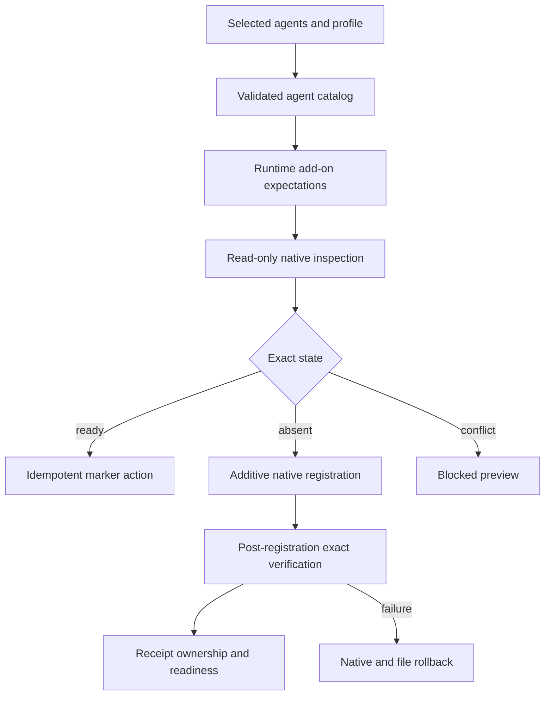
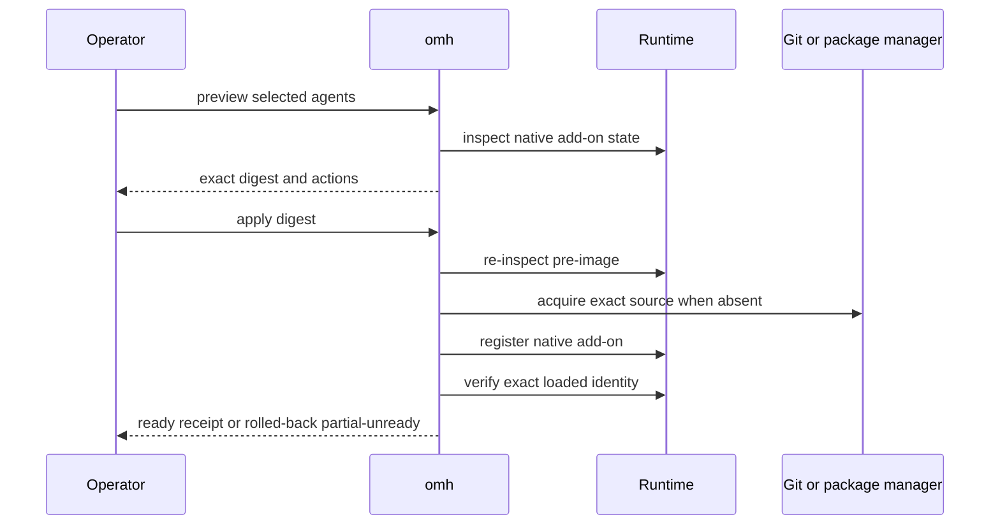

# Default OMO Runtime Add-ons - Plan

## Goal Capsule

- **Objective:** Make the reviewed OMO release a default native add-on whenever an Environment Instance selects OpenCode or Codex, while preserving Claude-only behavior and user-owned runtime configuration.
- **Authority:** The user request controls the default-install outcome; the v2 preview-first, immutable-provenance, ownership, and runtime-parity rules control how it is implemented.
- **Execution profile:** Extend the agent catalog, native registration, Exact Apply Plan, receipt-backed readiness, documentation, and live Windows/WSL validation.
- **Stop conditions:** The catalog pin is reproducible, preview is mutation-free, exact apply is additive and recoverable, runtime-native inspection proves OMO is loaded, and the canonical gates pass.
- **Tail ownership:** This plan ends at a verified local implementation and live environment result. Commit, push, pull-request creation, and merge require a separate explicit shipping instruction.

---

## Product Contract

### Summary

OpenCode selections include OMO Ultimate through the exact reviewed `oh-my-openagent` package, and Codex selections include LazyCodex OMO Light through its exact reviewed Codex marketplace. The default is agent-scoped, not a new semantic workflow capability, and Claude Code remains unchanged.

### Problem Frame

Oh My Harness currently installs the selected runtime and its repository-managed capability package, but OMO is only present when a user installs it separately. That makes a fresh OpenCode or Codex Environment Instance behave differently from the intended default and leaves status unable to distinguish an exact OMO registration from a stale or conflicting one.

OMO is a runtime add-on rather than one capability: it contributes agents, skills, hooks, MCP servers, and runtime-specific configuration. Treating it as a single workflow capability would make false Claude parity claims and would hide its larger native side-effect surface.

### Requirements

#### Catalog and default selection

- R1. Each OpenCode selection includes one required default add-on for `oh-my-openagent` version `4.19.2`, pinned to its exact package identity, tarball URL, and SRI; preflight must match the registry metadata against that pin before mutation.
- R2. Each Codex selection includes one required default add-on for LazyCodex OMO Light version `4.19.2`, pinned to the exact marketplace repository commit, root tree, manifest blob, and OMO plugin tree.
- R3. Claude Code has no OMO default add-on, and existing Claude capability behavior remains unchanged.
- R4. Default add-ons are derived from the selected agent, independent of Environment Profile and `profile` versus `workflow-only` capability selection.

#### Preview, apply, and ownership

- R5. Preview performs only bounded read-only native inspection and binds the add-on identity, observed registration, platform, selected agent, and catalog revision into the Exact Apply Plan digest.
- R6. Apply adds an absent exact registration, reuses an exact registration idempotently, and rejects a different source, version, tree, or duplicate registration as a user-owned collision.
- R7. Codex registration never enables autonomous permissions or changes the operator's sandbox and approval policy.
- R8. OpenCode preserves unrelated plugin entries and all existing OMO configuration; OMH does not create or change an OMO telemetry preference.
- R9. A failed add-on action restores every touched configuration pre-image and removes only an add-on marketplace or plugin proven absent before that action.
- R10. The receipt records each exact add-on pin and owns only its OMH marker plus explicitly managed registration edit; external runtime caches and unrelated user configuration are never claimed as repairable managed payload.

#### Readiness and lifecycle

- R11. `omh status` and `omh doctor` require both the receipt-backed marker and current native inspection of the exact add-on registration.
- R12. OpenCode readiness verifies the exact plugin spec, the catalog-pinned registry integrity preflight, and successful native plugin resolution; Codex readiness verifies marketplace origin, commit/tree identities, selector, version, enabled state, and install path.
- R13. Missing required add-ons are installable preview actions, while malformed state or non-exact existing registrations remain `unverifiable` or conflict rather than being reported ready.
- R14. Windows native and Ubuntu WSL use their own runtime homes, configuration roots, state roots, receipts, and native registration evidence.

#### Migration, documentation, and validation

- R15. The previously approved replacement of the legacy Claude `oh-my-harness` marketplace/plugin removes only the exact old OMH registration before registering the new receipt-owned generation.
- R16. Existing exact LazyCodex/OMO registrations are adopted without reinstalling, while unrelated marketplaces, plugins, skills, CLI authentication, and provider configuration remain unchanged.
- R17. README catalog output, `CONCEPTS.md`, CLI preview/status rendering, and the live validator describe and verify the default add-on behavior.
- R18. Typecheck, build, catalog, unit, contract, integration, runtime, harness, package, and diff gates remain green.

### Scope Boundaries

#### In scope

- Agent-catalog metadata for required runtime add-ons.
- Native OpenCode and Codex inspection, additive registration, recovery, status, doctor, and live validation.
- Exact replacement of the previously approved legacy OMH registration.

#### Deferred to Follow-Up Work

- A general user-selectable add-on marketplace with arbitrary third-party packages.
- Automatic add-on upgrades through Approved Startup Synchronization.
- A dedicated removal command for externally registered OMO content.

#### Outside this product's identity

- Advertising OMO as Claude Code parity when no equivalent upstream Claude integration exists.
- Reproducing or forking OMO's internal skills, agents, prompts, hooks, or model selection policy in this repository.
- Automatically changing Codex permission policy, OpenCode provider subscriptions, CLI authentication, or model credentials.

### Acceptance Examples

- AE1. Given OpenCode is selected and no OMO registration exists, preview verifies the catalog-pinned package metadata and contains an additive exact OMO action without changing the config; applying that digest adds `oh-my-openagent@4.19.2`, preserves existing plugins and OMO configuration, and proves native resolution.
- AE2. Given Codex is selected and no LazyCodex marketplace exists, apply materializes the reviewed commit into a content-addressed local snapshot, verifies its commit and trees before enabling `omo@sisyphuslabs`, and leaves sandbox and approval settings unchanged.
- AE3. Given either runtime already has the exact reviewed OMO registration, preview and reapply are idempotent and do not reinstall it.
- AE4. Given the same marketplace or package ID points to another source or version, preview blocks before mutation and reports the collision.
- AE5. Given add-on registration fails after one native mutation, rollback restores configuration and removes only the registration proven absent before apply.
- AE6. Given Claude Code alone is selected, the plan contains no OMO preflight or action.
- AE7. Given independent Windows and WSL instances, each reports readiness from its own OMO registration and receipt without reading the other instance's home.
- AE8. Given the legacy OMH source is the exact approved predecessor, replacement removes only that plugin and marketplace and preserves all unrelated runtime state.

### Success Criteria

- A fresh OpenCode or Codex exact apply ends with the reviewed OMO release visible through the runtime's native diagnostic surface.
- An exact reapply produces no add-on drift and keeps user-owned configuration stable.
- A conflicting add-on never becomes ready and causes no mutation.
- Windows and WSL live checks prove runtime, OMH plugin, OMO add-on, skills/hooks, status, and doctor behavior.

---

## Planning Contract

### Assumptions

- The action-oriented request to install and replace the new version authorizes the scoped local runtime mutations described here, but not commit, push, PR, or merge for this new diff.
- `oh-my-openagent@4.19.2` and LazyCodex `v4.19.2` are the reviewed current releases for this work.
- OpenCode's exact package spec is its native registration boundary. A required preflight resolves only that exact version and requires the returned tarball URL and SRI to match the catalog before the config can change; the runtime's own package manager then enforces the registry integrity while resolving the plugin.
- Codex's Git marketplace is acquired into an OMH content-addressed snapshot, checked out at the pinned commit, and verified before its local path is registered, so a mutable remote HEAD is never the native registration boundary.
- OMO telemetry remains upstream-owned on both runtimes. OMH does not change OMO telemetry configuration, rewrite the reviewed Codex plugin tree, or persist a global environment variable.

### Key Technical Decisions

- KTD1. Model OMO under `AgentCatalogEntry.defaultAddons`, not `CapabilityCatalogEntry`. The default follows agent selection and avoids false semantic parity.
- KTD2. Use a closed discriminated union for `opencode-package` and `codex-marketplace` registrations. Each runtime keeps native metadata without leaking it into other adapters.
- KTD3. Put add-on registration in its own Exact Apply Plan action and receipt marker. This gives add-on preflight, recovery, readiness, and clean ownership an identity separate from the OMH runtime plugin.
- KTD4. Accept only exact native state. OpenCode requires the exact package spec, matching registry SRI metadata, and successful native resolution; Codex requires a verified content-addressed Git snapshot plus the exact plugin observation.
- KTD5. Additive behavior is the normal path. Replacements remain explicit migrations, including the user-approved legacy OMH replacement in this run.

### High-Level Technical Design

### System-Wide Impact

- The Catalog Revision changes because agent desired state now includes default add-ons.
- Exact Apply Plan digest, receipt ownership, status, doctor, startup context, README generation, and live validation gain add-on-aware evidence.
- The runtime add-on is available to agents through the same native session discovery as a direct runtime launch; no agent-only action is hidden from automation.

### Risks and Dependencies

- OpenCode package metadata or resolution can fail offline. Required preflight must reject metadata drift before mutation, and apply must roll back its registration edit if native resolution fails.
- Codex remote HEAD can advance after this release. Acquisition must check out the catalog-pinned commit into an OMH content-addressed snapshot before registering its local path, so fresh installs remain reproducible after upstream moves.
- Existing global OpenCode configuration may contain legacy OMH or Compound Engineering plugin specs. The approved migration must target only proven predecessor entries.
- OMO changes frequently. Future version changes require a new Catalog Revision and explicit replacement preview rather than a mutable `latest` reference.

### Sources and Research

- The official LazyCodex README identifies the Codex edition and conservative installation posture: `https://github.com/code-yeongyu/lazycodex/blob/main/README.md`.
- The official Oh My OpenAgent repository and installation guide identify the OpenCode package and native installer surface: `https://github.com/code-yeongyu/oh-my-openagent` and `https://raw.githubusercontent.com/code-yeongyu/oh-my-openagent/dev/docs/guide/installation.md`.
- `docs/solutions/architecture-patterns/immutable-upstream-trust-receipts.md` defines the Git-object provenance boundary.
- `docs/solutions/workflow/fixed-native-runtime-installation.md` defines native registration, exact package, and migration patterns.
- `docs/solutions/logic-errors/runtime-expansion-must-not-inherit-unowned-registration.md` requires runtime-specific prior ownership during expansion.

---

## Implementation Units

### U1. Add a closed default add-on catalog contract

- **Goal:** Make each selected agent carry a validated, exact default add-on declaration.
- **Requirements:** R1-R4, R17.
- **Dependencies:** None.
- **Files:** `src/catalog/types.ts`, `src/catalog/load.ts`, `harness/contracts/capability-catalog.schema.json`, `harness/catalog/agents.json`, `harness/catalog/upstreams/registry.json`, `src/catalog/documentation.ts`, `tests/contracts/catalog.test.ts`, `tests/contracts/documentation.test.ts`, `README.md`, `CONCEPTS.md`.
- **Approach:** Add a runtime-neutral default-add-on envelope with runtime-native registration variants, validate exact source identities and runtime compatibility, and include the add-on summary in generated agent documentation.
- **Patterns to follow:** Closed catalog schemas and cross-reference validation in `src/catalog/load.ts`; generated README markers in `src/catalog/documentation.ts`.
- **Test scenarios:**
  - Load the reviewed catalog and assert Claude has no add-on while OpenCode and Codex each expose the exact OMO pin.
  - Reject unknown add-on fields, duplicate IDs, a runtime-incompatible registration kind, mutable versions, malformed SRI, and an unresolved source ID.
  - Change one add-on identity and assert the Catalog Revision changes.
  - Generate the README table and assert it contains both default add-ons without hand-maintained drift.
- **Verification:** Catalog contracts load fail-closed, generated documentation matches README, and the revision binds every add-on field.

### U2. Implement native OpenCode and Codex add-on registration

- **Goal:** Inspect, add, verify, and roll back OMO through each runtime's native surface.
- **Requirements:** R5-R10, R12-R13.
- **Dependencies:** U1.
- **Files:** `src/install/runtime-addon-acquisition.ts`, `src/environment/native-registration.ts`, `tests/unit/runtime-addon-acquisition.test.ts`, `tests/unit/native-registration.test.ts`.
- **Approach:** Add a bounded exact npm-metadata preflight for OpenCode and a content-addressed exact Git snapshot acquisition for Codex. Extend OpenCode JSONC mutation with exact package-spec preservation; add Codex marketplace/plugin inspection that verifies the managed snapshot, Git origin, commit, root tree, marketplace manifest blob, plugin tree, selector, version, and enabled state before reporting ready.
- **Execution note:** Start with failing native-registration tests for exact, absent, collision, and rollback-relevant state before changing production code.
- **Patterns to follow:** Atomic JSONC edits, bounded file reads, strict native JSON parsing, exact directory/source comparison, and no-shell command execution already used by OMH native registration.
- **Test scenarios:**
  - Add the exact OpenCode OMO spec to an unrelated plugin list and preserve all prior entries.
  - Preserve the OMO configuration byte-for-byte and reject malformed runtime configuration.
  - Treat an exact OpenCode spec as ready and legacy or differently versioned OMO specs as collisions.
  - Treat the exact Codex Git marketplace plus enabled plugin as ready only when all pinned object identities match.
  - Add an absent Codex marketplace, verify it before plugin installation, then add the plugin.
  - Reject duplicate, wrong-source, wrong-commit, wrong-tree, wrong-version, disabled, partial, or non-absolute Codex observations.
- **Verification:** Focused unit tests prove native mutation is additive, exact, bounded, and collision-safe.

### U3. Integrate add-ons with preview, apply, recovery, receipt, status, and doctor

- **Goal:** Make add-on readiness part of the full Environment Instance lifecycle.
- **Requirements:** R4-R14, R16.
- **Dependencies:** U1, U2.
- **Files:** `src/domain/desired-state.ts`, `src/ports/state.ts`, `src/environment/orchestrator.ts`, `src/cli/render.ts`, `harness/contracts/apply-plan.schema.json`, `harness/contracts/managed-state-receipt.schema.json`, `tests/contracts/receipt.test.ts`, `tests/unit/preview.test.ts`, `tests/integration/environment-runtime-addons.test.ts`, `tests/integration/environment-runtime-expansion.test.ts`, `tests/integration/omh-cli.test.ts`.
- **Approach:** Derive add-on models from selected agents, emit required preflights and standalone registration actions, record the exact pin and bind its fingerprint into markers, snapshot every touched config pre-image, add narrowly typed native recoveries, and require receipt pin plus marker plus live inspection in status and doctor.
- **Execution note:** Use failing integration coverage for mutation-free preview, stale digest, idempotence, conflict, partial failure, and recovery before completing orchestration.
- **Patterns to follow:** Runtime-specific prior ownership, `prepareActionRollback`, exact action payload validation, and receipt-backed status in `src/environment/orchestrator.ts`.
- **Test scenarios:**
  - OpenCode-only and Codex-only previews contain their default add-on; Claude-only preview contains none.
  - Preview leaves runtime homes byte-for-byte unchanged and a changed add-on pre-image makes apply stale.
  - Missing add-ons apply and become ready; exact add-ons reapply without native mutation.
  - Conflicting add-ons block before any action and remain untouched.
  - A forced post-mutation failure restores OpenCode config and removes only newly added Codex state.
  - Status and doctor report drift when a marker exists but the native add-on is removed or changed.
  - Windows and WSL selections produce distinct marker targets and observations.
- **Verification:** Integration tests prove add-ons participate in the same preview-first, rollback, receipt, and readiness invariants as the runtime plugin.

### U4. Extend documentation and live validation

- **Goal:** Prove the reviewed defaults through real Windows and WSL runtime diagnostics.
- **Requirements:** R11-R18, AE1-AE8.
- **Dependencies:** U1-U3.
- **Files:** `scripts/validate-dual-environment.ps1`, `README.md`, `CONCEPTS.md`, `tests/release/package-contents.test.ts`.
- **Approach:** Add add-on expectations to the live validator, keep runtime homes and config roots target-native, and document direct-launch restart semantics and explicit future replacement behavior.
- **Execution note:** Prefer runtime smoke verification over extra unit coverage for native package resolution and session discovery.
- **Test scenarios:**
  - Windows OpenCode debug config resolves `oh-my-openagent@4.19.2` and OMH from the managed config root.
  - Windows Codex lists exact `omo@sisyphuslabs` and OMH registrations without permission-policy changes.
  - WSL OpenCode and Codex independently report the same reviewed add-on versions from Linux-native homes.
  - Claude Code lists the new OMH generation after the approved exact predecessor replacement.
  - An arbitrary working directory still discovers the managed plugins and skills.
- **Verification:** The live validator and direct native diagnostic commands show exact runtime, OMH, OMO, status, doctor, and idempotent reapply evidence.

### U5. Review and preserve the solved provenance pattern

- **Goal:** Close review findings and record the reusable runtime-add-on pattern.
- **Requirements:** R5-R18.
- **Dependencies:** U1-U4.
- **Files:** `docs/solutions/architecture-patterns/default-native-runtime-addons.md`.
- **Approach:** Run structured code review against this plan, fix every applicable finding, then document how agent-scoped default add-ons preserve preview, provenance, ownership, and native parity without becoming semantic capabilities.
- **Test scenarios:** Test expectation: none -- this unit records verified implementation knowledge after all behavior-bearing units pass.
- **Verification:** No unresolved actionable review finding remains, and the solution document points to the final code and validation evidence.

---

## Verification Contract

| Gate | Evidence | Units |
| --- | --- | --- |
| Type system | `npm run typecheck` | U1-U3 |
| Build | `npm run build` | U1-U4 |
| Catalog drift | `npm run catalog:verify` | U1 |
| Unit tests | `npm run test:unit` | U2 |
| Contract tests | `npm run test:contracts` | U1, U3 |
| Integration tests | `npm run test:integration` | U3 |
| Claude runtime | `npm run test:runtime:claude` | U3, U4 |
| OpenCode runtime | `npm run test:runtime:opencode` | U2-U4 |
| Codex runtime | `npm run test:runtime:codex` | U2-U4 |
| Harness compatibility | `npm run test:harness` | U1-U4 |
| Package contents | `npm run package:verify` | U4 |
| Windows and WSL acceptance | `powershell -File scripts/validate-dual-environment.ps1` plus direct native diagnostics | U4 |
| Source quality | TypeScript no-excuse checker and `git diff --check` | U1-U5 |
| Review | `ce-code-review` with this plan as intent source | U5 |

---

## Definition of Done

### Global

- The exact reviewed OMO release is a catalog-derived default for OpenCode and Codex and is absent from Claude-only plans.
- Preview is read-only, stale digests fail before mutation, exact reapply is idempotent, and every collision fails closed.
- OpenCode and Codex native diagnostics prove the exact add-on is loaded; status and doctor agree with those observations.
- Codex permission policy and unrelated user-owned runtime state remain unchanged.
- The approved legacy OMH replacement is exact and unrelated plugins, marketplaces, provider config, authentication, and skills remain intact.
- Windows and WSL each pass target-native installation and discovery with independent receipts.
- Every Verification Contract gate passes, dead-end experiments are removed, and no actionable code-review finding remains.

### Per Unit

| Unit | Done signal |
| --- | --- |
| U1 | Closed catalog and generated docs bind the exact agent-scoped add-on identities |
| U2 | Native helpers prove exact, absent, conflict, OMO-config-preserving, and Git-object cases |
| U3 | Preview/apply/recovery/status/doctor treat add-ons as required receipt-backed state |
| U4 | Real Windows and WSL diagnostics show OMH plus exact OMO on the intended runtimes |
| U5 | Review findings are resolved and the reusable pattern is documented |
